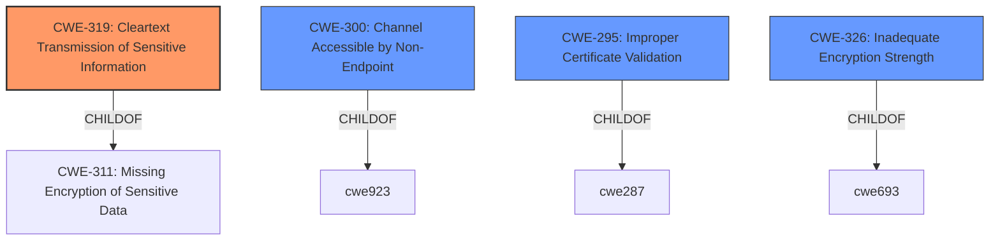

# Analysis for CVE-2021-35979

# Summary
| CWE ID | CWE Name | Confidence | CWE Abstraction Level | CWE Vulnerability Mapping Label | CWE-Vulnerability Mapping Notes |
|---|---|---|---|---|---|
| CWE-319 | Cleartext Transmission of Sensitive Information | 0.9 | Base | Primary | Allowed |
| CWE-300 | Channel Accessible by Non-Endpoint | 0.6 | Class | Secondary | Discouraged |
| CWE-295 | Improper Certificate Validation | 0.6 | Base | Secondary | Allowed |
| CWE-326 | Inadequate Encryption Strength | 0.5 | Class | Secondary | Allowed-with-Review |

## Evidence and Confidence

*   **Confidence Score:** 0.8
*   **Evidence Strength:** MEDIUM

## Relationship Analysis
The primary relationship that influenced my decision was the parent-child relationship between CWE-311 (Missing Encryption of Sensitive Data) and CWE-319 (Cleartext Transmission of Sensitive Information). Since the vulnerability specifically involves transmitting data without encryption, CWE-319 is a more precise classification than its parent. CWE-300, while relevant due to the MITM attack vector, is a higher-level class and thus less specific. CWE-295 is also considered as the vulnerability mentions the lack of authentication, and the fix involves certificate pinning.

## Vulnerability Chain
The vulnerability chain starts with the **lack of proper encryption** (CWE-311), leading to **cleartext transmission of sensitive information** (CWE-319), which enables **man-in-the-middle attacks** (CWE-300), potentially compromising confidentiality, integrity, and availability. The **lack of authentication** is also a factor.

## Summary of Analysis
My analysis is primarily based on the provided evidence, specifically:

*   "The encrypted mode is vulnerable to man-in-the-middle attacks and **does not perform authentication**."
*   "**Root cause of vulnerability:** RealPort encryption mode is vulnerable to man-in-the-middle attacks."
*   "**Weaknesses/vulnerabilities present:** Lack of proper encryption mechanisms which allows a man-in-the-middle attack to compromise the confidentiality and integrity of data exchanged during a session."
*    "The vulnerability is partially fixed in RealPort software ... by adding certificate pinning."

This directly indicates a **lack of proper encryption**, leading to **cleartext transmission** and the possibility of a **man-in-the-middle attack**.

CWE-319 (Cleartext Transmission of Sensitive Information) is the most specific and appropriate classification because it directly reflects the core issue: data is transmitted without encryption. While CWE-300 (Channel Accessible by Non-Endpoint) is relevant due to the MITM attack, it is a higher-level class and less descriptive of the root cause. CWE-295 (Improper Certificate Validation) is also considered as the fix mentions certificate pinning.

I considered CWE-311 (Missing Encryption of Sensitive Data) as a parent of CWE-319 but decided to map CWE-319 as the weakness is focused on the transmission of the data.

The selected CWEs are at the optimal level of specificity because they accurately represent the **lack of encryption** and the resulting vulnerability to **man-in-the-middle attacks**, while also addressing the **lack of authentication** that is involved in the attack.

Relevant CWE Information:

# Enhanced Context (25 CWEs)
The following CWEs were identified as potentially relevant to this vulnerability:

## CWE-1391: Use of Weak Credentials
**Abstraction Level**: Class
**Similarity Score**: 0.80
**Source**: dense

**Description**:
The product uses weak credentials (such as a default key or hard-coded password) that can be calculated, derived, reused, or guessed by an attacker.

**Mapping Guidance**:
- Usage: Allowed-with-Review
- Rationale: This CWE entry is a Class and might have Base-level children that would be more appropriate

## CWE-1240: Use of a Cryptographic Primitive with a Risky Implementation
**Abstraction Level**: Base
**Similarity Score**: 0.79
**Source**: dense

**Description**:
To fulfill the need for a cryptographic primitive, the product implements a cryptographic algorithm using a non-standard, unproven, or disallowed/non-compliant cryptographic implementation.

**Mapping Guidance**:
- Usage: Allowed
- Rationale: This CWE entry is at the Base level of abstraction, which is a preferred level of abstraction for mapping to the root causes of vulnerabilities.

## CWE-1204: Generation of Weak Initialization Vector (IV)
**Abstraction Level**: Base
**Similarity Score**: 0.78
**Source**: dense

**Description**:
The product uses a cryptographic primitive that uses an Initialization
			Vector (IV), but the product does not generate IVs that are
			sufficiently unpredictable or unique according to the expected
			cryptographic requirements for that primitive.
			

**Mapping Guidance**:
- Usage: Allowed
- Rationale: This CWE entry is at the Base level of abstraction, which is a preferred level of abstraction for mapping to the root causes of vulnerabilities.

## CWE-312: Cleartext Storage of Sensitive Information
**Abstraction Level**: Base
**Similarity Score**: 0.78
**Source**: dense

**Description**:
The product stores sensitive information in cleartext within a resource that might be accessible to another control sphere.

**Mapping Guidance**:
- Usage: Allowed
- Rationale: This CWE entry is at the Base level of abstraction, which is a preferred level of abstraction for mapping to the root causes of vulnerabilities.

## CWE-319: Cleartext Transmission of Sensitive Information
**Abstraction Level**: Base
**Similarity Score**: 0.78
**Source**: dense

**Description**:
The product transmits sensitive or security-critical data in cleartext in a communication channel that can be sniffed by unauthorized actors.

**Mapping Guidance**:
- Usage: Allowed
- Rationale: This CWE entry is at the Base level of abstraction, which is a preferred level of abstraction for mapping to the root causes of vulnerabilities.

## CWE-330: Use of Insufficiently Random Values
**Abstraction Level**: Class
**Similarity Score**: 0.78
**Source**: dense

**Description**:
The product uses insufficiently random numbers or values in a security context that depends on unpredictable numbers.

**Mapping Guidance**:
- Usage: Discouraged
- Rationale: This CWE entry is a level-1 Class (i.e., a child of a Pillar). It might have lower-level children that would be more appropriate

## CWE-798: Use of Hard-coded Credentials
**Abstraction Level**: Base
**Similarity Score**: 0.77
**Source**: dense

**Description**:
The product contains hard-coded credentials, such as a password or cryptographic key.

**Mapping Guidance**:
- Usage: Allowed
- Rationale: This CWE entry is at the Base level of abstraction, which is a preferred level of abstraction for mapping to the root causes of vulnerabilities.

## CWE-345: Insufficient Verification of Data Authenticity
**Abstraction Level**: Class
**Similarity Score**: 0.77
**Source**: dense

**Description**:
The product does not sufficiently verify the origin or authenticity of data, in a way that causes it to accept invalid data.

**Mapping Guidance**:
- Usage: Discouraged
- Rationale: This CWE entry is a level-1 Class (i.e., a child of a Pillar). It might have lower-level children that would be more appropriate

## CWE-331: Insufficient Entropy
**Abstraction Level**: Base
**Similarity Score**: 0.77
**Source**: dense

**Description**:
The product uses an algorithm or scheme that produces insufficient entropy, leaving patterns or clusters of values that are more likely to occur than others.

**Mapping Guidance**:
- Usage: Allowed
- Rationale: This CWE entry is at the Base level of abstraction, which is a preferred level of abstraction for mapping to the root causes of vulnerabilities.

## CWE-328: Use of Weak Hash
**Abstraction Level**: Base
**Similarity Score**: