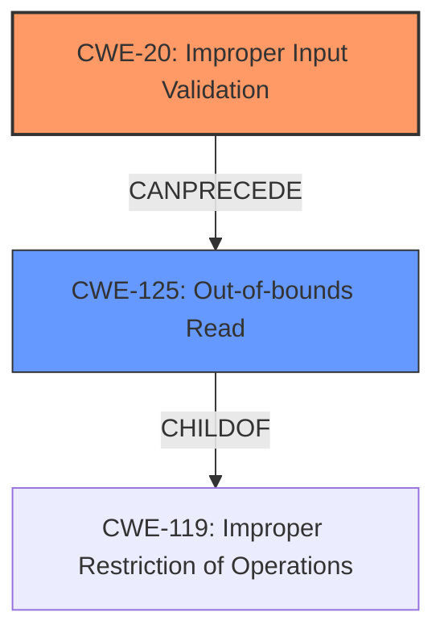

# Analysis for CVE-2021-35995

# Summary
| CWE ID | CWE Name | Confidence | CWE Abstraction Level | CWE Vulnerability Mapping Label | CWE-Vulnerability Mapping Notes |
|---|---|---|---|---|---|
| CWE-20 | Improper Input Validation | 0.75 | Class | Primary | Allowed-with-Review |
| CWE-125 | Out-of-bounds Read | 0.6 | Base | Secondary | Allowed |

## Evidence and Confidence

*   **Confidence Score:** 0.7
*   **Evidence Strength:** MEDIUM

## Relationship Analysis
The primary CWE is CWE-20, which is a Class-level CWE. This CWE has many children that specify the type of improper validation. Because there is no specific type of validation mentioned, I am using the general case. CWE-20 can precede CWE-22, CWE-41, CWE-74, CWE-119, and CWE-770. CWE-125 is a possible impact of **improper input validation**, where the software reads data past the end of the intended buffer. CWE-125 is a child of CWE-119.

## Vulnerability Chain
The vulnerability chain starts with **Improper input validation** (CWE-20), which leads to an out-of-bounds read (CWE-125) and ultimately results in the disclosure of arbitrary memory information.

## Summary of Analysis
The initial assessment identifies **Improper input validation** as the root cause, aligning with the provided description. The vulnerability description mentions that the software fails to properly validate input, leading to arbitrary memory information disclosure. The primary CWE match is CWE-787, but this does not match the **rootcause** of the vulnerability, rather the impact if an out-of-bounds write occurs. The **Improper input validation** is the **rootcause** of the vulnerability.

The graph relationships indicate that CWE-20 can precede several other CWEs, including those related to buffer overflows and path traversal. This suggests that the **improper input validation** could potentially lead to various vulnerabilities.

The final selection of CWE-20 is based on the evidence that the software fails to properly validate input. This is a general case of **improper input validation**, and there is no specific type of validation mentioned. CWE-125 is a possible impact of **improper input validation**, where the software reads data past the end of the intended buffer. This selection is at the optimal level of specificity, as it accurately represents the **rootcause** of the vulnerability without being overly specific.

Relevant CWE Information:

# Enhanced Context (25 CWEs)

## CWE-404: Improper Resource Shutdown or Release
**Abstraction Level**: Class
**Similarity Score**: 0.76
**Source**: dense

**Description**:
The product does not release or incorrectly releases a resource before it is made available for re-use.

**Mapping Guidance**:
- Usage: Allowed-with-Review
- Rationale: This CWE entry is a Class and might have Base-level children that would be more appropriate

*This CWE does not match the **rootcause** which is **Improper input validation**. Therefore, it is not applicable.*

## CWE-1289: Improper Validation of Unsafe Equivalence in Input
**Abstraction Level**: Base
**Similarity Score**: 0.76
**Source**: dense

**Description**:
The product receives an input value that is used as a resource identifier or other type of reference, but it does not validate or incorrectly validates that the input is equivalent to a potentially-unsafe value.

**Mapping Guidance**:
- Usage: Allowed
- Rationale: This CWE entry is at the Base level of abstraction, which is a preferred level of abstraction for mapping to the root causes of vulnerabilities.

*This CWE is related to input validation but focuses on unsafe equivalence, which is not the case in the vulnerability description. Therefore, it is not applicable.*

## CWE-41: Improper Resolution of Path Equivalence
**Abstraction Level**: Base
**Similarity Score**: 0.75
**Source**: dense

**Description**:
The product is vulnerable to file system contents disclosure through path equivalence. Path equivalence involves the use of special characters in file and directory names. The associated manipulations are intended to generate multiple names for the same object.

**Mapping Guidance**:
- Usage: Allowed
- Rationale: This CWE entry is at the Base level of abstraction, which is a preferred level of abstraction for mapping to the root causes of vulnerabilities.

*This CWE is not related to the described vulnerability, which is about **improper input validation** leading to memory information disclosure. Therefore, it is not applicable.*

## CWE-226: Sensitive Information in Resource Not Removed Before Reuse
**Abstraction Level**: Base
**Similarity Score**: 0.75
**Source**: dense

**Description**:
The product releases a resource such as memory or a file so that it can be made available for reuse, but it does not clear or "zeroize" the information contained in the resource before the product performs a critical state transition or makes the resource available for reuse by other entities.

**Mapping Guidance**:
- Usage: Allowed
- Rationale: This CWE entry is at the Base level of abstraction, which is a preferred level of abstraction for mapping to the root causes of vulnerabilities.

*This CWE does not match the vulnerability description, which is about **improper input validation** rather than resource reuse. Therefore, it is not applicable.*

## CWE-667: Improper Locking
**Abstraction Level**: Class
**Similarity Score**: 0.75
**Source**: dense

**Description**:
The product does not properly acquire or release a lock on a resource, leading to unexpected resource state changes and behaviors.

**Mapping Guidance**:
- Usage: Allowed-with-Review
- Rationale: This CWE entry is a Class and might have Base-level children that would be more appropriate

*This CWE is not related to **improper input validation**. Therefore, it is not applicable.*

## CWE-73: External Control of File Name or Path
**Abstraction Level**: Base
**Similarity Score**: 0.75
**Source**: dense

**Description**:
The product allows user input to control or influence paths or file names that are used in filesystem operations.

**Mapping Guidance**:
- Usage: Allowed
- Rationale: This CWE entry is at the Base level of abstraction, which is a preferred level of abstraction for mapping to the root causes of vulnerabilities.

*This CWE is not related to the described vulnerability, which is about **improper input validation** leading to memory information disclosure, not file path manipulation. Therefore, it is not applicable.*

## CWE-125: Out-of-bounds Read
**Abstraction Level**: Base
**Similarity Score**: 0.75
**Source**: dense

**Description**:
The product reads data past the end, or before the beginning, of the intended buffer.

**Mapping Guidance**:
- Usage: Allowed
- Rationale: This CWE entry is at the Base level of abstraction, which is a preferred level of abstraction for mapping to the root causes of vulnerabilities.

*This CWE matches a possible impact of **improper input validation**. Therefore, it is a secondary candidate.*

## CWE-59: Improper Link Resolution Before File Access ('Link Following')
**Abstraction Level**: Base
**Similarity Score**: 0.75
**Source**: dense

**Description**:
The product attempts to access a file based on the filename, but it does not properly prevent that filename from identifying a link or shortcut that resolves to an unintended resource.

**Mapping Guidance**:
- Usage: Allowed
- Rationale: This CWE entry is at the Base level of abstraction, which is a preferred level of abstraction for mapping to the root causes of vulnerabilities.

*This CWE is not related to the described vulnerability, which is about **improper input validation** leading to memory information disclosure, not link resolution issues. Therefore, it is not applicable.*

## CWE-668: Exposure of Resource to Wrong Sphere
**Abstraction Level**: Class
**Similarity Score**: 0.75
**Source**: dense

**Description**:
The product exposes a resource to the wrong control sphere, providing unintended actors with inappropriate access to the resource.

**Mapping Guidance**:
- Usage: Discouraged
- Rationale: CWE-668 is high-level and is often misused as a catch-all when lower-level CWE IDs might be applicable. It is sometimes used for low-information vulnerability reports [REF-1287]. It is a level-1 Class (i.e., a child of a Pillar). It is not useful for trend analysis.

*This CWE is too general and does not accurately describe the specific vulnerability.