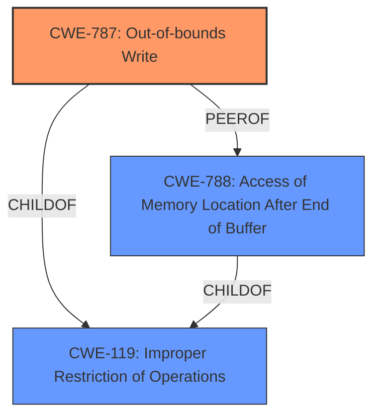

# Analysis Report for CVE-2021-35997

# Vulnerability Analysis Report: CVE-2021-35997

## Description


## Analysis (with Relationship Data)

# Summary
| CWE ID | CWE Name | Confidence | CWE Abstraction Level | CWE Vulnerability Mapping Label | CWE-Vulnerability Mapping Notes |
|---|---|---|---|---|---|
| CWE-787 | Out-of-bounds Write | 1.0 | Base | Allowed | Primary CWE |
| CWE-788 | Access of Memory Location After End of Buffer | 0.6 | Base | Discouraged | Secondary Candidate |

## Evidence and Confidence

*   **Confidence Score:** 0.9
*   **Evidence Strength:** HIGH

## Relationship Analysis
The primary CWE is CWE-787, which is a base-level CWE and a child of CWE-119 (Improper Restriction of Operations within the Bounds of a Memory Buffer). CWE-788 is also a child of CWE-119 and a peer of CWE-787. While CWE-788 is more specific in describing the access after the end of the buffer, CWE-787 is more general and covers both before and after the buffer, and is the more commonly mapped CWE.



## Vulnerability Chain
The vulnerability chain starts with the parsing of a specially crafted file, leading to **memory corruption**, specifically an out-of-bounds write. This **weakness** allows an unauthenticated attacker to achieve arbitrary code execution.

## Summary of Analysis
The initial analysis focused on identifying the root cause of the vulnerability. The vulnerability description clearly states that the issue is a **memory corruption** vulnerability when parsing a specially crafted file. The "CVE Reference Links Content Summary" further specifies this as an "Access of Memory Location After End of Buffer" (CWE-788), leading to the more general CWE-787 (Out-of-bounds Write).

The retriever results also listed CWE-787 as the top candidate with a score of 1.0, and CWE-788 as the second candidate. The "CWE for similar CVE Descriptions" section listed CWE-787 as the primary match and most frequent CWE. Given the evidence and the mapping guidance, CWE-787 is the most appropriate primary CWE. While CWE-788 is more specific, its mapping guidance discourages its use when children like CWE-787 are available.

*   **CWE-787: Out-of-bounds Write**
    *   The vulnerability involves writing data past the end of the intended buffer. The "CVE Reference Links Content Summary" explicitly states an "Access of Memory Location After End of Buffer," which falls under the broader category of out-of-bounds writes.
    *   This can lead to arbitrary code execution, a severe security implication.
    *   CWE-787 is a base-level CWE and a child of CWE-119. The mapping guidance allows its use.
    *   The "CWE for similar CVE Descriptions" section lists CWE-787 as the primary match.
    *   Confidence: 1.0

*   **CWE-788: Access of Memory Location After End of Buffer**
    *   The "CVE Reference Links Content Summary" identifies the root cause as this issue.
    *   While it is a valid candidate, the mapping guidance discourages its use when lower-level CWEs are available.
    *   Confidence: 0.6

I considered other CWEs from the Retriever Results, such as:
*   CWE-125 (Out-of-bounds Read): While related to memory access issues, the vulnerability is described as **memory corruption**, implying a write operation rather than a read.
*   CWE-457 (Use of Uninitialized Variable) and CWE-665 (Improper Initialization): These are not directly supported by the description, which focuses on the out-of-bounds write rather than initialization issues.
*   CWE-122 (Heap-based Buffer Overflow) and CWE-121 (Stack-based Buffer Overflow): While buffer overflows are related, the description does not specify whether the buffer is heap-based or stack-based, making CWE-787 a more general and appropriate choice.
*   CWE-20 (Improper Input Validation): Although a specially crafted file is involved, the core issue is the out-of-bounds write, not the input validation itself.

The selection of CWE-787 is based on the provided evidence, particularly the "CVE Reference Links Content Summary," and the mapping guidance for the suggested CWEs. It is the most accurate and specific CWE that describes the root cause of the vulnerability.


## CWE Relationship Analysis

Current CWEs represent these abstraction levels: .


### Vulnerability Chain Analysis

**Chain starting from CWE-787:**
- 787 (Out-of-bounds Write) - ROOT


**Chain starting from CWE-121:**
- 121 (Stack-based Buffer Overflow) - ROOT


### CWE Relationship Diagram

```mermaid
graph TD
    classDef primary fill:#f96,stroke:#333,stroke-width:2px
    classDef secondary fill:#69f,stroke:#333
    classDef tertiary fill:#9e9,stroke:#333
```


*Report generated on 2025-04-02 10:58:34*
