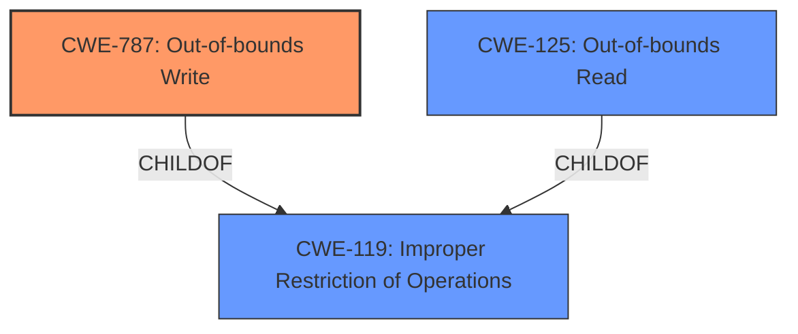

# Analysis for CVE-2021-35999

# Summary
| CWE ID  | CWE Name                       | Confidence | CWE Abstraction Level | CWE Vulnerability Mapping Label | CWE-Vulnerability Mapping Notes |
| ------- | ------------------------------ | ---------- | ----------------------- | ------------------------------- | ------------------------------- |
| CWE-787 | Out-of-bounds Write            | 1.0        | Base                    | Primary                         | Allowed                       |
| CWE-125 | Out-of-bounds Read            | 0.7        | Base                    | Secondary                       | Allowed                       |

## Evidence and Confidence

*   **Confidence Score:** 0.9
*   **Evidence Strength:** HIGH

## Relationship Analysis
The primary CWE identified is CWE-787 (**Out-of-bounds Write**), which is a base-level CWE. Several other CWEs were considered but ultimately deemed less suitable. CWE-125 (**Out-of-bounds Read**) is related and may be a secondary factor. CWE-787 is a child of CWE-119 (**Improper Restriction of Operations within the Bounds of a Memory Buffer**). The relationship with CWE-119 indicates a broader class of memory safety issues.

## Vulnerability Chain
The vulnerability chain involves the parsing of a specially crafted file leading to **memory corruption**, which ultimately results in arbitrary code execution. The root cause is the **Out-of-bounds Write** (CWE-787), where the software writes data beyond the allocated buffer. A potential secondary weakness is an **Out-of-bounds Read** (CWE-125) triggered during the parsing of the malicious file and before the write.

## Summary of Analysis
The analysis is based on the vulnerability description, key phrases, and CVE reference links content summary provided. The key phrase **memory corruption**, the root cause description of "Access of Memory Location After End of Buffer", and the presence of an "Out-of-bounds read" vulnerability are strong indicators for CWE-787.

The selection of CWE-787 is further supported by the "CWE for similar CVE Descriptions", which lists CWE-787 as the Primary CWE Match and the top CWE. The retriever results also rank CWE-787 as the top match.

The "Complete CWE Specifications" for CWE-787 confirms that this CWE is a base-level weakness that describes writing data past the end or before the beginning of the intended buffer, aligning perfectly with the vulnerability description.

CWE-125 was considered a secondary candidate due to the "Out-of-bounds read" reported in the CVE Reference Links Content Summary but its primary role is not as strong as the write.

The chosen CWEs are at the optimal level of specificity because they directly address the **root cause** of the vulnerability (**Out-of-bounds Write**). Broader CWEs like CWE-119 would not provide sufficient detail.

Relevant CWE Information:

# Enhanced Context (25 CWEs)

## CWE-1289: Improper Validation of Unsafe Equivalence in Input
**Abstraction Level**: Base
**Similarity Score**: 0.77
**Source**: dense

**Description**:
The product receives an input value that is used as a resource identifier or other type of reference, but it does not validate or incorrectly validates that the input is equivalent to a potentially-unsafe value.

**Mapping Guidance**:
- Usage: Allowed
- Rationale: This CWE entry is at the Base level of abstraction, which is a preferred level of abstraction for mapping to the root causes of vulnerabilities.

*Not selected*: While input validation may be a contributing factor, the core issue is memory corruption due to out-of-bounds access.

## CWE-73: External Control of File Name or Path
**Abstraction Level**: Base
**Similarity Score**: 0.75
**Source**: dense

**Description**:
The product allows user input to control or influence paths or file names that are used in filesystem operations.

**Mapping Guidance**:
- Usage: Allowed
- Rationale: This CWE entry is at the Base level of abstraction, which is a preferred level of abstraction for mapping to the root causes of vulnerabilities.

*Not selected*: This is not a path manipulation vulnerability, but a memory corruption one.

## CWE-41: Improper Resolution of Path Equivalence
**Abstraction Level**: Base
**Similarity Score**: 0.75
**Source**: dense

**Description**:
The product is vulnerable to file system contents disclosure through path equivalence. Path equivalence involves the use of special characters in file and directory names. The associated manipulations are intended to generate multiple names for the same object.

**Mapping Guidance**:
- Usage: Allowed
- Rationale: This CWE entry is at the Base level of abstraction, which is a preferred level of abstraction for mapping to the root causes of vulnerabilities.

*Not selected*: This is not a path manipulation vulnerability, but a memory corruption one.

## CWE-665: Improper Initialization
**Abstraction Level**: Class
**Similarity Score**: 0.75
**Source**: dense

**Description**:
The product does not initialize or incorrectly initializes a resource, which might leave the resource in an unexpected state when it is accessed or used.

**Mapping Guidance**:
- Usage: Discouraged
- Rationale: This CWE entry is a level-1 Class (i.e., a child of a Pillar). It might have lower-level children that would be more appropriate

*Not selected*: While improper initialization could contribute to memory corruption, it is not the direct cause in this case.

## CWE-404: Improper Resource Shutdown or Release
**Abstraction Level**: Class
**Similarity Score**: 0.75
**Source**: dense

**Description**:
The product does not release or incorrectly releases a resource before it is made available for re-use.

**Mapping Guidance**:
- Usage: Allowed-with-Review
- Rationale: This CWE entry is a Class and might have Base-level children that would be more appropriate

*Not selected*: This CWE does not describe the vulnerability.

## CWE-552: Files or Directories Accessible to External Parties
**Abstraction Level**: Base
**Similarity Score**: 0.75
**Source**: dense

**Description**:
The product makes files or directories accessible to unauthorized actors, even though they should not be.

**Mapping Guidance**:
- Usage: Allowed
- Rationale: This CWE entry is at the Base level of abstraction, which is a preferred level of abstraction for mapping to the root causes of vulnerabilities.

*Not selected*: The issue is not related to file or directory access permissions.

## CWE-667: Improper Locking
**Abstraction Level**: Class
**Similarity Score**: 0.74
**Source**: dense

**Description**:
The product does not properly acquire or release a lock on a resource, leading to unexpected resource state changes and behaviors.

**Mapping Guidance**:
- Usage: Allowed-with-Review
- Rationale: This CWE entry is a Class and might have Base-level children that would be more appropriate

*Not selected*: Improper locking is not related to this vulnerability.

## CWE-226: Sensitive Information in Resource Not Removed Before Reuse
**Abstraction Level**: Base
**Similarity Score**: 0.74
**Source**: dense

**Description**:
The product releases a resource such as memory or a file so that it can be made available for reuse, but it does not clear or "zeroize" the information contained in the resource before the product performs a critical state transition or makes the resource available for reuse by other entities.

**Mapping Guidance**:
- Usage: Allowed
- Rationale: This CWE entry is at the Base level of abstraction, which is a preferred level of abstraction for mapping to the root causes of vulnerabilities.

*Not selected*: This CWE does not describe the vulnerability.

## CWE-378: Creation of Temporary File With Insecure Permissions
**Abstraction Level**: Base
**Similarity Score**: 0.74
**Source**: dense

**Description**:
Opening temporary files without appropriate measures or controls can leave the file, its contents and any function that it impacts vulnerable to attack.

**Mapping Guidance**:
- Usage: Allowed
- Rationale: This CWE entry is at the Base level of abstraction, which is a preferred level of abstraction for mapping to the root causes of vulnerabilities.

*Not selected*: This CWE does not describe the vulnerability.

## CWE-184: Incomplete List of Disallowed Inputs
**Abstraction Level**: Base
**Similarity Score**: 0.74
**Source**: dense

**Description**:
The product implements a protection mechanism that relies on a list of inputs (or properties of inputs) that are not allowed by