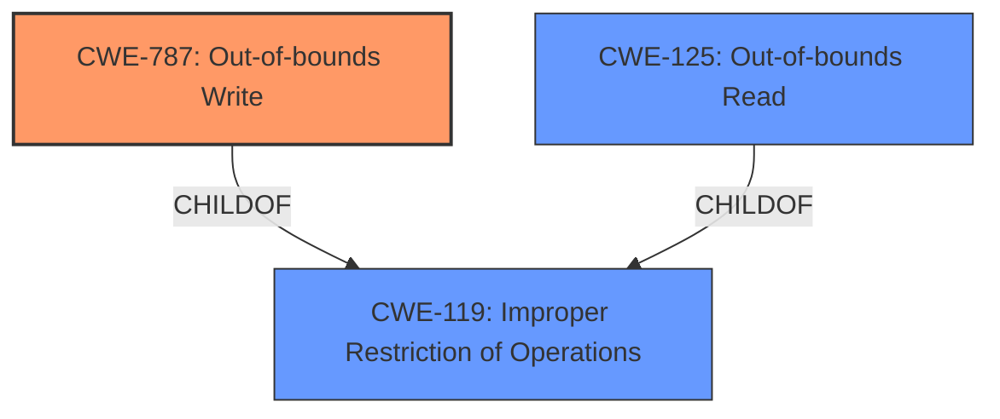

# Raw Analyzer Response for CVE-2021-36000

# Summary
| CWE ID | CWE Name | Confidence | CWE Abstraction Level | CWE Vulnerability Mapping Label | CWE-Vulnerability Mapping Notes |
|---|---|---|---|---|---|
| CWE-787 | Out-of-bounds Write | 1.0 | Base | Allowed | Primary CWE |
| CWE-125 | Out-of-bounds Read | 0.7 | Base | Allowed | Secondary Candidate |

## Evidence and Confidence

*   **Confidence Score:** 0.9
*   **Evidence Strength:** HIGH

## Relationship Analysis
The primary CWE, CWE-787, is a base-level CWE and a child of CWE-119 (Improper Restriction of Operations within the Bounds of a Memory Buffer). CWE-125 (Out-of-bounds Read) is a peer of CWE-787 and also a child of CWE-119. The vulnerability description points strongly towards a write operation that occurs out of bounds, making CWE-787 the more appropriate primary classification. CWE-125 is a reasonable secondary consideration given the shared parent, and the possibility that the vulnerability involves a read operation too.

## Vulnerability Chain
The vulnerability chain starts with a specially crafted file, which leads to **memory corruption** due to an out-of-bounds write, ultimately resulting in arbitrary code execution. The root cause is the **memory corruption** from the OOB write, and the impact is arbitrary code execution.

## Summary of Analysis
The initial analysis and resulting conclusion are based on the evidence provided in the vulnerability description and the CVE reference links content summary. The vulnerability description explicitly mentions "**memory corruption**" when parsing a specially crafted file. The CVE reference links content summary confirms "Access of memory location after end of buffer" and "Out-of-bounds write, leading to arbitrary code execution". This evidence strongly supports the selection of CWE-787 (Out-of-bounds Write) as the primary CWE.

The retriever results and graph relationships also influence the final selection. CWE-787 has the highest retriever score and is a base-level CWE, which is the preferred level of abstraction. The relationship with CWE-119 further clarifies the nature of the vulnerability as related to memory buffer handling.

The selected CWEs are at the optimal level of specificity because they accurately represent the root cause of the vulnerability (out-of-bounds write) and a potential secondary weakness (out-of-bounds read). A more generic CWE like CWE-119 would not capture the specific nature of the **memory corruption**.

Relevant CWE Information:

# Enhanced Context (25 CWEs)
The following CWEs were identified as potentially relevant to this vulnerability:

## CWE-1289: Improper Validation of Unsafe Equivalence in Input
**Abstraction Level**: Base
**Similarity Score**: 0.77
**Source**: dense

**Description**:
The product receives an input value that is used as a resource identifier or other type of reference, but it does not validate or incorrectly validates that the input is equivalent to a potentially-unsafe value.

**Mapping Guidance**:
- Usage: Allowed
- Rationale: This CWE entry is at the Base level of abstraction, which is a preferred level of abstraction for mapping to the root causes of vulnerabilities.

**Analysis:** This CWE is not selected because the primary issue is **memory corruption** due to out-of-bounds write, not improper validation of input equivalence.

## CWE-73: External Control of File Name or Path
**Abstraction Level**: Base
**Similarity Score**: 0.75
**Source**: dense

**Description**:
The product allows user input to control or influence paths or file names that are used in filesystem operations.

**Mapping Guidance**:
- Usage: Allowed
- Rationale: This CWE entry is at the Base level of abstraction, which is a preferred level of abstraction for mapping to the root causes of vulnerabilities.

**Analysis:** This CWE is not selected because the vulnerability is triggered by parsing a specially crafted file, not by external control of file names or paths.

## CWE-665: Improper Initialization
**Abstraction Level**: Class
**Similarity Score**: 0.75
**Source**: dense

**Description**:
The product does not initialize or incorrectly initializes a resource, which might leave the resource in an unexpected state when it is accessed or used.

**Mapping Guidance**:
- Usage: Discouraged
- Rationale: This CWE entry is a level-1 Class (i.e., a child of a Pillar). It might have lower-level children that would be more appropriate

**Analysis:** This CWE is not selected because the root cause is an out-of-bounds write, not an initialization issue.

## CWE-41: Improper Resolution of Path Equivalence
**Abstraction Level**: Base
**Similarity Score**: 0.75
**Source**: dense

**Description**:
The product is vulnerable to file system contents disclosure through path equivalence. Path equivalence involves the use of special characters in file and directory names. The associated manipulations are intended to generate multiple names for the same object.

**Mapping Guidance**:
- Usage: Allowed
- Rationale: This CWE entry is at the Base level of abstraction, which is a preferred level of abstraction for mapping to the root causes of vulnerabilities.

**Analysis:** This CWE is not selected because the vulnerability is not related to path equivalence issues.

## CWE-807: Reliance on Untrusted Inputs in a Security Decision
**Abstraction Level**: Base
**Similarity Score**: 0.75
**Source**: dense

**Description**:
The product uses a protection mechanism that relies on the existence or values of an input, but the input can be modified by an untrusted actor in a way that bypasses the protection mechanism.

**Mapping Guidance**:
- Usage: Allowed
- Rationale: This CWE entry is at the Base level of abstraction, which is a preferred level of abstraction for mapping to the root causes of vulnerabilities.

**Analysis:** This CWE is not selected because the core issue is not reliance on untrusted inputs in a security decision, but rather a buffer overflow due to processing a crafted file.

## CWE-184: Incomplete List of Disallowed Inputs
**Abstraction Level**: Base
**Similarity Score**: 0.75
**Source**: dense

**Description**:
The product implements a protection mechanism that relies on a list of inputs (or properties of inputs) that are not allowed by policy or otherwise require other action to neutralize before additional processing takes place, but the list is incomplete.

**Mapping Guidance**:
- Usage: Allowed
- Rationale: This CWE entry is at the Base level of abstraction, which is a preferred level of abstraction for mapping to the root causes of vulnerabilities.

**Analysis:** This CWE is not selected because the vulnerability is not related to an incomplete list of disallowed inputs.

## CWE-404: Improper Resource Shutdown or Release
**Abstraction Level**: Class
**Similarity Score**: 0.74
**Source**: dense

**Description**:
The product does not release or incorrectly releases a resource before it is made available for re-use.

**Mapping Guidance**:
- Usage: Allowed-with-Review
- Rationale: This CWE entry is a Class and might have Base-level children that would be more appropriate

**Analysis:** This CWE is not selected as the vulnerability doesn't involve resource management issues.

## CWE-552: Files or Directories Accessible to External Parties
**Abstraction Level**: Base
**Similarity Score**: 0.74
**Source**: dense

**Description**:
The product makes files or directories accessible to unauthorized actors, even though they should not be.

**Mapping Guidance**:
- Usage: Allowed
- Rationale: This CWE entry is at the Base level of abstraction, which is a preferred level of abstraction for mapping to the root causes of vulnerabilities.

**Analysis:** This CWE is not selected because the vulnerability does not involve unauthorized access to files or directories.

## CWE-667: Improper Locking
**Abstraction Level**: Class
**Similarity Score**: 0.74
**Source**: dense

**Description**:
The product does not properly acquire or release a lock on a resource, leading to unexpected resource state changes and behaviors.

**Mapping Guidance**:
- Usage: Allowed-with-Review
- Rationale: This CWE entry is a Class and might have Base-level children that would be more appropriate

**Analysis:** This CWE is not selected because the vulnerability doesn't involve improper locking mechanisms.

## CWE-378: Creation of Temporary File With Insecure Permissions
**Abstraction Level**: Base
**Similarity Score**: 0.74
**Source**: dense

**Description**:
Opening temporary files without appropriate measures or controls