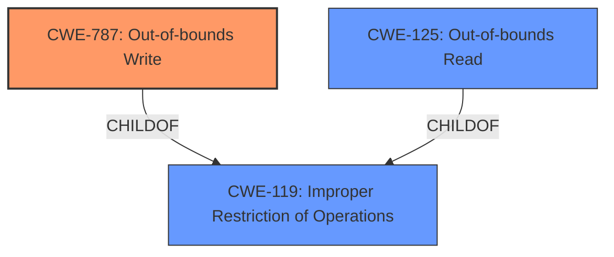

# Analysis Report for CVE-2021-36015

# Vulnerability Analysis Report: CVE-2021-36015

## Description


## Analysis (with Relationship Data)

# Summary
| CWE ID  | CWE Name                       | Confidence | CWE Abstraction Level | CWE Vulnerability Mapping Label | CWE-Vulnerability Mapping Notes |
| :-------- | :----------------------------- | :--------- | :---------------------- | :------------------------------ | :------------------------------ |
| CWE-787 | Out-of-bounds Write          | 1.0        | Base                    | Primary CWE                   | Allowed                         |
| CWE-125 | Out-of-bounds Read            | 0.6        | Base                    | Secondary CWE                  | Allowed                         |
| CWE-119 | Improper Restriction of Operations within the Bounds of a Memory Buffer | 0.6       | Class                    | Secondary CWE                   | Allowed                         |

## Evidence and Confidence

*   **Confidence Score:** 0.9
*   **Evidence Strength:** HIGH

## Relationship Analysis
The primary CWE, CWE-787 [CWE-787: Out-of-bounds Write], is a base-level CWE. It is a child of CWE-119 [CWE-119: Improper Restriction of Operations]. CWE-125 [CWE-125: Out-of-bounds Read] is also a child of CWE-119 [CWE-119: Improper Restriction of Operations]. The selection was influenced by prioritizing the root cause and aligning with the observed behavior of memory corruption due to writing beyond buffer boundaries. The relationships between these CWEs assisted in understanding the potential scope and impact of the vulnerability, leading to a more accurate classification.



## Vulnerability Chain
The vulnerability chain starts with the parsing of a specially crafted file, leading to accessing a memory location after the end of a buffer, and culminating in memory corruption and arbitrary code execution.
  - **Root Cause**: Parsing of a specially crafted file leads to **access of memory location after end of buffer**.
  - **Weakness**: **Memory corruption** due to **out-of-bounds write**.
  - **Impact**: Arbitrary code execution.

## Summary of Analysis
The initial analysis focused on the **memory corruption** vulnerability due to parsing a specially crafted file. The **CVE Reference Links Content Summary** indicates that the root cause is the **access of memory location after end of buffer**. The primary CWE suggested is CWE-787 [CWE-787: Out-of-bounds Write], which aligns with the vulnerability description. The retriever results also list CWE-787 [CWE-787: Out-of-bounds Write] as the top combined result. Given the description, the software accesses a memory location after the end of a buffer, leading to potential memory corruption, this aligns well with CWE-787 [CWE-787: Out-of-bounds Write].
"The product writes data past the end, or before the beginning, of the intended buffer."

CWE-125 [CWE-125: Out-of-bounds Read] was considered as a secondary CWE, as the **access of memory location after end of buffer** could involve reading. The retriever results also list CWE-125 [CWE-125: Out-of-bounds Read].
"The product reads data past the end, or before the beginning, of the intended buffer."

CWE-119 [CWE-119: Improper Restriction of Operations within the Bounds of a Memory Buffer] was considered as a secondary CWE as both CWE-787 [CWE-787: Out-of-bounds Write] and CWE-125 [CWE-125: Out-of-bounds Read] are children of it.

The selected CWEs are at the optimal level of specificity as they accurately represent the **memory corruption** caused by **out-of-bounds write** and read.

Relevant CWE Information:


## CWE Relationship Analysis

Current CWEs represent these abstraction levels: .


### Vulnerability Chain Analysis

**Chain starting from CWE-787:**
- 787 (Out-of-bounds Write) - ROOT


**Chain starting from CWE-119:**
- 119 (Improper Restriction of Operations within the Bounds of a Memory Buffer) - ROOT


### CWE Relationship Diagram

```mermaid
graph TD
    classDef primary fill:#f96,stroke:#333,stroke-width:2px
    classDef secondary fill:#69f,stroke:#333
    classDef tertiary fill:#9e9,stroke:#333
```


*Report generated on 2025-04-02 13:20:07*
