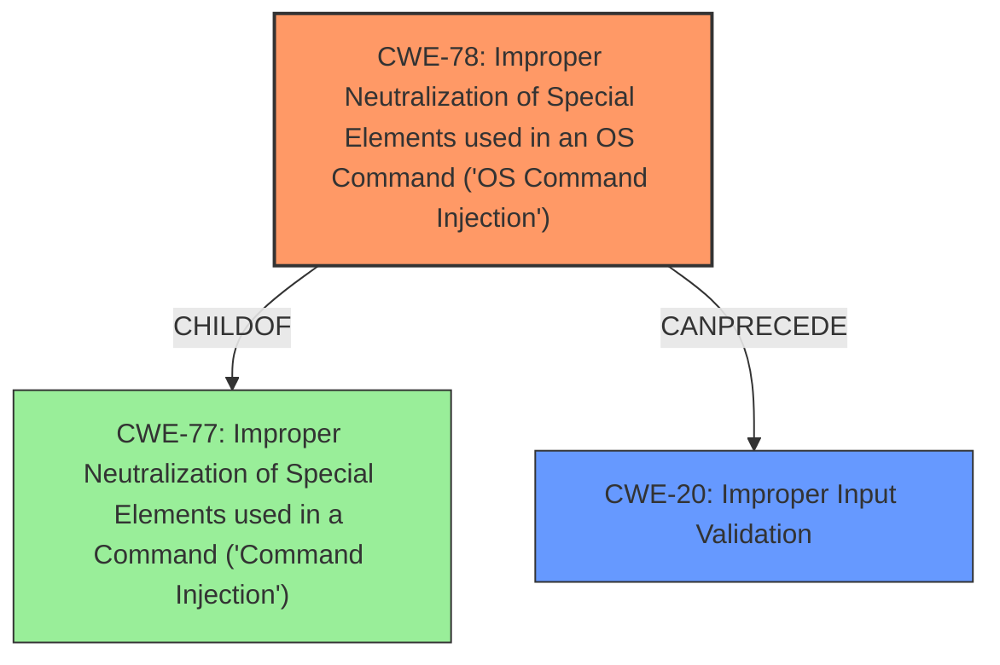

# Analysis for CVE-2021-36024

# Summary
| CWE ID | CWE Name | Confidence | CWE Abstraction Level | CWE Vulnerability Mapping Label | CWE-Vulnerability Mapping Notes |
|---|---|---|---|---|---|
| CWE-78 | Improper Neutralization of Special Elements used in an OS Command ('OS Command Injection') | 0.9 | Base | Allowed | Primary CWE |
| CWE-20 | Improper Input Validation | 0.6 | Base | Allowed | Secondary CWE |

## Evidence and Confidence

*   **Confidence Score:** 0.8
*   **Evidence Strength:** MEDIUM

## Relationship Analysis
The primary CWE is CWE-78, which focuses on the improper neutralization of special elements in OS commands. This vulnerability can be a result of inadequate input validation (CWE-20).

## Vulnerability Chain
The vulnerability chain starts with **Improper Neutralization of Special Elements Used In A Command** (CWE-78) as the root cause. An attacker uploads a specially crafted file, leading to remote code execution. This is facilitated by the absence of proper input validation (CWE-20).

## Summary of Analysis
The primary weakness lies in the **Improper Neutralization of Special Elements Used In A Command** (CWE-78), leading to remote code execution. The description states "An attacker with admin privileges can upload a specially crafted file to achieve remote code execution," which suggests that the application fails to adequately sanitize or neutralize special elements within the uploaded file that are then processed as part of a command. The **Vulnerability Description Key Phrases** section also identifies this as the root cause.

CWE-78 is further supported by the "CVE Reference Links Content Summary," which explicitly mentions **Improper Input Validation** (CWE-20) as a contributing factor. The description indicates that the vulnerability requires admin privileges.

The retriever results also list CWE-78, with a high score indicating relevance. The presence of **Improper Neutralization of Special Elements Used In A Command** is the primary driver of the vulnerability.

I am selecting CWE-78 as the primary CWE because it directly addresses the weakness of improper neutralization leading to OS command injection, and CWE-20 as a secondary CWE because improper input validation is the underlying cause that led to the command injection vulnerability.

Relevant CWE Information:

# Enhanced Context (25 CWEs)
The following CWEs were identified as potentially relevant to this vulnerability:

## CWE-74: Improper Neutralization of Special Elements in Output Used by a Downstream Component ('Injection')
**Abstraction Level**: Class
**Similarity Score**: 0.77
**Source**: dense

**Description**:
The product constructs all or part of a command, data structure, or record using externally-influenced input from an upstream component, but it does not neutralize or incorrectly neutralizes special elements that could modify how it is parsed or interpreted when it is sent to a downstream component.

**Mapping Guidance**:
- Usage: Discouraged
- Rationale: CWE-74 is high-level and often misused when lower-level weaknesses are more appropriate.

## CWE-78: Improper Neutralization of Special Elements used in an OS Command ('OS Command Injection')
**Abstraction Level**: base
**Similarity Score**: 5.03
**Source**: graph

**Description**:
CWE-78: Improper Neutralization of Special Elements used in an OS Command ('OS Command Injection')

**Mapping Guidance**:
- Usage: Allowed
- Rationale: This CWE entry is at the Base level of abstraction, which is a preferred level of abstraction for mapping to the root causes of vulnerabilities.

**Relationships**:
- CANFOLLOW -> CWE-184
- CANALSOBE -> CWE-88
- CHILDOF -> CWE-77
- CHILDOF -> CWE-77
- CHILDOF -> CWE-74

### Summary of Analysis

The vulnerability is due to the **Improper Neutralization of Special Elements Used In A Command** (CWE-78), allowing an attacker with admin privileges to upload a specially crafted file to achieve remote code execution. The **Vulnerability Description Key Phrases** section identifies this as the root cause.

*   **CWE-78: Improper Neutralization of Special Elements used in an OS Command ('OS Command Injection')**
    *   **Technical Explanation:** The application fails to neutralize special elements within the uploaded file. These un-neutralized elements are then used in a command that the system executes, leading to code execution.
    *   **Security Implications:** This can lead to arbitrary code execution on the server.
    *   **Relationship:** CWE-78 is a child of CWE-77 (Improper Neutralization of Special Elements used in a Command ('Command Injection')).
    *   **Mapping Guidance:** The usage is "Allowed," and it is at the Base level of abstraction, which is a preferred level.
    *   **Supporting Evidence:** The vulnerability description explicitly mentions "Improper Neutralization of Special Elements Used In A Command."

*   **CWE-20: Improper Input Validation**
    *   **Technical Explanation:** The application does not properly validate the uploaded file, which allows the attacker to inject malicious commands.
    *   **Security Implications:** This allows an attacker to upload a malicious file that can be executed by the system.
    *   **Relationship:** This is a prerequisite to CWE-78, as proper input validation would prevent the injection of malicious commands.
    *   **Mapping Guidance:** The usage is "Allowed," and it is at the Base level of abstraction, which is a preferred level.
    *   **Supporting Evidence:** The "CVE Reference Links Content Summary" identifies "Improper Input Validation (CWE-20)" as a root cause of the vulnerability.

CWE-77 was considered but not used as the primary CWE because CWE-78 is more specific in that the injection leads to OS Command execution.
CWE-74 was considered but not used as the primary CWE because CWE-78 is more specific in that the command is an OS command.
Other CWEs like CWE-89 (SQL Injection), CWE-79 (Cross-site Scripting), and CWE-22 (Path Traversal) were not used because they do not align with the vulnerability description, which explicitly mentions command injection and code execution via file upload.