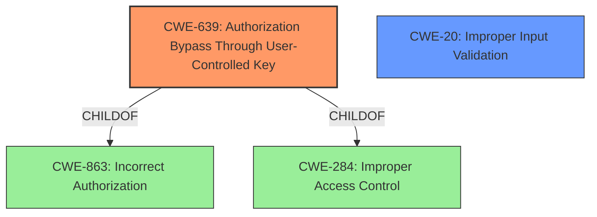

# Raw Analyzer Response for CVE-2021-36032

# Summary
| CWE ID | CWE Name | Confidence | CWE Abstraction Level | CWE Vulnerability Mapping Label | CWE-Vulnerability Mapping Notes |
|---|---|---|---|---|---|
| CWE-639 | Authorization Bypass Through User-Controlled Key | 0.8 | Base | Allowed | Primary CWE: The system's authorization functionality does not prevent one user from gaining access to another user's data or record by modifying the key value identifying the data. |
| CWE-20 | Improper Input Validation | 0.6 | Class | Discouraged | Secondary Candidate: The product receives input or data, but it does not validate or incorrectly validates that the input has the properties that are required to process the data safely and correctly. |

## Evidence and Confidence

*   **Confidence Score:** 0.7
*   **Evidence Strength:** MEDIUM

## Relationship Analysis
The primary CWE is CWE-639, which is a base level CWE and a child of both CWE-863 (Incorrect Authorization) and CWE-284 (Improper Access Control). CWE-20 is a class level CWE and parent to many other specific input validation issues. The relationship that impacted the decision was prioritizing CWE-639 as a more specific issue than CWE-20.

## Vulnerability Chain
The vulnerability chain starts with **improper input validation** (CWE-20) which leads to an insecure direct object reference, culminating in information exposure and privilege escalation.

## Summary of Analysis
The initial assessment identified two potential CWEs: CWE-639 and CWE-20. The vulnerability description states that it is an **improper input validation** vulnerability that can be triggered to achieve information exposure and privilege escalation.
The CVE Reference Links Content Summary states the **root cause of vulnerability** is **improper input validation** (CWE-20). The key phrase is "improper input validation vulnerability".

Based on the retriever results:
- CWE-639 has a high score and is a Base level CWE. Its description closely matches the scenario where an attacker can modify a key to access another user's data.
- CWE-20 is also a good candidate because the description explicitly mentions "**improper input validation**". However, it is a Class level CWE and the mapping guidance discourages its use when more specific CWEs are available.

The analysis concludes that CWE-639 is the primary CWE because it provides a more precise description of the vulnerability, focusing on the authorization bypass aspect, where the **improper input validation** allows for manipulation of keys used for authorization. CWE-20 is kept as a secondary candidate.

Relevant CWE Information:

# Enhanced Context (25 CWEs)

## CWE-807: Reliance on Untrusted Inputs in a Security Decision
**Abstraction Level**: Base
**Similarity Score**: 0.76
**Source**: dense

**Description**:
The product uses a protection mechanism that relies on the existence or values of an input, but the input can be modified by an untrusted actor in a way that bypasses the protection mechanism.

**Why it was not selected:** While this CWE is related, it is not as specific as CWE-639 because it describes a general reliance on untrusted inputs, whereas CWE-639 specifically addresses authorization bypass.

## CWE-668: Exposure of Resource to Wrong Sphere
**Abstraction Level**: Class
**Similarity Score**: 0.76
**Source**: dense

**Description**:
The product exposes a resource to the wrong control sphere, providing unintended actors with inappropriate access to the resource.

**Why it was not selected:** CWE-668 is too high-level and general. While the vulnerability does result in exposure, the root cause is more specifically related to authorization bypass.

## CWE-639: Authorization Bypass Through User-Controlled Key
**Abstraction Level**: Base
**Similarity Score**: 0.76
**Source**: dense

**Description**:
The system's authorization functionality does not prevent one user from gaining access to another user's data or record by modifying the key value identifying the data.

**Why it was selected:** It aligns directly with the vulnerability description, where an attacker can modify a key to access another user's data, bypassing authorization checks.

## CWE-653: Improper Isolation or Compartmentalization
**Abstraction Level**: Class
**Similarity Score**: 0.76
**Source**: dense

**Description**:
The product does not properly compartmentalize or isolate functionality, processes, or resources that require different privilege levels, rights, or permissions.

**Why it was not selected:** While this could be a contributing factor, the core issue is the authorization bypass through user-controlled keys, which is more accurately captured by CWE-639.

## CWE-1289: Improper Validation of Unsafe Equivalence in Input
**Abstraction Level**: Base
**Similarity Score**: 0.76
**Source**: dense

**Description**:
The product receives an input value that is used as a resource identifier or other type of reference, but it does not validate or incorrectly validates that the input is equivalent to a potentially-unsafe value.

**Why it was not selected:** This CWE is related to **improper input validation** but doesn't directly address the authorization bypass. It is also less specific than CWE-639.

## CWE-1220: Insufficient Granularity of Access Control
**Abstraction Level**: Base
**Similarity Score**: 0.75
**Source**: dense

**Description**:
The product implements access controls via a policy or other feature with the intention to disable or restrict accesses (reads and/or writes) to assets in a system from untrusted agents. However, implemented access controls lack required granularity, which renders the control policy too broad because it allows accesses from unauthorized agents to the security-sensitive assets.

**Why it was not selected:** The issue is not with the granularity of the access control, but with the ability to bypass authorization checks altogether.

## CWE-74: Improper Neutralization of Special Elements in Output Used by a Downstream Component ('Injection')
**Abstraction Level**: Class
**Similarity Score**: 0.75
**Source**: dense

**Description**:
The product constructs all or part of a command, data structure, or record using externally-influenced input from an upstream component, but it does not neutralize or incorrectly neutralizes special elements that could modify how it is parsed or interpreted when it is sent to a downstream component.

**Why it was not selected:** This CWE focuses on injection vulnerabilities, which is not the primary issue here. The vulnerability is about bypassing authorization, not injecting malicious code.

## CWE-274: Improper Handling of Insufficient Privileges
**Abstraction Level**: Base
**Similarity Score**: 0.75
**Source**: dense

**Description**:
The product does not handle or incorrectly handles when it has insufficient privileges to perform an operation, leading to resultant weaknesses.

**Why it was not selected:** The vulnerability doesn't involve insufficient privileges but rather the ability to escalate privileges through authorization bypass.

## CWE-610: Externally Controlled Reference to a Resource in Another Sphere
**Abstraction Level**: Class
**Similarity Score**: 0.75
**Source**: dense

**Description**:
The product uses an externally controlled name or reference that resolves to a resource that is outside of the intended control sphere.

**Why it was not selected:** This CWE is about accessing resources outside the intended control sphere, but the more direct issue is the authorization bypass facilitated by user-controlled keys.

## CWE-41: Improper Resolution of Path Equivalence
**Abstraction Level**: Base
**Similarity Score**: 0.74
**Source**: dense

**Description**:
The product is vulnerable to file system contents disclosure through path equivalence. Path equivalence involves the use of special characters in file and directory names. The associated manipulations are intended to generate multiple names for the same object.

**Why it was not selected:** This is specific to file system path equivalence issues, which is not relevant to the described vulnerability.