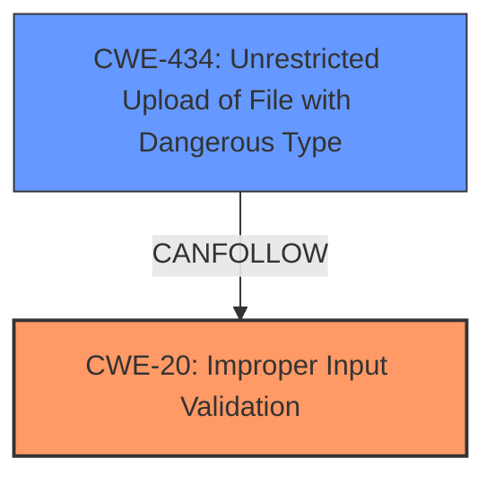

# Analysis for CVE-2021-36034

# Summary
| CWE ID | CWE Name | Confidence | CWE Abstraction Level | CWE Vulnerability Mapping Label | CWE-Vulnerability Mapping Notes |
|---|---|---|---|---|---|
| CWE-20 | Improper Input Validation | 1.0 | Class | Primary | Discouraged, but directly identified in the vulnerability description and CVE summary |
| CWE-434 | Unrestricted Upload of File with Dangerous Type | 0.8 | Base | Secondary | Allowed, reflects the attack vector. |

## Evidence and Confidence

*   **Confidence Score:** 0.9
*   **Evidence Strength:** HIGH

## Relationship Analysis
The primary CWE is CWE-20, which is a class-level CWE. While discouraged, it's used because the description explicitly mentions "**improper input validation**". CWE-434, a base-level CWE, is considered as a secondary weakness, representing the specific attack vector of uploading a file with a dangerous type.

## Vulnerability Chain
The vulnerability chain starts with the attacker having admin privileges, then uploading a specially crafted file (**vector**). This leverages the **improper input validation** (**rootcause**) to achieve remote code execution (**impact**).
  - **Root Cause:** CWE-20 Improper Input Validation
  - **Attack Vector:** CWE-434 Unrestricted Upload of File with Dangerous Type
  - **Impact:** Remote Code Execution

## Summary of Analysis
The initial assessment identified CWE-20 as a primary candidate due to the explicit mention of "**improper input validation**" in both the vulnerability description and CVE summary. Despite the discouragement of using CWE-20 due to its high-level nature, the direct evidence supports its inclusion. CWE-434 was chosen as a secondary CWE because the attack vector involves uploading a malicious file.

The relationship graph highlights how CWE-434 (Unrestricted Upload of File with Dangerous Type) can lead to CWE-20 (Improper Input Validation), where the **improper validation** allows the dangerous file to be processed, leading to remote code execution.

The selection of CWEs is based on the provided evidence, and while CWE-20 is a high-level class, the specific context and explicit mention in the vulnerability description justify its inclusion. CWE-434 adds specificity by detailing the file upload attack vector.

Relevant CWE Information:

# Enhanced Context (25 CWEs)
The following CWEs were identified as potentially relevant to this vulnerability:

## CWE-1289: Improper Validation of Unsafe Equivalence in Input
**Abstraction Level**: Base
**Similarity Score**: 0.77

## CWE-807: Reliance on Untrusted Inputs in a Security Decision
**Abstraction Level**: Base
**Similarity Score**: 0.76

## CWE-184: Incomplete List of Disallowed Inputs
**Abstraction Level**: Base
**Similarity Score**: 0.75

## CWE-41: Improper Resolution of Path Equivalence
**Abstraction Level**: Base
**Similarity Score**: 0.75

## CWE-73: External Control of File Name or Path
**Abstraction Level**: Base
**Similarity Score**: 0.75

## CWE-274: Improper Handling of Insufficient Privileges
**Abstraction Level**: Base
**Similarity Score**: 0.75

## CWE-23: Relative Path Traversal
**Abstraction Level**: Base
**Similarity Score**: 0.75

## CWE-653: Improper Isolation or Compartmentalization
**Abstraction Level**: Class
**Similarity Score**: 0.75

## CWE-280: Improper Handling of Insufficient Permissions or Privileges
**Abstraction Level**: Base
**Similarity Score**: 0.75

## CWE-404: Improper Resource Shutdown or Release
**Abstraction Level**: Class
**Similarity Score**: 0.75

## CWE-22: Improper Limitation of a Pathname to a Restricted Directory ('Path Traversal')
**Abstraction Level**: Base
**Similarity Score**: 7446.33

## CWE-23: Relative Path Traversal
**Abstraction Level**: Base
**Similarity Score**: 7062.82

## CWE-863: Incorrect Authorization
**Abstraction Level**: Class
**Similarity Score**: 6883.82

## CWE-73: External Control of File Name or Path
**Abstraction Level**: Base
**Similarity Score**: 6874.63

## CWE-639: Authorization Bypass Through User-Controlled Key
**Abstraction Level**: Base
**Similarity Score**: 6843.32

## CWE-434: Unrestricted Upload of File with Dangerous Type
**Abstraction Level**: base
**Similarity Score**: 5.03

## CWE-183: Permissive List of Allowed Inputs
**Abstraction Level**: base
**Similarity Score**: 4.82

## CWE-178: Improper Handling of Case Sensitivity
**Abstraction Level**: base
**Similarity Score**: 4.51

## CWE-430: Deployment of Wrong Handler
**Abstraction Level**: base
**Similarity Score**: 4.39

## CWE-22: Improper Limitation of a Pathname to a Restricted Directory ('Path Traversal')
**Abstraction Level**: base
**Similarity Score**: 4.33

## CWE-770: Allocation of Resources Without Limits or Throttling
**Abstraction Level**: base
**Similarity Score**: 4.33

## CWE-190: Integer Overflow or Wraparound
**Abstraction Level**: base
**Similarity Score**: 4.33

## CWE-59: Improper Link Resolution Before File Access ('Link Following')
**Abstraction Level**: base
**Similarity Score**: 4.33

## CWE-98: Improper Control of Filename for Include/Require Statement in PHP Program ('PHP Remote File Inclusion')
**Abstraction Level**: variant
**Similarity Score**: 3.88

## CWE-351: Insufficient Type Distinction
**Abstraction Level**: base
**Similarity Score**: 3.64

**CWE-20: Improper Input Validation**
*   **How the vulnerability's details match the CWE's characteristics:** The vulnerability description explicitly states that there is an **improper input validation** issue. The attacker can upload a specially crafted file, which bypasses the validation and leads to remote code execution.
*   **The security implications and potential impact:** Remote code execution.
*   **Any parent-child relationships or chain patterns that influenced your mapping:** CWE-20 is a Class-level CWE, and the guidance discourages its use when more specific CWEs are available. However, the explicit mention of **improper input validation** justifies its selection in this case.
*   **Whether the weakness is primary or secondary in the vulnerability:** Primary.
*   **How the official MITRE mapping guidance influenced your decision:** While the mapping guidance discourages using CWE-20, the direct mention of **improper input validation** makes it a relevant and necessary inclusion.

**CWE-434: Unrestricted Upload of File with Dangerous Type**
*   **How the vulnerability's details match the CWE's characteristics:** The attacker uploads a specially crafted file. The system does not restrict the upload of dangerous file types.
*   **The security implications and potential impact:** Remote code execution.
*   **Any parent-child relationships or chain patterns that influenced your mapping:** CWE-434 can lead to other vulnerabilities if the uploaded file is not properly validated.
*   **Whether the weakness is primary or secondary in the vulnerability:** Secondary.
*   **How the official MITRE mapping guidance influenced your decision:** The mapping guidance allows the use of CWE-434, as it is at the Base level of abstraction.

**Other CWEs Considered but Not Used**
*   CWE-22 (Improper Limitation of a Pathname to a Restricted Directory ('Path Traversal')): While path traversal could be involved in the remote code execution, the description doesn't explicitly mention it. It is also not as direct a cause as CWE-434 and CWE-20.
*   CWE-73 (External Control of File Name or Path): Similar to CWE-22, this is a possibility but not explicitly stated in the description.
*   CWE-863 (Incorrect Authorization): The description states that an attacker with admin privileges can exploit this vulnerability. This suggests the attacker is authorized, but the **input validation** is flawed and the attacker is able to upload a malicious file that executes code.