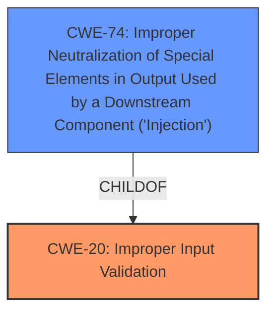

# Enhanced Analysis for CVE-2021-36035

# Summary
| CWE ID  | CWE Name                                                                    | Confidence | CWE Abstraction Level | CWE Vulnerability Mapping Label | CWE-Vulnerability Mapping Notes |
| :-------- | :-------------------------------------------------------------------------- | :---------- | :---------------------- | :------------------------------ | :------------------------------ |
| CWE-20  | Improper Input Validation                                                      | 0.9        | Class                   | Primary                         | Discouraged                  |
| CWE-74  | Improper Neutralization of Special Elements in Output Used by a Downstream Component ('Injection') | 0.6        | Class                   | Secondary                         | Discouraged                  |

## Evidence and Confidence

*   **Confidence Score:** 0.9
*   **Evidence Strength:** HIGH

## Relationship Analysis
The primary relationship influencing the CWE selection is the direct match of the **improper input validation** root cause. While CWE-20 is a class-level CWE, it is the most direct representation of the stated weakness. CWE-74 is a parent of several injection-related CWEs and may also be relevant given the potential for remote code execution, implying a possible injection scenario. However, the description emphasizes validation issues over specific injection techniques.



## Vulnerability Chain
The vulnerability chain starts with **improper input validation**. This leads to a crafted request being processed by the Adobe Stock API, ultimately resulting in remote code execution. The chain is:

1.  **Improper Input Validation (CWE-20)**: The Magento Commerce version fails to properly validate input from a crafted request.
2.  Adobe Stock API processes the invalid request.
3.  Remote Code Execution (Impact): Attacker achieves remote code execution.

## Summary of Analysis
The initial assessment identified **improper input validation** as the primary root cause based on the vulnerability description and CVE reference summary.

The assessment is heavily based on the provided evidence, particularly the "Vulnerability Description Key Phrases" which clearly states "**rootcause: improper input validation**" and the "CVE Reference Links Content Summary" which identifies the "**Root Cause of Vulnerability:** The root cause is identified as "Improper Input Validation" (CWE-20)."

CWE-20 is selected because it aligns directly with the root cause identified in the vulnerability description and CVE reference summary. Despite being a class-level CWE, it accurately represents the **improper input validation** weakness. The potential for remote code execution suggests that CWE-74 might be applicable, but the primary issue is the lack of proper validation, making CWE-20 the most appropriate primary classification.
CWE-74 is included as a secondary candidate because the rootcause of "Improper Input Validation" could lead to injection.

Relevant CWE Information:

# Enhanced Context (25 CWEs)

## CWE-1289: Improper Validation of Unsafe Equivalence in Input
**Abstraction Level**: Base
**Similarity Score**: 0.76
**Source**: dense

**Description**:
The product receives an input value that is used as a resource identifier or other type of reference, but it does not validate or incorrectly validates that the input is equivalent to a potentially-unsafe value.
*Not Used:* While this is related to input validation, the description is too specific to equivalence in input.

## CWE-807: Reliance on Untrusted Inputs in a Security Decision
**Abstraction Level**: Base
**Similarity Score**: 0.75
**Source**: dense

**Description**:
The product uses a protection mechanism that relies on the existence or values of an input, but the input can be modified by an untrusted actor in a way that bypasses the protection mechanism.
*Not Used:* The description is more about bypassing a protection mechanism, while the vulnerability is about **improper input validation**.

## CWE-665: Improper Initialization
**Abstraction Level**: Class
**Similarity Score**: 0.74
**Source**: dense

**Description**:
The product does not initialize or incorrectly initializes a resource, which might leave the resource in an unexpected state when it is accessed or used.
*Not Used:* The description is related to initialization, while the vulnerability is about **improper input validation**.

## CWE-664: Improper Control of a Resource Through its Lifetime
**Abstraction Level**: Pillar
**Similarity Score**: 0.74
**Source**: dense

**Description**:
The product does not maintain or incorrectly maintains control over a resource throughout its lifetime of creation, use, and release.
*Not Used:* The description is too high-level.

## CWE-184: Incomplete List of Disallowed Inputs
**Abstraction Level**: Base
**Similarity Score**: 0.74
**Source**: dense

**Description**:
The product implements a protection mechanism that relies on a list of inputs (or properties of inputs) that are not allowed by policy or otherwise require other action to neutralize before additional processing takes place, but the list is incomplete.
*Not Used:* The description is too specific to a list of disallowed inputs.

## CWE-639: Authorization Bypass Through User-Controlled Key
**Abstraction Level**: Base
**Similarity Score**: 0.74
**Source**: dense

**Description**:
The system's authorization functionality does not prevent one user from gaining access to another user's data or record by modifying the key value identifying the data.
*Not Used:* The description is about authorization bypass, while the vulnerability is about **improper input validation**.

## CWE-41: Improper Resolution of Path Equivalence
**Abstraction Level**: Base
**Similarity Score**: 0.74
**Source**: dense

**Description**:
The product is vulnerable to file system contents disclosure through path equivalence. Path equivalence involves the use of special characters in file and directory names. The associated manipulations are intended to generate multiple names for the same object.
*Not Used:* The description is about path equivalence, while the vulnerability is about **improper input validation**.

## CWE-74: Improper Neutralization of Special Elements in Output Used by a Downstream Component ('Injection')
**Abstraction Level**: Class
**Similarity Score**: 0.74
**Source**: dense

**Description**:
The product constructs all or part of a command, data structure, or record using externally-influenced input from an upstream component, but it does not neutralize or incorrectly neutralizes special elements that could modify how it is parsed or interpreted when it is sent to a downstream component.
*Used as Secondary Candidate:* The remote code execution impact makes this a possiblity.

## CWE-653: Improper Isolation or Compartmentalization
**Abstraction Level**: Class
**Similarity Score**: 0.74
**Source**: dense

**Description**:
The product does not properly compartmentalize or isolate functionality, processes, or resources that require different privilege levels, rights, or permissions.
*Not Used:* The description is about isolation, while the vulnerability is about **improper input validation**.

## CWE-73: External Control of File Name or Path
**Abstraction Level**: Base
**Similarity Score**: 0.74
**Source**: dense

**Description**:
The product allows user input to control or influence paths or file names that are used in filesystem operations.
*Not Used:* The description is too specific to file names and paths.

## CWE-22: Improper Limitation of a Pathname to a Restricted Directory ('Path Traversal')
**Abstraction Level**: Base
**Similarity Score**: 9100.00
**Source**: sparse

**Description**:
The product uses external input to construct a pathname that is intended to identify a file or directory that is located underneath a restricted parent directory, but the product does not properly neutralize special elements within the pathname that can cause the pathname to resolve to a location that is outside of the restricted directory.
*Not Used:* The description is about path traversal, while the vulnerability is about **improper input validation**.

## CWE-79: Improper Neutralization of Input During Web Page Generation ('Cross-site Scripting')
**Abstraction Level**: Base
**Similarity Score**: 8936.03
**Source**: sparse

**Description**:
The product does not neutralize or incorrectly neutralizes user-controllable input before it is placed in output that is used as a web page that is served to other users.
*Not Used:* The description is about cross-site scripting, while the vulnerability is about **improper input validation**.

## CWE-639: Authorization Bypass Through User-Controlled Key
**Abstraction Level**: Base
**Similarity Score**: 8908.91
**Source**: sparse

**Description**:
The system's authorization functionality does not prevent one user from gaining access to another user's data or record by modifying the key value identifying the data.
*Not Used:* The description is about authorization bypass, while the vulnerability is about **improper input validation**.

## CWE-116: Improper Encoding or Esc


## CWE Relationship Analysis

Current CWEs represent these abstraction levels: .


### Vulnerability Chain Analysis

**Chain starting from CWE-664:**
- 664 (Improper Control of a Resource Through its Lifetime) - ROOT


**Chain starting from CWE-79:**
- 79 (Improper Neutralization of Input During Web Page Generation ('Cross-site Scripting')) - ROOT


### CWE Relationship Diagram

```mermaid
graph TD
    classDef primary fill:#f96,stroke:#333,stroke-width:2px
    classDef secondary fill:#69f,stroke:#333
    classDef tertiary fill:#9e9,stroke:#333
```