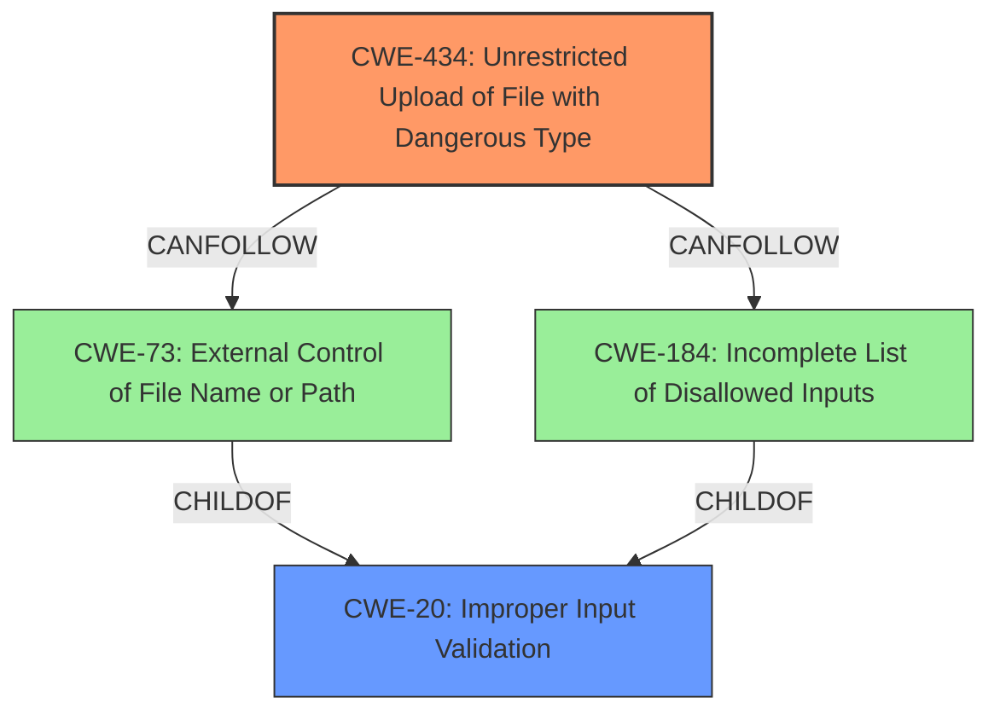

# Enhanced Analysis for CVE-2021-36041

# Summary
| CWE ID | CWE Name | Confidence | CWE Abstraction Level | CWE Vulnerability Mapping Label | CWE-Vulnerability Mapping Notes |
|---|---|---|---|---|---|
| CWE-434 | Unrestricted Upload of File with Dangerous Type | 1.0 | Base | Primary | Allowed |
| CWE-20 | Improper Input Validation | 0.7 | Class | Secondary | Discouraged |

## Evidence and Confidence

*   **Confidence Score:** 0.85
*   **Evidence Strength:** HIGH

## Relationship Analysis
The primary CWE is CWE-434, which describes the unrestricted upload of a file with a dangerous type. The secondary CWE is CWE-20, Improper Input Validation. CWE-434 can follow CWE-184 (Incomplete List of Disallowed Inputs), CWE-73 (External Control of File Name or Path), and CWE-20. CWE-20 is a general class of weakness and is often the parent of more specific input validation issues.



## Vulnerability Chain
The vulnerability chain starts with the **improper input validation** (CWE-20), which then leads to the unrestricted upload of a file with a dangerous type (CWE-434), ultimately resulting in remote code execution.

## Summary of Analysis
The vulnerability description clearly indicates that the Magento Commerce application is affected by an **improper input validation** vulnerability, where an attacker with admin privileges can upload a specially crafted file leading to remote code execution.

The **Vulnerability Description Key Phrases** section also highlights the **rootcause** as **improper input validation**. The CVE reference links content summary confirms this, stating "Root cause of vulnerability: Improper Input Validation" and "Weaknesses/vulnerabilities present: Improper input validation leading to arbitrary code execution."

Based on this evidence, the primary CWE is determined to be CWE-434 (Unrestricted Upload of File with Dangerous Type) with a confidence of 1.0. This is because the attacker is able to upload a specially crafted file, indicating that there are insufficient restrictions on the type of file being uploaded. CWE-434 is a Base level CWE, which is the preferred level of abstraction.

CWE-20 (Improper Input Validation) is also considered as a secondary CWE with a confidence of 0.7. While the description mentions **improper input validation**, CWE-20 is a broad class and is discouraged by MITRE. It is included because the **improper input validation** is the root cause that allows the unrestricted file upload.

The retriever results listed CWE-22 (Improper Limitation of a Pathname to a Restricted Directory ('Path Traversal')) and CWE-73 (External Control of File Name or Path). These CWEs are related to path traversal vulnerabilities, where an attacker can manipulate file paths to access unauthorized files. While file upload is involved, the core issue isn't path manipulation but rather the unrestricted upload of dangerous file types. Therefore, these CWEs were not selected.
CWE-285 (Improper Authorization) and CWE-863 (Incorrect Authorization) were also listed. While the attacker needs admin privileges, the core issue is not an authorization bypass but the ability to upload a dangerous file type. Therefore, these CWEs were not selected.
CWE-787 (Out-of-bounds Write) was also listed. However, the vulnerability description does not indicate any out-of-bounds write issues. Therefore, this CWE was not selected.


## CWE Relationship Analysis

Current CWEs represent these abstraction levels: .


### Vulnerability Chain Analysis

**Chain starting from CWE-787:**
- 787 (Out-of-bounds Write) - ROOT


**Chain starting from CWE-73:**
- 73 (External Control of File Name or Path) - ROOT


### CWE Relationship Diagram

```mermaid
graph TD
    classDef primary fill:#f96,stroke:#333,stroke-width:2px
    classDef secondary fill:#69f,stroke:#333
    classDef tertiary fill:#9e9,stroke:#333
```