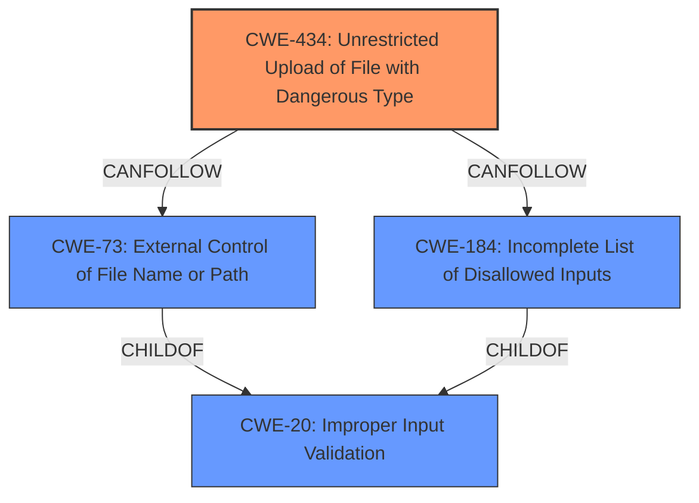

# Analysis for CVE-2021-36042

# Summary
| CWE ID | CWE Name | Confidence | CWE Abstraction Level | CWE Vulnerability Mapping Label | CWE-Vulnerability Mapping Notes |
|---|---|---|---|---|---|
| CWE-434 | Unrestricted Upload of File with Dangerous Type | 0.9 | Base | Allowed | Primary CWE |
| CWE-20 | Improper Input Validation | 0.6 | Class | Discouraged | Secondary Candidate |

## Evidence and Confidence

*   **Confidence Score:** 0.8
*   **Evidence Strength:** HIGH

## Relationship Analysis
The primary relationship influencing the selection was the parent-child relationship and the CANFOLLOW relationship of CWE-434. CWE-434 is a base CWE, and it CANFOLLOW CWE-73 and CWE-184, which describe how the file name/path is obtained and that the list of disallowed inputs is incomplete. CWE-20 is a parent of CWE-73 and CWE-184. Thus, the program did not validate the file type, which led to the file being uploaded.

## Vulnerability Chain
The vulnerability chain starts with **improper input validation** (CWE-20), leading to an **unrestricted upload of a file with a dangerous type** (CWE-434), ultimately resulting in remote code execution.

## Summary of Analysis
The initial analysis focused on identifying the **root cause** of the vulnerability and its subsequent impact. The vulnerability description clearly states that the root cause is an **improper input validation**, which leads to an **unrestricted file upload**, ultimately enabling remote code execution.

The evidence from the vulnerability description and CVE reference links supports this assessment:

*   "**improper input validation** vulnerability"
*   "An attacker with Admin privileges can achieve **unrestricted file upload** which can result in remote code execution."
*   "**Root Cause of Vulnerability:** **Improper Input Validation** (CWE-20)"

Based on the evidence, CWE-434 (Unrestricted Upload of File with Dangerous Type) is the primary CWE because the **improper input validation** leads directly to a dangerous file type being uploaded without restriction. This aligns with the CWE's description: "The product allows the upload or transfer of dangerous file types that are automatically processed within its environment."

CWE-20 (Improper Input Validation) is considered as a secondary CWE because the root cause is the **improper input validation**, but is a more general and less descriptive CWE than CWE-434. The mapping guidance for CWE-20 discourages its use when lower-level CWEs are available. The direct consequence of the **improper input validation** is the ability to upload a file of a dangerous type without restriction.

The selection of CWE-434 is at the optimal level of specificity, as it directly addresses the vulnerability of allowing unrestricted uploads of dangerous file types.

Relevant CWE Information:

# Enhanced Context (25 CWEs)
The following CWEs were identified as potentially relevant to this vulnerability:

## CWE-434: Unrestricted Upload of File with Dangerous Type
**Abstraction Level**: Base
**Similarity Score**: 5.03
**Source**: graph

**Description**:
CWE-434: Unrestricted Upload of File with Dangerous Type

**Mapping Guidance**:
- Usage: Allowed
- Rationale: This CWE entry is at the Base level of abstraction, which is a preferred level of abstraction for mapping to the root causes of vulnerabilities.

**Relationships**:
- CANFOLLOW -> CWE-73
- CANFOLLOW -> CWE-184
- CANFOLLOW -> CWE-183
- PEEROF -> CWE-430
- PEEROF -> CWE-436

## CWE-20: Improper Input Validation
**Abstraction:** Class
**Status:** Stable

### Description
The product receives input or data, but it does
        not validate or incorrectly validates that the input has the
        properties that are required to process the data safely and
        correctly.

### Extended Description

Input validation is a frequently-used technique for checking potentially dangerous inputs in order to ensure that the inputs are safe for processing within the code, or when communicating with other components. When software does not validate input properly, an attacker is able to craft the input in a form that is not expected by the rest of the application. This will lead to parts of the system receiving unintended input, which may result in altered control flow, arbitrary control of a resource, or arbitrary code execution.