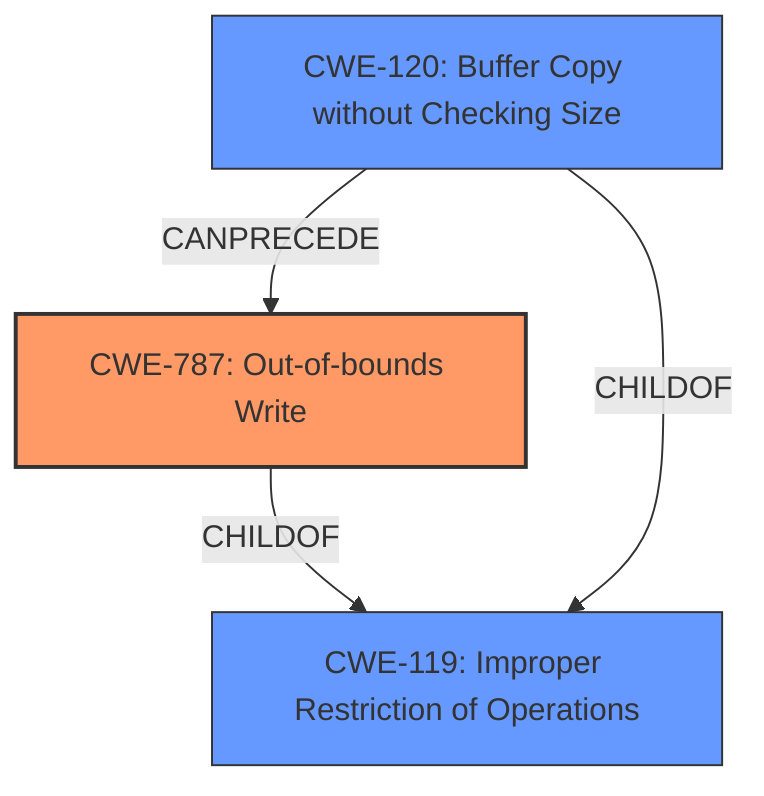

# Analysis for CVE-2021-36046

# Summary
| CWE ID | CWE Name | Confidence | CWE Abstraction Level | CWE Vulnerability Mapping Label | CWE-Vulnerability Mapping Notes |
|---|---|---|---|---|---|
| CWE-787 | Out-of-bounds Write | 1.0 | Base | Allowed | Primary CWE |

## Evidence and Confidence

*   **Confidence Score:** 1.0
*   **Evidence Strength:** HIGH

## Relationship Analysis
The primary CWE identified is CWE-787 (**Out-of-bounds Write**). This is a Base level CWE which is the preferred level of abstraction. CWE-787 has hierarchical relationships as a `ChildOf` CWE-119 (**Improper Restriction of Operations within the Bounds of a Memory Buffer**). CWE-120 (**Buffer Copy without Checking Size of Input ('Classic Buffer Overflow')**) is another `ChildOf` CWE-119 and `CanPrecede` CWE-787. These relationships show that writing past the end of a buffer is related to buffer overflows and improper restrictions on buffer operations.

## Vulnerability Chain
The vulnerability chain starts with a **memory corruption** vulnerability. This leads to an **out-of-bounds write**, which can result in arbitrary code execution. The provided information does not detail the specific steps leading to the memory corruption, so the chain is:
1. **Memory corruption** (Root Cause)
2. CWE-787 (**Out-of-bounds Write**)
3. Arbitrary code execution (Impact)

## Summary of Analysis
The analysis is based on the provided evidence, which indicates a **memory corruption** vulnerability in XMP Toolkit version 2020.1 (and earlier). The root cause is identified as an **out-of-bounds write**, which directly corresponds to CWE-787 (**Out-of-bounds Write**).

The vulnerability description mentions "access of memory location after end of buffer" in the "CVE Reference Links Content Summary" section. This is strong evidence for an out-of-bounds write. The "Vulnerability Description Key Phrases" section mentions "**memory corruption**" as the **weakness**.

The retriever results also support this conclusion, with CWE-787 (**Out-of-bounds Write**) being the top combined result.

The selection of CWE-787 (**Out-of-bounds Write**) is at the optimal level of specificity because it directly describes the **root cause** of the vulnerability which is writing data past the end of the intended buffer. Other CWEs, such as CWE-119 (**Improper Restriction of Operations within the Bounds of a Memory Buffer**), are more general and do not accurately represent the specific weakness.

Relevant CWE Information:

# Enhanced Context (25 CWEs)
The following CWEs were identified as potentially relevant to this vulnerability:

## CWE-226: Sensitive Information in Resource Not Removed Before Reuse
**Abstraction Level**: Base
**Similarity Score**: 0.76
**Source**: dense

**Description**:
The product releases a resource such as memory or a file so that it can be made available for reuse, but it does not clear or "zeroize" the information contained in the resource before the product performs a critical state transition or makes the resource available for reuse by other entities.

**Mapping Guidance**:
- Usage: Allowed
- Rationale: This CWE entry is at the Base level of abstraction, which is a preferred level of abstraction for mapping to the root causes of vulnerabilities.

**Why Not Used**: This CWE is not related to the vulnerability description as there is no mention of sensitive information being reused.

## CWE-667: Improper Locking
**Abstraction Level**: Class
**Similarity Score**: 0.76
**Source**: dense

**Description**:
The product does not properly acquire or release a lock on a resource, leading to unexpected resource state changes and behaviors.

**Mapping Guidance**:
- Usage: Allowed-with-Review
- Rationale: This CWE entry is a Class and might have Base-level children that would be more appropriate

**Why Not Used**: There is no indication of locking issues in the vulnerability description.

## CWE-191: Integer Underflow (Wrap or Wraparound)
**Abstraction Level**: Base
**Similarity Score**: 0.75
**Source**: dense

**Description**:
The product subtracts one value from another, such that the result is less than the minimum allowable integer value, which produces a value that is not equal to the correct result.

**Mapping Guidance**:
- Usage: Allowed
- Rationale: This CWE entry is at the Base level of abstraction, which is a preferred level of abstraction for mapping to the root causes of vulnerabilities.

**Why Not Used**: There is no indication of integer underflow in the vulnerability description.

## CWE-404: Improper Resource Shutdown or Release
**Abstraction Level**: Class
**Similarity Score**: 0.75
**Source**: dense

**Description**:
The product does not release or incorrectly releases a resource before it is made available for re-use.

**Mapping Guidance**:
- Usage: Allowed-with-Review
- Rationale: This CWE entry is a Class and might have Base-level children that would be more appropriate

**Why Not Used**: There is no indication of improper resource shutdown or release in the vulnerability description.

## CWE-131: Incorrect Calculation of Buffer Size
**Abstraction Level**: Base
**Similarity Score**: 0.74
**Source**: dense

**Description**:
The product does not correctly calculate the size to be used when allocating a buffer, which could lead to a buffer overflow.

**Mapping Guidance**:
- Usage: Allowed
- Rationale: This CWE entry is at the Base level of abstraction, which is a preferred level of abstraction for mapping to the root causes of vulnerabilities.

**Why Not Used**: While this could lead to a buffer overflow, the description specifically mentions memory corruption due to writing past the end of the buffer, making CWE-787 a more precise match.

## CWE-665: Improper Initialization
**Abstraction Level**: Class
**Similarity Score**: 0.74
**Source**: dense

**Description**:
The product does not initialize or incorrectly initializes a resource, which might leave the resource in an unexpected state when it is accessed or used.

**Mapping Guidance**:
- Usage: Discouraged
- Rationale: This CWE entry is a level-1 Class (i.e., a child of a Pillar). It might have lower-level children that would be more appropriate

**Why Not Used**: There is no mention of initialization issues in the vulnerability description.

## CWE-457: Use of Uninitialized Variable
**Abstraction Level**: Variant
**Similarity Score**: 0.74
**Source**: dense

**Description**:
The code uses a variable that has not been initialized, leading to unpredictable or unintended results.

**Mapping Guidance**:
- Usage: Allowed
- Rationale: This CWE entry is at the Variant level of abstraction, which is a preferred level of abstraction for mapping to the root causes of vulnerabilities.

**Why Not Used**: There is no mention of uninitialized variables in the vulnerability description.

## CWE-1325: Improperly Controlled Sequential Memory Allocation
**Abstraction Level**: Base
**Similarity Score**: 0.74
**Source**: dense

**Description**:
The product manages a group of objects or resources and performs a separate memory allocation for each object, but it does not properly limit the total amount of memory that is consumed by all of the combined objects.

**Mapping Guidance**:
- Usage: Allowed
- Rationale: This CWE entry is at the Base level of abstraction, which is a preferred level of abstraction for mapping to the root causes of vulnerabilities.

**Why Not Used**: This CWE is not related to the vulnerability description as there is no mention of uncontrolled memory allocation.

## CWE-1289: Improper Validation of Unsafe Equivalence in Input
**Abstraction Level**: Base
**Similarity Score**: 0.74
**Source**: dense

**Description**:
The product receives an input value that is used as a resource identifier or other type of reference, but it does not validate or incorrectly validates that the input is equivalent to a potentially-unsafe value.

**Mapping Guidance**:
- Usage: Allowed
- Rationale: This CWE entry is at the Base level of abstraction, which is a preferred level of abstraction for mapping to the root causes of vulnerabilities.

**Why Not Used**: This CWE is not related to the vulnerability description as there is no mention of unsafe equivalence in input.

## CWE-908: Use of Uninitialized Resource