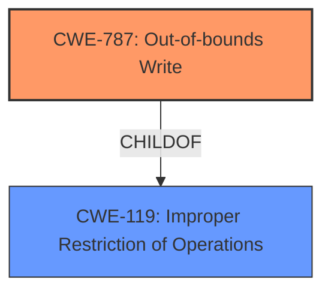

# Raw Analyzer Response for CVE-2021-36049

# Summary
| CWE ID | CWE Name | Confidence | CWE Abstraction Level | CWE Vulnerability Mapping Label | CWE-Vulnerability Mapping Notes |
|---|---|---|---|---|---|
| CWE-787 | Out-of-bounds Write | 0.9 | Base | Allowed | Primary CWE |
| CWE-119 | Improper Restriction of Operations within a Memory Buffer | 0.7 | Class | Allowed-with-Review | Secondary Candidate |

## Evidence and Confidence

*   **Confidence Score:** 0.8
*   **Evidence Strength:** HIGH

## Relationship Analysis
The primary CWE, CWE-787, is a base-level weakness that describes writing data past the end or before the beginning of an intended buffer. This is a child of CWE-119, which represents a broader class of improper restrictions of operations within memory buffers. The secondary CWE, CWE-119 is a parent of CWE-787. This hierarchical relationship indicates that CWE-787 is a more specific manifestation of the general problem described by CWE-119.

## Vulnerability Chain
The vulnerability chain starts with the **insecure handling** of a malicious Bridge file, which leads to **memory corruption** due to an out-of-bounds write (CWE-787). This, in turn, results in arbitrary code execution.

## Summary of Analysis
Initially, the description points to **memory corruption** due to **insecure handling** of a malicious file, potentially leading to arbitrary code execution. The "CWE for similar CVE Descriptions" section suggests CWE-119 as the primary match and CWE-787 as a top CWE. The CVE reference summary indicates that the root cause is "Access of Memory Location After End of Buffer", which is a type of out-of-bounds write.

The retriever results list CWE-787 (Out-of-bounds Write) as the top combined result. Given the evidence for an out-of-bounds write and the retriever results, CWE-787 is the most specific and appropriate CWE. CWE-119 is a valid, but more general, classification.

The final decision is based on:
  - The vulnerability description indicating **memory corruption** due to **insecure handling**.
  - The CVE reference summary pointing to "Access of Memory Location After End of Buffer."
  - The retriever results ranking CWE-787 as the top match.

The selected CWE, CWE-787, is at the optimal level of specificity because it directly reflects the **out-of-bounds write** condition leading to **memory corruption**.

Relevant CWE Information:

# Enhanced Context (25 CWEs)

## CWE-1289: Improper Validation of Unsafe Equivalence in Input
**Abstraction Level**: Base
**Similarity Score**: 0.81
**Source**: dense

**Description**:
The product receives an input value that is used as a resource identifier or other type of reference, but it does not validate or incorrectly validates that the input is equivalent to a potentially-unsafe value.

**Mapping Guidance**:
- Usage: Allowed
- Rationale: This CWE entry is at the Base level of abstraction, which is a preferred level of abstraction for mapping to the root causes of vulnerabilities.

*Not Used:* This CWE is focused on improper validation of equivalence, which is not explicitly stated in the vulnerability description. The primary issue is the insecure handling leading to memory corruption, not necessarily a validation issue.

## CWE-1288: Improper Validation of Consistency within Input
**Abstraction Level**: Base
**Similarity Score**: 0.77
**Source**: dense

**Description**:
The product receives a complex input with multiple elements or fields that must be consistent with each other, but it does not validate or incorrectly validates that the input is actually consistent.

**Mapping Guidance**:
- Usage: Allowed
- Rationale: This CWE entry is at the Base level of abstraction, which is a preferred level of abstraction for mapping to the root causes of vulnerabilities.

*Not Used:* Similar to CWE-1289, this CWE focuses on the validation of consistency, which is not the primary issue.

## CWE-807: Reliance on Untrusted Inputs in a Security Decision
**Abstraction Level**: Base
**Similarity Score**: 0.77
**Source**: dense

**Description**:
The product uses a protection mechanism that relies on the existence or values of an input, but the input can be modified by an untrusted actor in a way that bypasses the protection mechanism.

**Mapping Guidance**:
- Usage: Allowed
- Rationale: This CWE entry is at the Base level of abstraction, which is a preferred level of abstraction for mapping to the root causes of vulnerabilities.

*Not Used:* While the vulnerability involves a malicious file, the core issue is memory corruption due to insecure handling rather than a bypassed protection mechanism.

## CWE-183: Permissive List of Allowed Inputs
**Abstraction Level**: Base
**Similarity Score**: 0.77
**Source**: dense

**Description**:
The product implements a protection mechanism that relies on a list of inputs (or properties of inputs) that are explicitly allowed by policy because the inputs are assumed to be safe, but the list is too permissive - that is, it allows an input that is unsafe, leading to resultant weaknesses.

**Mapping Guidance**:
- Usage: Allowed
- Rationale: This CWE entry is at the Base level of abstraction, which is a preferred level of abstraction for mapping to the root causes of vulnerabilities.

*Not Used:* This CWE is not applicable because the vulnerability doesn't seem to stem from a permissive list of allowed inputs.

## CWE-184: Incomplete List of Disallowed Inputs
**Abstraction Level**: Base
**Similarity Score**: 0.76
**Source**: dense

**Description**:
The product implements a protection mechanism that relies on a list of inputs (or properties of inputs) that are not allowed by policy or otherwise require other action to neutralize before additional processing takes place, but the list is incomplete.

**Mapping Guidance**:
- Usage: Allowed
- Rationale: This CWE entry is at the Base level of abstraction, which is a preferred level of abstraction for mapping to the root causes of vulnerabilities.

*Not Used:* Similar to CWE-183, this CWE does not align with the description, as it is not related to an incomplete list of disallowed inputs.

## CWE-179: Incorrect Behavior Order: Early Validation
**Abstraction Level**: Base
**Similarity Score**: 0.76
**Source**: dense

**Description**:
The product validates input before applying protection mechanisms that modify the input, which could allow an attacker to bypass the validation via dangerous inputs that only arise after the modification.

**Mapping Guidance**:
- Usage: Allowed
- Rationale: This CWE entry is at the Base level of abstraction, which is a preferred level of abstraction for mapping to the root causes of vulnerabilities.

*Not Used:* This CWE does not fit because the vulnerability is not directly related to the order of validation.

## CWE-606: Unchecked Input for Loop Condition
**Abstraction Level**: Base
**Similarity Score**: 0.76
**Source**: dense

**Description**:
The product does not properly check inputs that are used for loop conditions, potentially leading to a denial of service or other consequences because of excessive looping.

**Mapping Guidance**:
- Usage: Allowed
- Rationale: This CWE entry is at the Base level of abstraction, which is a preferred level of abstraction for mapping to the root causes of vulnerabilities.

*Not Used:* The vulnerability is not related to unchecked input for loop conditions.

## CWE-665: Improper Initialization
**Abstraction Level**: Class
**Similarity Score**: 0.76
**Source**: dense

**Description**:
The product does not initialize or incorrectly initializes a resource, which might leave the resource in an unexpected state when it is accessed or used.

**Mapping Guidance**:
- Usage: Discouraged
- Rationale: This CWE entry is a level-1 Class (i.e., a child of a Pillar). It might have lower-level children that would be more appropriate

*Not Used:* This CWE is too general and does not specifically describe the **memory corruption**.

## CWE-1173: Improper Use of Validation Framework
**Abstraction Level**: Base
**Similarity Score**: 0.76
**Source**: dense

**Description**:
The product does not use, or incorrectly uses, an input validation framework that is provided by the source language or an independent library.

**Mapping Guidance**:
- Usage: Allowed
- Rationale: This CWE entry is at the Base level of abstraction, which is a preferred level of abstraction for mapping to the root causes of vulnerabilities.

*Not Used:* This CWE does not fit because the vulnerability is not directly related to the validation framework.

## CWE-138: Improper Neutralization of Special Elements
**Abstraction Level**: Class
**Similarity Score**: 0.75