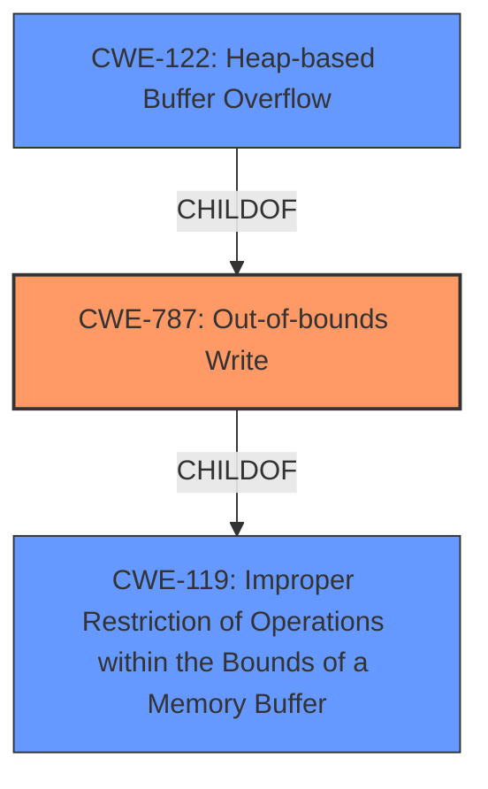

# Enhanced Analysis for CVE-2021-36065

# Summary
| CWE ID | CWE Name | Confidence | CWE Abstraction Level | CWE Vulnerability Mapping Label | CWE-Vulnerability Mapping Notes |
|---|---|---|---|---|---|
| CWE-787 | Out-of-bounds Write | 1.0 | Base | Allowed | Primary CWE |
| CWE-122 | Heap-based Buffer Overflow | 0.8 | Variant | Allowed | Secondary Candidate |
| CWE-119 | Improper Restriction of Operations within the Bounds of a Memory Buffer | 0.6 | Class | Discouraged | Secondary Candidate |

## Evidence and Confidence

*   **Confidence Score:** 0.9
*   **Evidence Strength:** HIGH

## Relationship Analysis
The primary CWE is CWE-787, which represents the **out-of-bounds write** that is the root cause of the vulnerability. CWE-122 is a variant that specifies this is a heap-based buffer overflow. CWE-119 is a more general class that includes out-of-bounds reads and writes. The relationships that impacted my decision were the ChildOf relationships of CWE-787 and CWE-122 to CWE-119. The abstraction levels of Base and Variant are preferred.



## Vulnerability Chain
The vulnerability chain starts with a malicious file opened by the user, leading to a **heap-based buffer overflow** (CWE-122 and CWE-787), which results in arbitrary code execution.

## Summary of Analysis
The initial analysis identified CWE-787 as the primary candidate, which aligns with the provided "Primary CWE Match" and the vulnerability description stating a "**heap-based buffer overflow**". The "**heap-based buffer overflow**" is the root cause. CWE-122, Heap-based Buffer Overflow, is a more specific variant of CWE-787. CWE-119 is a more general case.

The evidence from the vulnerability description includes: "Adobe Photoshop versions 21.2.10 (and earlier) and 22.4.3 (and earlier) are affected by a **heap-based buffer overflow** vulnerability that could result in arbitrary code execution in the context of the current user."

The graph relationships influenced the final selection by showing the hierarchical structure, with CWE-787 being a child of CWE-119, and CWE-122 being a child of CWE-787.

CWE-787 and CWE-122 are at the optimal level of specificity because they accurately describe the **out-of-bounds write** condition and the memory location. CWE-119 is too general and is discouraged.

Relevant CWE Information:

# Enhanced Context (25 CWEs)

## CWE-1289: Improper Validation of Unsafe Equivalence in Input
**Abstraction Level**: Base
**Similarity Score**: 0.80
**Source**: dense

This CWE was not selected because the vulnerability is not related to input validation.

## CWE-1288: Improper Validation of Consistency within Input
**Abstraction Level**: Base
**Similarity Score**: 0.76
**Source**: dense

This CWE was not selected because the vulnerability is not related to input validation.

## CWE-606: Unchecked Input for Loop Condition
**Abstraction Level**: Base
**Similarity Score**: 0.76
**Source**: dense

This CWE was not selected because the vulnerability is not related to a loop condition.

## CWE-183: Permissive List of Allowed Inputs
**Abstraction Level**: Base
**Similarity Score**: 0.76
**Source**: dense

This CWE was not selected because the vulnerability is not related to a permissive list of allowed inputs.

## CWE-807: Reliance on Untrusted Inputs in a Security Decision
**Abstraction Level**: Base
**Similarity Score**: 0.75
**Source**: dense

This CWE was not selected because the vulnerability is not related to reliance on untrusted inputs.

## CWE-184: Incomplete List of Disallowed Inputs
**Abstraction Level**: Base
**Similarity Score**: 0.75
**Source**: dense

This CWE was not selected because the vulnerability is not related to a incomplete list of disallowed inputs.

## CWE-179: Incorrect Behavior Order: Early Validation
**Abstraction Level**: Base
**Similarity Score**: 0.75
**Source**: dense

This CWE was not selected because the vulnerability is not related to behavior order or early validation.

## CWE-1173: Improper Use of Validation Framework
**Abstraction Level**: Base
**Similarity Score**: 0.74
**Source**: dense

This CWE was not selected because the vulnerability is not related to a validation framework.

## CWE-252: Unchecked Return Value
**Abstraction Level**: Base
**Similarity Score**: 0.74
**Source**: dense

This CWE was not selected because the vulnerability is not related to an unchecked return value.

## CWE-457: Use of Uninitialized Variable
**Abstraction Level**: Variant
**Similarity Score**: 0.74
**Source**: dense

This CWE was not selected because the vulnerability is not related to the use of an uninitialized variable.

## CWE-190: Integer Overflow or Wraparound
**Abstraction Level**: Base
**Similarity Score**: 7302.27
**Source**: sparse

This CWE was not selected because the vulnerability is not related to an integer overflow.

## CWE-125: Out-of-bounds Read
**Abstraction Level**: Base
**Similarity Score**: 6805.88
**Source**: sparse

This CWE was not selected because the vulnerability is related to an out-of-bounds write, not a read.

## CWE-119: Improper Restriction of Operations within the Bounds of a Memory Buffer
**Abstraction Level**: Class
**Similarity Score**: 6648.91
**Source**: sparse

**Description**:
The product performs operations on a memory buffer, but it reads from or writes to a memory location outside the buffer's intended boundary. This may result in read or write operations on unexpected memory locations that could be linked to other variables, data structures, or internal program data.

**Mapping Guidance**:
- Usage: Discouraged
- Rationale: CWE-119 is commonly misused in low-information vulnerability reports when lower-level CWEs could be used instead, or when more details about the vulnerability are available.

While this CWE generally applies to buffer overflows, it is discouraged because more specific CWEs like CWE-787 (Out-of-bounds Write) and CWE-122 (Heap-based Buffer Overflow) are available and more descriptive of the actual vulnerability. It is kept as a secondary candidate because it is the parent of CWE-787.

## CWE-1284: Improper Validation of Specified Quantity in Input
**Abstraction Level**: Base
**Similarity Score**: 6633.32
**Source**: sparse

This CWE was not selected because the vulnerability is not related to input validation.

## CWE-839: Numeric Range Comparison Without Minimum Check
**Abstraction Level**: Base
**Similarity Score**: 6531.44
**Source**: sparse

This CWE was not selected because the vulnerability is not related to numeric range comparison.

## CWE-128: Wrap-around Error
**Abstraction Level**: base
**Similarity Score**: 5.03
**Source**: graph

This CWE was not selected because the vulnerability is not related to a wrap-around error.

## CWE-190: Integer Overflow or Wraparound
**Abstraction Level**: base
**Similarity Score**: 5.03
**Source**: graph

This CWE was not selected because the vulnerability is not related to an integer overflow.

## CWE-41: Improper Resolution of Path Equivalence
**Abstraction Level**: base
**Similarity Score**: 5.03
**Source**: graph

This CWE was not selected because the vulnerability is not related to path equivalence.

## CWE-839: Numeric Range Comparison Without Minimum Check
**Abstraction Level**: base
**Similarity Score**: 4.33
**Source**: graph

This CWE was not selected because the vulnerability is not related to numeric range comparison.

## CWE-170: Improper Null Termination
**Abstraction Level**: base
**Similarity Score**: 4.33
**Source**: graph

This CWE was not selected because the vulnerability is not related to null termination.

## CWE-22: Improper Limitation of a Pathname to a Restricted Directory ('Path Tra


## CWE Relationship Analysis

Current CWEs represent these abstraction levels: .


### Vulnerability Chain Analysis

**Chain starting from CWE-787:**
- 787 (Out-of-bounds Write) - ROOT


**Chain starting from CWE-839:**
- 839 (Numeric Range Comparison Without Minimum Check) - ROOT


### CWE Relationship Diagram

```mermaid
graph TD
    classDef primary fill:#f96,stroke:#333,stroke-width:2px
    classDef secondary fill:#69f,stroke:#333
    classDef tertiary fill:#9e9,stroke:#333
```