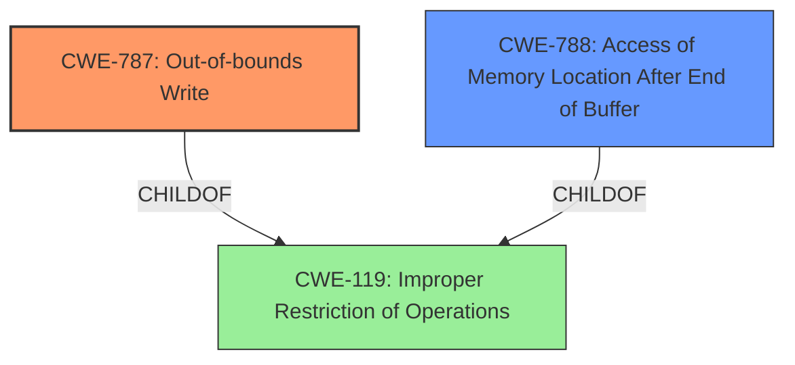

# Analysis for CVE-2021-36067

# Summary
| CWE ID | CWE Name | Confidence | CWE Abstraction Level | CWE Vulnerability Mapping Label | CWE-Vulnerability Mapping Notes |
|---|---|---|---|---|---|
| CWE-787 | Out-of-bounds Write | 1.0 | Base | Allowed | Primary CWE |
| CWE-788 | Access of Memory Location After End of Buffer | 0.7 | Base | Discouraged | Secondary Candidate |

## Evidence and Confidence

*   **Confidence Score:** 1.0
*   **Evidence Strength:** HIGH

## Relationship Analysis
The primary relationship that impacted the decision was the parent-child relationship between CWE-787 (Out-of-bounds Write) and CWE-119 (Improper Restriction of Operations Within the Bounds of a Memory Buffer). While CWE-119 is a parent, the description and provided CVE reference link summary specifically mention memory corruption due to insecure handling which can be classified as writing past the end of a buffer (CWE-787). CWE-788 (Access of Memory Location After End of Buffer) was considered, but the description explicitly states a "write" operation, making CWE-787 a more accurate fit. The abstraction level also influenced the decision, with a preference for the base level as per the mapping guidance.

## Vulnerability Chain
The chain of events for this vulnerability is as follows:
1.  **Root Cause:** **Insecure handling** of a malicious Bridge file.
2.  **Weakness:** **Memory corruption** (specifically, an out-of-bounds write).
3.  **Impact:** Arbitrary code execution.

The chain starts with the insecure handling of the file, leading to memory corruption and ultimately resulting in arbitrary code execution.

## Summary of Analysis
The initial assessment pointed towards CWE-787 (Out-of-bounds Write) as the primary weakness, supported by the vulnerability description key phrases and CVE reference link content summary, which clearly indicates **memory corruption** due to **insecure handling** leading to an access of a memory location after the end of the buffer.

The evidence supporting CWE-787 is strong: "Adobe Bridge version 11.1 (and earlier) is affected by a **memory corruption** vulnerability due to **insecure handling** of a malicious Bridge file, potentially resulting in arbitrary code execution in the context of the current user." The CVE Reference Links Content Summary confirms the root cause as "Access of Memory Location After End of Buffer" (CWE-788), and the description specifies it as a buffer issue.

The graph relationships helped refine the selection. While CWE-119 is a parent, the more specific CWE-787 is appropriate. CWE-788 was considered because the CVE reference specifies this CWE, but the description explicitly mentions a "write" operation which makes CWE-787 the better option.

The selected CWE, CWE-787, is at the optimal level of specificity because it accurately describes the **memory corruption** resulting from writing past the end of a buffer. This is a base level CWE, which aligns with mapping guidance preferences.

Relevant CWE Information:

# Enhanced Context (25 CWEs)
The following CWEs were identified as potentially relevant to this vulnerability:

## CWE-1289: Improper Validation of Unsafe Equivalence in Input
**Abstraction Level**: Base
**Similarity Score**: 0.81

This CWE was not selected because the vulnerability is related to **memory corruption** and **insecure handling** of a file and not related to validating input equivalence.

## CWE-807: Reliance on Untrusted Inputs in a Security Decision
**Abstraction Level**: Base
**Similarity Score**: 0.77

This CWE was not selected because the vulnerability is related to **memory corruption** and **insecure handling** of a file and not related to making a security decision based on untrusted input.

## CWE-1288: Improper Validation of Consistency within Input
**Abstraction Level**: Base
**Similarity Score**: 0.77

This CWE was not selected because the vulnerability is related to **memory corruption** and **insecure handling** of a file and not related to validating consistency within the input.

## CWE-183: Permissive List of Allowed Inputs
**Abstraction Level**: Base
**Similarity Score**: 0.77

This CWE was not selected because the vulnerability is related to **memory corruption** and **insecure handling** of a file and not related to a permissive list of allowed inputs.

## CWE-184: Incomplete List of Disallowed Inputs
**Abstraction Level**: Base
**Similarity Score**: 0.76

This CWE was not selected because the vulnerability is related to **memory corruption** and **insecure handling** of a file and not related to an incomplete list of disallowed inputs.

## CWE-665: Improper Initialization
**Abstraction Level**: Class
**Similarity Score**: 0.76

This CWE was not selected because the vulnerability is related to **memory corruption** and **insecure handling** of a file and not an improper initialization.

## CWE-179: Incorrect Behavior Order: Early Validation
**Abstraction Level**: Base
**Similarity Score**: 0.76

This CWE was not selected because the vulnerability is related to **memory corruption** and **insecure handling** of a file and not the order of validation.

## CWE-606: Unchecked Input for Loop Condition
**Abstraction Level**: Base
**Similarity Score**: 0.76

This CWE was not selected because the vulnerability is related to **memory corruption** and **insecure handling** of a file and not unchecked input for a loop condition.

## CWE-138: Improper Neutralization of Special Elements
**Abstraction Level**: Class
**Similarity Score**: 0.76

This CWE was not selected because the vulnerability is related to **memory corruption** and **insecure handling** of a file and not improper neutralization of special elements.

## CWE-1286: Improper Validation of Syntactic Correctness of Input
**Abstraction Level**: Base
**Similarity Score**: 0.76

This CWE was not selected because the vulnerability is related to **memory corruption** and **insecure handling** of a file and not improper validation of syntactic correctness of input.

## CWE-190: Integer Overflow or Wraparound
**Abstraction Level**: Base
**Similarity Score**: 6425.95

This CWE was not selected because the vulnerability is related to **memory corruption** and **insecure handling** of a file and not an integer overflow.

## CWE-125: Out-of-bounds Read
**Abstraction Level**: Base
**Similarity Score**: 6415.52

This CWE was not selected because the description mentions a write and not a read.

## CWE-1284: Improper Validation of Specified Quantity in Input
**Abstraction Level**: Base
**Similarity Score**: 6315.20

This CWE was not selected because the vulnerability is related to **memory corruption** and **insecure handling** of a file and not improper validation of specified quantity in input.

## CWE-457: Use of Uninitialized Variable
**Abstraction Level**: Variant
**Similarity Score**: 6189.42

This CWE was not selected because the vulnerability is related to **memory corruption** and **insecure handling** of a file and not use of an uninitialized variable.

## CWE-252: Unchecked Return Value
**Abstraction Level**: Base
**Similarity Score**: 6159.90

This CWE was not selected because the vulnerability is related to **memory corruption** and **insecure handling** of a file and not an unchecked return value.

## CWE-120: Buffer Copy without Checking Size of Input ('Classic Buffer Overflow')
**Abstraction Level**: base
**Similarity Score**: 4.33

This CWE was not selected because there is insufficient information about a buffer copy operation. The description mentions "insecure handling" which is too generic, but a buffer copy operation is not implied.

## CWE-22: Improper Limitation of a Pathname to a Restricted Directory ('Path Traversal')
**Abstraction Level**: base
**Similarity Score**: 4.33

This CWE was not selected because the vulnerability is related to **memory corruption** and **insecure handling** of a file and not related to a path traversal.

## CWE-770: Allocation of Resources Without Limits or Throttling
**Abstraction Level**: base
**Similarity Score**: 4.33

This CWE was not selected because the vulnerability is related to **memory corruption**