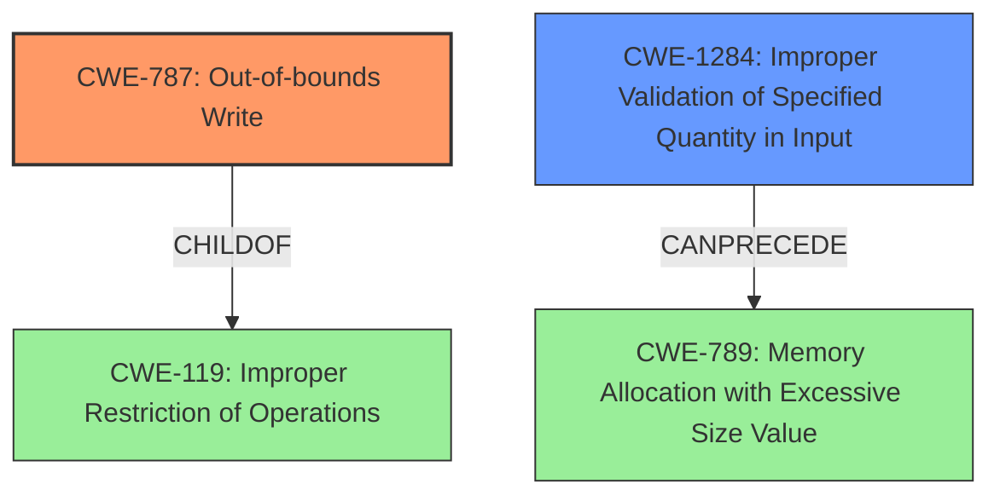

# Raw Analyzer Response for CVE-2021-36077

# Summary
| CWE ID | CWE Name | Confidence | CWE Abstraction Level | CWE Vulnerability Mapping Label | CWE-Vulnerability Mapping Notes |
|---|---|---|---|---|---|
| CWE-787 | Out-of-bounds Write | 0.9 | Base | Allowed | Primary CWE |
| CWE-1284 | Improper Validation of Specified Quantity in Input | 0.6 | Base | Allowed | Secondary Candidate |

## Evidence and Confidence

*   **Confidence Score:** 0.75
*   **Evidence Strength:** MEDIUM

## Relationship Analysis
The primary CWE, CWE-787, is a base-level CWE which is appropriate. CWE-787 is a child of CWE-119, which represents the broader class of improper restrictions of operations within memory buffers. The secondary CWE considered, CWE-1284, can precede CWE-789 (Memory Allocation with Excessive Size Value). The relationships illustrate the flow from input to memory allocation and potential exploitation.

## Vulnerability Chain
The vulnerability chain starts with the **insecure handling** of a malicious SVG file leading to **memory corruption**. This leads to an out-of-bounds write, resulting in a local application denial of service.

## Summary of Analysis
The analysis indicates that the primary weakness is an out-of-bounds write (CWE-787) caused by **insecure handling** of a malicious SVG file, resulting in memory corruption and denial of service.

The evidence supporting this is:

*   The vulnerability description mentions **memory corruption** due to **insecure handling** of a malicious SVG file.
*   The CVE reference links content summary explicitly states that the root cause is "Access of Memory Location After End of Buffer (CWE-788)" and lists "Out-of-bounds Write (CWE-787)" as a cause of other vulnerabilities.
*   Retriever results list CWE-787 as the top candidate with a score of 1.000.
*   The CVSS vector specifies a local attack vector with user interaction required, consistent with a malicious file needing to be opened.

Based on the retriever results and the CVE reference links, CWE-787 (Out-of-bounds Write) is the most appropriate primary CWE. The vulnerability involves writing data past the intended buffer due to **insecure handling**, leading to **memory corruption** and denial of service.

CWE-1284 (Improper Validation of Specified Quantity in Input) was considered as a secondary CWE, given that SVG files may contain size or length parameters that, if not properly validated, could lead to memory allocation issues. While this could be a contributing factor, the primary issue is the out-of-bounds write itself. The evidence for this secondary CWE is weaker, hence the lower confidence score.

CWE-788 (Access of Memory Location After End of Buffer) was also considered, but since the vulnerability involves writing past the end of the buffer, CWE-787 is more specific and appropriate.

Relevant CWE Information:
# Enhanced Context (25 CWEs)
The following CWEs were identified as potentially relevant to this vulnerability:

## CWE-1289: Improper Validation of Unsafe Equivalence in Input
**Abstraction Level**: Base
**Similarity Score**: 0.76

## CWE-404: Improper Resource Shutdown or Release
**Abstraction Level**: Class
**Similarity Score**: 0.75

## CWE-665: Improper Initialization
**Abstraction Level**: Class
**Similarity Score**: 0.75

## CWE-664: Improper Control of a Resource Through its Lifetime
**Abstraction Level**: Pillar
**Similarity Score**: 0.75

## CWE-226: Sensitive Information in Resource Not Removed Before Reuse
**Abstraction Level**: Base
**Similarity Score**: 0.75

## CWE-274: Improper Handling of Insufficient Privileges
**Abstraction Level**: Base
**Similarity Score**: 0.74

## CWE-667: Improper Locking
**Abstraction Level**: Class
**Similarity Score**: 0.74

## CWE-653: Improper Isolation or Compartmentalization
**Abstraction Level**: Class
**Similarity Score**: 0.74

## CWE-1419: Incorrect Initialization of Resource
**Abstraction Level**: Class
**Similarity Score**: 0.74

## CWE-280: Improper Handling of Insufficient Permissions or Privileges 
**Abstraction Level**: Base
**Similarity Score**: 0.73

## CWE-190: Integer Overflow or Wraparound
**Abstraction Level**: Base
**Similarity Score**: 6496.61

## CWE-1284: Improper Validation of Specified Quantity in Input
**Abstraction Level**: Base
**Similarity Score**: 6462.07

## CWE-125: Out-of-bounds Read
**Abstraction Level**: Base
**Similarity Score**: 6339.28

## CWE-789: Memory Allocation with Excessive Size Value
**Abstraction Level**: Variant
**Similarity Score**: 6248.54

## CWE-193: Off-by-one Error
**Abstraction Level**: Base
**Similarity Score**: 6007.89

## CWE-41: Improper Resolution of Path Equivalence
**Abstraction Level**: base
**Similarity Score**: 5.03

## CWE-1325: Improperly Controlled Sequential Memory Allocation
**Abstraction Level**: base
**Similarity Score**: 5.03

## CWE-789: Memory Allocation with Excessive Size Value
**Abstraction Level**: variant
**Similarity Score**: 4.53

## CWE-170: Improper Null Termination
**Abstraction Level**: base
**Similarity Score**: 4.33

## CWE-120: Buffer Copy without Checking Size of Input ('Classic Buffer Overflow')
**Abstraction Level**: base
**Similarity Score**: 4.33

## CWE-190: Integer Overflow or Wraparound
**Abstraction Level**: base
**Similarity Score**: 4.33

## CWE-193: Off-by-one Error
**Abstraction Level**: base
**Similarity Score**: 4.33

## CWE-22: Improper Limitation of a Pathname to a Restricted Directory ('Path Traversal')
**Abstraction Level**: base
**Similarity Score**: 4.33

## CWE-770: Allocation of Resources Without Limits or Throttling
**Abstraction Level**: base
**Similarity Score**: 4.33

## CWE-73: External Control of File Name or Path
**Abstraction Level**: base
**Similarity Score**: 4.33