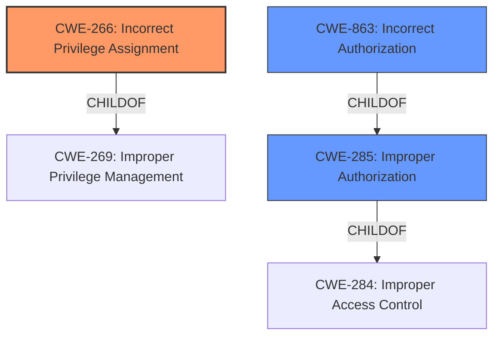

# Analysis for CVE-2021-36097

# Summary
| CWE ID | CWE Name | Confidence | CWE Abstraction Level | CWE Vulnerability Mapping Label | CWE-Vulnerability Mapping Notes |
|---|---|---|---|---|---|
| CWE-266 | Incorrect Privilege Assignment | 0.8 | Base | Allowed | Primary CWE |
| CWE-863 | Incorrect Authorization | 0.6 | Class | Allowed-with-Review | Secondary Candidate |
| CWE-285 | Improper Authorization | 0.4 | Class | Discouraged | Secondary Candidate |

## Evidence and Confidence

*   **Confidence Score:** 0.8
*   **Evidence Strength:** HIGH

## Relationship Analysis
The primary relationship influencing the decision is the parent-child relationship between CWE-269 (Improper Privilege Management), CWE-266 (Incorrect Privilege Assignment), and CWE-863 (Incorrect Authorization). CWE-266 is a child of CWE-269, representing a more specific case of improper privilege management. CWE-863 is a child of CWE-285, which is a child of CWE-284. The analysis favors CWE-266 due to its base-level abstraction and the specific nature of the vulnerability, which involves **incorrectly assigning privileges**.

## Vulnerability Chain
The chain of events is as follows:
1.  **Root Cause:** **Incorrect Privilege Assignment** (CWE-266): Agents are assigned the privilege to lock tickets even without the necessary "Owner" permission.
2.  **Weakness:** **Incorrect Authorization** (CWE-863): The system incorrectly authorizes agents to perform the lock action.
3.  **Impact:** Unauthorized ticket manipulation and potential data leaks due to movement to a queue with less restrictive permissions.

## Summary of Analysis
The initial assessment pointed towards access control issues, specifically concerning privileges. The description clearly states that agents are able to "lock the ticket without the Owner permission". The "CVE Reference Links Content Summary" confirms that the "**vulnerability stems from a flaw in the access control mechanism**" and that "**agents were granted the ability to lock tickets even when lacking the 'Owner' permission**."

The Retriever Results listed several candidate CWEs, including CWE-266 (Incorrect Privilege Assignment) with a high sparse score and CWE-863 (Incorrect Authorization).

CWE-266 (Incorrect Privilege Assignment) is selected as the primary CWE because it directly reflects the **root cause** described in the vulnerability. The vulnerability description indicates a specific flaw in the privilege assignment mechanism, allowing agents to lock tickets without the 'Owner' permission. This aligns with the definition of CWE-266, where a product "incorrectly assigns a privilege to a particular actor, creating an unintended sphere of control for that actor."

CWE-863 (Incorrect Authorization) was considered as a secondary CWE since the authorization check is performed, but it is done incorrectly due to the privilege assignment flaw. It represents the immediate consequence of the incorrect privilege assignment, where the system authorizes the action despite the agent lacking the necessary permission. However, since the **root cause** is more accurately captured by the privilege assignment issue, CWE-266 is the primary.

CWE-285 (Improper Authorization) was also considered, as it is a parent of CWE-863. However, the mapping guidance discourages its use, and since the authorization is performed but incorrectly, CWE-863 is preferred, even though it is only a secondary consideration.

The selection of CWE-266 is at the optimal level of specificity as it is a Base-level CWE that directly addresses the **root cause** of the vulnerability.