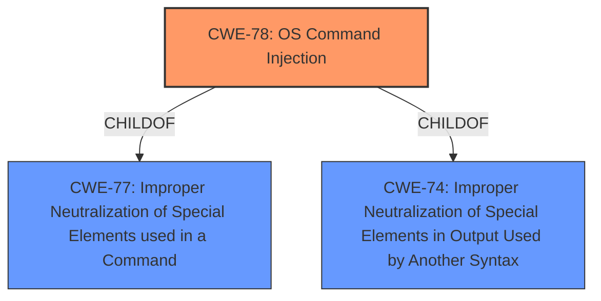

# Analysis for CVE-2021-36100

# Summary

| CWE ID | CWE Name | Confidence | CWE Abstraction Level | CWE Vulnerability Mapping Label | CWE-Vulnerability Mapping Notes |
|---|---|---|---|---|---|
| CWE-78 | Improper Neutralization of Special Elements used in an OS Command ('OS Command Injection') | 1.0 | Base | Allowed | Primary CWE. The system constructs an OS command using externally-influenced input without proper neutralization of special elements. |

## Evidence and Confidence

*   **Confidence Score:** 1.0
*   **Evidence Strength:** HIGH

## Relationship Analysis
The primary relationship influencing the decision is that CWE-78 is a base-level weakness, making it specific enough to describe the root cause of the vulnerability. CWE-78 is a child of CWE-77, CWE-74 which are more general injection issues.

## Vulnerability Chain
The vulnerability chain involves:
1.  **Improper Input Validation:** The system fails to properly validate or sanitize input strings used in system configurations.
2.  **OS Command Injection:** An attacker injects malicious OS commands into the system configuration through a specially crafted string.
3.  **Remote Code Execution:** The injected commands are executed on the server.
4.  **System Compromise:** The attacker gains control of the system.

## Summary of Analysis
Initially, the vulnerability description indicated a potential for command execution through a **specially crafted string**. The **CVE Reference Links Content Summary** confirmed that the **root cause** was due to **improper input validation** that allowed the injection of system commands leading to arbitrary code execution.

The Retriever results and the description of the vulnerability strongly suggest **CWE-78: Improper Neutralization of Special Elements used in an OS Command ('OS Command Injection')**. The vulnerability allows for the execution of arbitrary system commands through a specially crafted string in the OTRS system configuration. This directly aligns with the description of CWE-78, which involves constructing an OS command using externally influenced input without proper neutralization.

The evidence includes:

*   "Specially crafted string in OTRS system configuration can allow the execution of any system command."
*   "Improper input validation: The system does not properly sanitize or validate strings used in system configurations, allowing for the injection of system commands."
*   "Remote Code Execution: The vulnerability allows the attacker to execute arbitrary system commands on the server hosting OTRS."

The relationship graph indicates that CWE-78 is a child of more general injection issues (CWE-77, CWE-74), confirming that it is the most specific and appropriate choice for this vulnerability.

Other CWEs Considered:

*   CWE-134 (Use of Externally-Controlled Format String): While format string vulnerabilities can lead to command execution, the description focuses on a specially crafted string leading to OS command execution, not a format string issue.
*   CWE-88 (Improper Neutralization of Argument Delimiters in a Command ('Argument Injection')): While argument injection is a related concept, the core issue is the ability to inject and execute arbitrary OS commands, making CWE-78 more appropriate.
*   CWE-1287 (Improper Validation of Specified Type of Input): This is a general input validation issue. While this is true, it doesn't capture the specifics of OS command injection.
*   CWE-553 (Command Shell in Externally Accessible Directory): This is about having a shell in a web directory, not about injecting commands.
*   CWE-89 (Improper Neutralization of Special Elements used in an SQL Command ('SQL Injection')): SQL Injection is not relevant given the vulnerability description.

The chosen CWE is at the optimal level of specificity because it directly addresses the **root cause** of the vulnerability, which is the **improper neutralization** of special elements in an OS command, and the ability to inject and execute arbitrary OS commands.