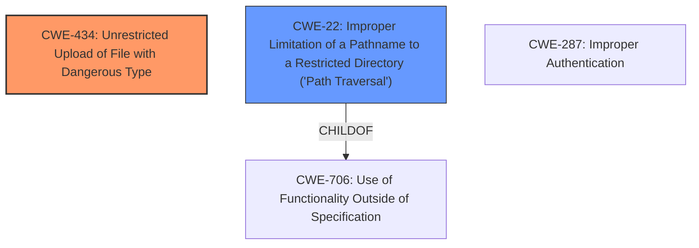

# Enhanced Analysis for CVE-2021-36121

# Summary
| CWE ID  | CWE Name                                                                           | Confidence | CWE Abstraction Level | CWE Vulnerability Mapping Label | CWE-Vulnerability Mapping Notes |
| :-------- | :--------------------------------------------------------------------------------- | :---------- | :----------------------- | :------------------------------ | :------------------------------ |
| CWE-434 | Unrestricted Upload of File with Dangerous Type                                    | 0.95       | Base                     | Primary                       | Allowed                       |
| CWE-22  | Improper Limitation of a Pathname to a Restricted Directory ('Path Traversal') | 0.80       | Base                     | Secondary                     | Allowed                       |

## Evidence and Confidence

*   **Confidence Score:** 0.90
*   **Evidence Strength:** HIGH

## Relationship Analysis

The primary CWE selected is CWE-434 (Unrestricted Upload of File with Dangerous Type), as it directly addresses the **unrestricted upload** vulnerability described. The secondary CWE is CWE-22 (Improper Limitation of a Pathname to a Restricted Directory ('Path Traversal')), as the attacker is using directory traversal to write the file to an arbitrary location. CWE-22 is a child of CWE-706 (Use of Functionality Outside of Specification).



## Vulnerability Chain

The vulnerability chain starts with an **unrestricted file upload** (CWE-434). The attacker leverages this by performing directory traversal (CWE-22) to write the malicious file to an arbitrary location. This ultimately leads to remote code execution.

## Summary of Analysis

The initial analysis and subsequent review conclude that CWE-434 and CWE-22 are the most appropriate classifications for this vulnerability. This assessment is primarily based on the vulnerability description, which explicitly mentions **unrestricted upload** and directory traversal.

The graph relationships influenced the selection by highlighting the connection between directory traversal and broader specification violations.

The selected CWEs are at the optimal level of specificity because they directly address the root cause (**unrestricted upload**) and the exploitation technique (directory traversal).

Relevant CWE Information:

# Enhanced Context (25 CWEs)

## Vulnerability Description

An issue was discovered in Echo ShareCare 8.15.5. The file-upload feature in Access/DownloadFeed_Mnt/FileUpload_Upd.cfm is susceptible to an **unrestricted upload** vulnerability via the name1 parameter, when processing remote input from an authenticated user, leading to the ability for arbitrary files to be written to arbitrary filesystem locations via ../ Directory Traversal on the Z drive (a hard-coded drive letter where ShareCare application files reside) and remote code execution as the ShareCare service user (NT AUTHORITY\SYSTEM).

### Vulnerability Description Key Phrases

*   **weakness:** **unrestricted upload**
*   **impact:** arbitrary file write, remote code execution
*   **vector:** ../ directory traversal
*   **attacker:** authenticated user
*   **product:** Echo ShareCare
*   **version:** 8.15.5
*   **component:** file-upload feature in Access/DownloadFeed_Mnt/FileUpload_Upd.cfm

## CVE Reference Links Content Summary

Based on the provided content, here's an analysis of the vulnerability related to CVE-2021-36121:

**Vulnerability:** Command Argument Injection

*   **Root Cause:** The ShareCare application's `UnzipFile` feature in `/Access/EligFeedParse_Sup/UnzipFile_Upd.cfm` uses a `cfexecute` tag to execute the `7z.exe` command-line utility. The application takes a user-provided ZIP password (`Form.zippass`) and directly passes it as an argument to `7z.exe` without sanitization or validation.

*   **Weaknesses:** The primary weakness is the lack of sanitization or validation of user-supplied input (`Form.zippass`) before passing it as an argument to the `7z.exe` command. This allows for the injection of arbitrary command-line arguments.

*   **Impact of Exploitation:** An attacker can inject arbitrary command-line arguments to `7z.exe`. This could potentially lead to various malicious outcomes, such as:

    *   Executing arbitrary commands on the server.
    *   Modifying or deleting files.
    *   Disclosing sensitive information.
    *   Denial of Service.
*   **Attack Vectors:** An authenticated user can send a specially crafted request with malicious data in the `zippass` parameter that will be used as an argument in the execution of `7z.exe`.

*   **Required Attacker Capabilities/Position:**

    *   The attacker must be an authenticated user of the ShareCare application.
    *   The attacker needs to be able to send HTTP requests to the `/Access/EligFeedParse_Sup/UnzipFile_Upd.cfm` endpoint, including the `zippass` parameter.

**Additional Details:**

The provided content offers more specific details than the CVE description, outlining the specific vulnerable component and parameters involved in the exploit. It clearly identifies the lack of input sanitization as the root cause.

**In summary, this content directly relates to CVE-2021-36121, outlining a command argument injection vulnerability due to the lack of sanitization on user-supplied input when invoking 7z.exe.**

## Retriever Results

### Top Combined Results

| Rank | CWE ID | Name | Abstraction | Usage | Retrievers | Individual Scores |
| :--- | :----- | :--- | :---------- | :---- | :--------- | :---------------- |
| 1 | 434 | Unrestricted Upload of File with Dangerous Type | Base | Allowed | sparse | 0.644 |
| 2 | 23 | Relative Path Traversal | Base | Allowed | sparse | 0.407 |
| 3 | 22 | Improper Limitation of a Pathname to a Restricted Directory ('Path Traversal') | Base | Allowed | sparse | 0.404 |
| 4 | 59 | Improper Link Resolution Before File Access ('Link Following') | Base | Allowed | sparse | 0.401 |
| 5 | 427 | Uncontrolled Search Path Element | Base | Allowed | sparse | 0.379 |
| 6 | 646 | Reliance on File Name or Extension of Externally-Supplied File | Variant | Allowed | dense | 0.600 |
| 7 | 184 | Incomplete List of Disallowed Inputs | Base | Allowed | graph | 0.002 |
| 8 | 36 | Absolute Path Traversal | Base | Allowed | sparse | 0.372 |
| 9 | 306 | Missing Authentication for Critical Function | Base | Allowed | sparse | 0.367 |
| 10 | 20 | Improper Input Validation | Class | Discouraged | sparse | 0.358 |

**CWE-434: Unrestricted Upload of File with Dangerous Type**

*   **How the vulnerability's details match the CWE's characteristics:** The description explicitly states that the file-upload feature is susceptible to an **unrestricted upload** vulnerability. This aligns perfectly with CWE-434, which describes a product allowing the upload of dangerous file types.
*   **The security implications and potential impact:** This allows an attacker to upload arbitrary files, potentially leading to remote code execution, as mentioned in the description.
*   **Any parent-child relationships or chain patterns that influenced your mapping:** CWE-434 is a base level CWE, which is the preferred level of abstraction.
*   **Whether the weakness is primary or secondary in the vulnerability:** Primary
*   **How the official MITRE mapping guidance influenced your decision:** The MITRE mapping guidance for CWE-434 states that it is at the Base level of abstraction and that the usage is "Allowed."

**CWE-22: Improper Limitation of a Pathname to a Restricted Directory ('Path Traversal')**

*   **How the vulnerability's details match the CWE's characteristics:** The description mentions that an attacker can write arbitrary files to arbitrary filesystem locations via ../ Directory Traversal. This aligns with CWE-22, which describes the improper limitation of a pathname to a restricted directory.
*   **The security implications and potential impact:** This allows an attacker to write files outside of the intended directory, potentially overwriting critical system files or placing executable files in accessible locations.
*   **Any parent-child relationships or chain patterns that influenced your mapping:** CWE-22 is a


## CWE Relationship Analysis

Current CWEs represent these abstraction levels: .


### Vulnerability Chain Analysis

**Chain starting from CWE-287:**
- 287 (Improper Authentication) - ROOT


**Chain starting from CWE-706:**
- 706 (Use of Incorrectly-Resolved Name or Reference) - ROOT


### CWE Relationship Diagram

```mermaid
graph TD
    classDef primary fill:#f96,stroke:#333,stroke-width:2px
    classDef secondary fill:#69f,stroke:#333
    classDef tertiary fill:#9e9,stroke:#333
```