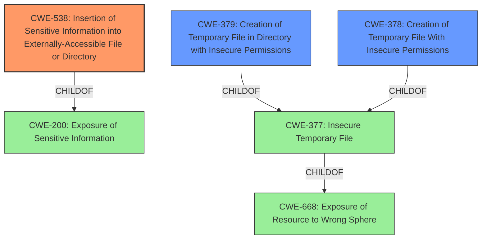

# Enhanced Analysis for CVE-2021-36151

# Summary
| CWE ID | CWE Name | Confidence | CWE Abstraction Level | CWE Vulnerability Mapping Label | CWE-Vulnerability Mapping Notes |
|---|---|---|---|---|---|
| CWE-538 | Insertion of Sensitive Information into Externally-Accessible File or Directory | 0.8 | Base | Allowed | Primary CWE |
| CWE-379 | Creation of Temporary File in Directory with Insecure Permissions | 0.7 | Base | Allowed | Secondary Candidate |
| CWE-378 | Creation of Temporary File With Insecure Permissions | 0.6 | Base | Allowed | Secondary Candidate |

## Evidence and Confidence

*   **Confidence Score:** 0.8
*   **Evidence Strength:** MEDIUM

## Relationship Analysis
The primary CWE, CWE-538, is a child of CWE-200, indicating a broader category of sensitive information exposure. CWE-379 and CWE-378 are children of CWE-377 (Insecure Temporary File), forming a hierarchy related to temporary file handling vulnerabilities. The relationship between CWE-377 and CWE-668 suggests a potential exposure of resources to the wrong sphere, but the specifics of the vulnerability lean more towards insecure temporary file creation. The abstraction levels influenced the selection by preferring the more specific "Base" level CWEs over the higher-level "Class" CWEs.



## Vulnerability Chain
The vulnerability chain starts with the **insecure creation of a temporary file** in a directory accessible to all local users. This leads to the **Hadoop token, which is sensitive information, being written to this file**. As a result, the **sensitive information becomes exposed to unintended actors**.

## Summary of Analysis
The initial assessment identified CWE-538 as the most relevant due to the explicit mention of sensitive information being written to an externally accessible file. This aligns with the vulnerability description stating that the Hadoop token is written to a temporary file visible to all local users. The retriever results supported this selection, ranking CWE-538 as the top combined result. The MITRE mapping guidance for CWE-538 allows its usage and suggests carefully reading the name and description to ensure an appropriate fit, which is confirmed by the vulnerability description.

CWE-379 and CWE-378 were considered as secondary CWEs because the vulnerability involves the creation of a temporary file with insecure permissions, but the core issue is the exposure of the Hadoop token. CWE-379 is more specific than CWE-378 because it highlights that the temporary file is created in a directory with insecure permissions, allowing unintended actors to access it.

The hierarchical relationships between CWEs influenced the selection by preferring the more specific "Base" level CWEs (CWE-538, CWE-379, CWE-378) over the higher-level "Class" CWEs (CWE-377, CWE-668). This ensures that the selected CWEs accurately represent the specific weakness in the vulnerability. The final selection of CWEs is based on the provided evidence, the retriever results, and the MITRE mapping guidance, ensuring that the selected CWEs are at the optimal level of specificity.

Relevant CWE Information:

# Enhanced Context (25 CWEs)
The following CWEs were identified as potentially relevant to this vulnerability:

## CWE-538: Insertion of Sensitive Information into Externally-Accessible File or Directory
**Abstraction:** Base
**Status:** Draft

### Description
The product places **sensitive information** into files or directories that are **accessible to actors who are allowed to have access to the files, but not to the sensitive information**.

### Extended Description
Not provided

### Alternative Terms
None

### Relationships
ChildOf -> CWE-200

### Mapping Guidance
**Usage:** Allowed
**Rationale:** This CWE entry is at the Base level of abstraction, which is a preferred level of abstraction for mapping to the root causes of vulnerabilities.
**Comments:** Carefully read both the name and description to ensure that this mapping is an appropriate fit. Do not try to 'force' a mapping to a lower-level Base/Variant simply to comply with this preferred level of abstraction.
**Reasons:**
- Acceptable-Use


### Additional Notes
**[Maintenance]** Depending on usage, this could be a weakness or a category. Further study of all its children is needed, and the entire sub-tree may need to be clarified. The current organization is based primarily on the exposure of sensitive information as a consequence, instead of as a primary weakness.

**[Maintenance]** There is a close relationship with CWE-552, which is more focused on weaknesses. As a result, it may be more appropriate to convert CWE-538 to a category.

### Observed Examples
- **CVE-2018-1999036:** SSH password for private key stored in build log

**Vulnerability Description Key Phrases:**
- **impact:** Hadoop token is written to a temp file visible to all local users

The vulnerability description directly states the Hadoop token (sensitive information) is written to a file visible to all local users.

## CWE-378: Creation of Temporary File With Insecure Permissions
**Abstraction:** Base
**Status:** Draft

### Description
Opening temporary files without appropriate measures or controls can leave the file, its contents and any function that it impacts vulnerable to attack.

### Extended Description
Not provided

### Alternative Terms
None

### Relationships
ChildOf -> CWE-377

### Mapping Guidance
**Usage:** Allowed
**Rationale:** This CWE entry is at the Base level of abstraction, which is a preferred level of abstraction for mapping to the root causes of vulnerabilities.
**Comments:** Carefully read both the name and description to ensure that this mapping is an appropriate fit. Do not try to 'force' a mapping to a lower-level Base/Variant simply to comply with this preferred level of abstraction.
**Reasons:**
- Acceptable-Use

### Observed Examples
- **CVE-2022-24823:** A network application framework uses the Java function createTempFile(), which will create a file that is readable by other local users of the system

## CWE-379: Creation of Temporary File in Directory with Insecure Permissions
**Abstraction:** Base
**Status:** Incomplete

### Description
The product creates a temporary file in a directory whose permissions allow unintended actors to determine the file's existence or otherwise access that file.

### Extended Description
On some operating systems, the fact that the temporary file exists may be apparent to any user with sufficient privileges to access that directory. Since the file is visible, the application that is using the temporary file could be known. If one has access to list the processes on the system, the attacker has gained information about what the user is doing at that time. By correlating this with the applications the user is running, an attacker could potentially discover what a user's actions are. From this, higher levels of security could be breached.

### Alternative Terms
None

### Relationships
ChildOf -> CWE-377

### Mapping Guidance
**Usage:** Allowed
**Rationale:** This CWE entry is at the Base level of abstraction, which is a preferred level of abstraction for mapping to the root causes of vulnerabilities.
**Comments:** Carefully read both the name and description to ensure that this mapping is an appropriate fit. Do not try to 'force' a mapping to a lower-level Base/Variant simply to comply with this preferred level of abstraction.
**Reasons:**
- Acceptable-Use

### Observed Examples
- **CVE-2022-27818:** A hotkey daemon written in Rust creates a domain socket file underneath /tmp, which is accessible by any user.
- **CVE-2021-21290:** A Java-based application for a rapid-development framework uses File.createTempFile() to create a random temporary file with insecure default permissions.

CWE-201, CWE-61, CWE-377, CWE-226, CWE-668, CWE-277, and CWE-269 were


## CWE Relationship Analysis

Current CWEs represent these abstraction levels: .


### Vulnerability Chain Analysis

**Chain starting from CWE-377:**
- 377 (Insecure Temporary File) - ROOT


**Chain starting from CWE-201:**
- 201 (Insertion of Sensitive Information Into Sent Data) - ROOT


### CWE Relationship Diagram

```mermaid
graph TD
    classDef primary fill:#f96,stroke:#333,stroke-width:2px
    classDef secondary fill:#69f,stroke:#333
    classDef tertiary fill:#9e9,stroke:#333
```