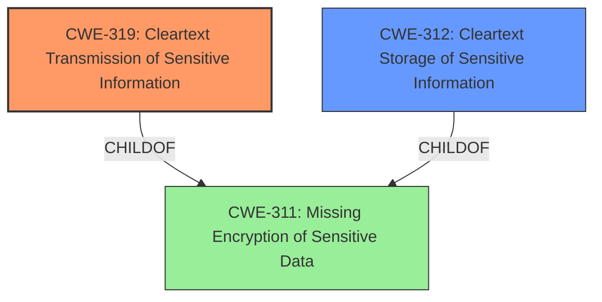

# Analysis Report for CVE-2021-36165

# Vulnerability Analysis Report: CVE-2021-36165

## Description


## Analysis (with Relationship Data)

# Summary
| CWE ID | CWE Name | Confidence | CWE Abstraction Level | CWE Vulnerability Mapping Label | CWE-Vulnerability Mapping Notes |
|---|---|---|---|---|---|
| CWE-319 | Cleartext Transmission of Sensitive Information | 1 | Base | Allowed | Primary CWE |
| CWE-312 | Cleartext Storage of Sensitive Information | 0.8 | Base | Allowed | Secondary Candidate |
| CWE-256 | Plaintext Storage of a Password | 0.5 | Base | Allowed | Secondary Candidate |

## Evidence and Confidence

*   **Confidence Score:** 0.9
*   **Evidence Strength:** HIGH

## Relationship Analysis
The primary CWE selected is CWE-319 (Cleartext Transmission of Sensitive Information), which is a base-level CWE. It is a child of CWE-311 (Missing Encryption of Sensitive Data), which is a class-level CWE. CWE-312 (Cleartext Storage of Sensitive Information) is also a base-level CWE and a child of CWE-311. The relationships show a hierarchy where a general lack of encryption (CWE-311) leads to specific issues of transmitting (CWE-319) or storing (CWE-312) sensitive data in cleartext. The abstraction levels influenced the choice, favoring the more specific base-level CWEs over the general class-level CWE.



## Vulnerability Chain
The vulnerability chain starts with the **incorrect** use of base64 encoding instead of proper encryption (**ROOT CAUSE**). This leads to **cleartext transmission of sensitive information** (CWE-319), where an attacker can intercept and decode the credentials. The impact is unauthorized access to the router.

## Summary of Analysis
The initial analysis focused on identifying the most accurate CWE based on the vulnerability description and related information. The description clearly states that the router sends username and password credentials as base64. The key phrase is "**cleartext storage of sensitive information** and sends username and password as base64." The CVE Reference Links Content Summary confirms this, stating that the root cause is the use of base64 encoding, which leads to **cleartext transmission** of credentials.

The Retriever Results listed CWE-312 (Cleartext Storage of Sensitive Information) as the top combined result. However, based on the evidence, the credentials are not only stored, but transmitted in a **cleartext** format (base64), therefore CWE-319 is a more accurate primary classification.

CWE-319 (Cleartext Transmission of Sensitive Information) is chosen because the vulnerability involves the transmission of username and password credentials using base64 encoding, which is a form of **cleartext transmission**.
> **Vulnerability Description:** RICON Industrial Cellular Router S9922L 16.10.3(3794) is affected by **cleartext storage of sensitive information** and sends username and password as base64.
> **CVE Reference Links Content Summary:** The RICON Industrial Cellular Router sends username and password credentials using base64 encoding instead of proper encryption.

CWE-312 (Cleartext Storage of Sensitive Information) is considered as a secondary candidate because it highlights that the credentials are stored without proper encryption which is an aspect of the vulnerability, however, the credentials are sent as base64, so CWE-319 is a better fit.
> **Vulnerability Description:** RICON Industrial Cellular Router S9922L 16.10.3(3794) is affected by **cleartext storage of sensitive information** and sends username and password as base64.

CWE-256 (Plaintext Storage of a Password) was considered because base64 is easily decodable, and it might be considered as plaintext. However, since it is being transmitted using base64, it is not completely plaintext which makes CWE-319 a better fit.
> **Vulnerability Description:** RICON Industrial Cellular Router S9922L 16.10.3(3794) is affected by **cleartext storage of sensitive information** and sends username and password as base64.

The selected CWEs are at the optimal level of specificity because they accurately represent the weakness. CWE-319 describes the **cleartext transmission**, while CWE-312 highlights the storage aspect. This ensures that both the transmission and storage vulnerabilities are identified.

Relevant CWE Information:

# Enhanced Context (25 CWEs)

## CWE-312: Cleartext Storage of Sensitive Information
**Abstraction Level**: Base
**Similarity Score**: 0.83
**Source**: dense

**Description**:
The product stores sensitive information in cleartext within a resource that might be accessible to another control sphere.

**Mapping Guidance**:
- Usage: Allowed
- Rationale: This CWE entry is at the Base level of abstraction, which is a preferred level of abstraction for mapping to the root causes of vulnerabilities.

## CWE-316: Cleartext Storage of Sensitive Information in Memory
**Abstraction Level**: Variant
**Similarity Score**: 0.80
**Source**: dense

**Description**:
The product stores sensitive information in cleartext in memory.

**Mapping Guidance**:
- Usage: Allowed
- Rationale: This CWE entry is at the Variant level of abstraction, which is a preferred level of abstraction for mapping to the root causes of vulnerabilities.

## CWE-311: Missing Encryption of Sensitive Data
**Abstraction Level**: Class
**Similarity Score**: 0.79
**Source**: dense

**Description**:
The product does not encrypt sensitive or critical information before storage or transmission.

**Mapping Guidance**:
- Usage: Discouraged
- Rationale: CWE-311 is high-level with more precise children available. It is a level-1 Class (i.e., a child of a Pillar).

## CWE-313: Cleartext Storage in a File or on Disk
**Abstraction Level**: Variant
**Similarity Score**: 0.78
**Source**: dense

**Description**:
The product stores sensitive information in cleartext in a file, or on disk.

**Mapping Guidance**:
- Usage: Allowed
- Rationale: This CWE entry is at the Variant level of abstraction, which is a preferred level of abstraction for mapping to the root causes of vulnerabilities.

## CWE-319: Cleartext Transmission of Sensitive Information
**Abstraction Level**: Base
**Similarity Score**: 0.77
**Source**: dense

**Description**:
The product transmits sensitive or security-critical data in cleartext in a communication channel that can be sniffed by unauthorized actors.

**Mapping Guidance**:
- Usage: Allowed
- Rationale: This CWE entry is at the Base level of abstraction, which is a preferred level of abstraction for mapping to the root causes of vulnerabilities.

## CWE-922: Insecure Storage of Sensitive Information
**Abstraction Level**: Class
**Similarity Score**: 0.76
**Source**: dense

**Description**:
The product stores sensitive information without properly limiting read or write access by unauthorized actors.

**Mapping Guidance**:
- Usage: Allowed-with-Review
- Rationale: This CWE entry is a Class and might have Base-level children that would be more appropriate

## CWE-538: Insertion of Sensitive Information into Externally-Accessible File or Directory
**Abstraction Level**: Base
**Similarity Score**: 0.76
**Source**: dense

**Description**:
The product places sensitive information into files or directories that are accessible to actors who are allowed to have access to the files, but not to the sensitive information.

**Mapping Guidance**:
- Usage: Allowed
- Rationale: This CWE entry is at the Base level of abstraction, which is a preferred level of abstraction for mapping to the root causes of vulnerabilities.

## CWE-226: Sensitive Information in Resource Not Removed Before Reuse
**Abstraction Level**: Base
**Similarity Score**: 0.76
**Source**: dense

**Description**:
The product releases a resource such as memory or a file so that it can be made available for reuse, but it does not clear or "zeroize" the information contained in the resource before the product performs a critical state transition or makes the resource available for reuse by other entities.

**Mapping Guidance**:
- Usage: Allowed
- Rationale: This CWE entry is at the Base level of abstraction, which is a preferred level of abstraction for mapping to the root causes of vulnerabilities.

## CWE-212: Improper Removal of Sensitive Information Before Storage or Transfer
**Abstraction Level**: Base
**Similarity Score**: 0.75
**Source**: dense


## CWE Relationship Analysis

Current CWEs represent these abstraction levels: .


### Vulnerability Chain Analysis

**Chain starting from CWE-312:**
- 312 (Cleartext Storage of Sensitive Information) - ROOT


**Chain starting from CWE-311:**
- 311 (Missing Encryption of Sensitive Data) - ROOT


### CWE Relationship Diagram

```mermaid
graph TD
    classDef primary fill:#f96,stroke:#333,stroke-width:2px
    classDef secondary fill:#69f,stroke:#333
    classDef tertiary fill:#9e9,stroke:#333
```


*Report generated on 2025-04-02 01:56:18*
