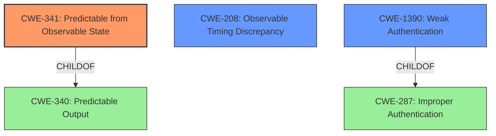

# Analysis for CVE-2021-36166

# Summary
| CWE ID  | CWE Name                                       | Confidence | CWE Abstraction Level | CWE Vulnerability Mapping Label | CWE-Vulnerability Mapping Notes |
| :------- | :--------------------------------------------- | :--------- | :---------------------- | :------------------------------ | :------------------------------ |
| CWE-341 | Predictable from Observable State                | 0.85       | Base                    | Allowed                         | Primary CWE                   |
| CWE-208 | Observable Timing Discrepancy                  | 0.65       | Base                    | Allowed                         | Secondary Candidate           |
| CWE-1390 | Weak Authentication | 0.50       | Class                    | Allowed-with-Review                         | Secondary Candidate           |

## Evidence and Confidence

*   **Confidence Score:** 0.80
*   **Evidence Strength:** HIGH

## Relationship Analysis
The primary CWE is CWE-341, which indicates that the authentication token is **predictable** based on **observable** system properties. CWE-208 (Observable Timing Discrepancy) is a related concern, as timing differences could be one way an attacker observes the system. CWE-1390 (Weak Authentication) serves as a broader classification that encompasses the **improper authentication** and predictability aspects, although CWE-341 is more specific and preferred. The child-parent relationship between CWE-340 and CWE-341 reinforces this hierarchy, where CWE-341 offers a more detailed characterization of the vulnerability.

## Vulnerability Chain
The vulnerability chain begins with **improper authentication**, which leads to a **weakness** that allows an attacker to **guess** the administrative account's authentication token. This is possible because the token is **predictable** from **observable** system properties. This allows a remote attacker to bypass authentication and potentially gain unauthorized access to the system.

## Summary of Analysis
The initial assessment, based on the vulnerability description, points to an **improper authentication** issue where an attacker can **guess** an authentication token by observing certain system properties. The retriever results indicate that CWE-341 (Predictable from Observable State) is a highly relevant candidate. The description for CWE-341 aligns well: "A number or object is predictable based on observations that the attacker can make about the state of the system or network, such as time, process ID, etc."

The evidence from the description is clear: "An **improper authentication** vulnerability in FortiMail before 7.0.1 may allow a remote attacker to efficiently **guess** one administrative accounts authentication token by means of the observation of certain systems properties." This directly supports the selection of CWE-341.

CWE-341 is chosen as the primary CWE because it's at the Base level of abstraction, which is preferred, and it accurately describes the root cause: the authentication token is **predictable** based on **observable** state. CWE-208 could be a contributing factor to the observation. CWE-1390 is considered but it is more general and a Class level.

Relevant CWE Information:
# Enhanced Context (25 CWEs)
The following CWEs were identified as potentially relevant to this vulnerability:

## CWE-302: Authentication Bypass by Assumed-Immutable Data
**Abstraction Level**: Base
**Similarity Score**: 0.79
**Source**: dense

**Description**:
The authentication scheme or implementation uses key data elements that are assumed to be immutable, but can be controlled or modified by the attacker.

**Mapping Guidance**:
- Usage: Allowed
- Rationale: This CWE entry is at the Base level of abstraction, which is a preferred level of abstraction for mapping to the root causes of vulnerabilities.

## CWE-1391: Use of Weak Credentials
**Abstraction Level**: Class
**Similarity Score**: 0.78
**Source**: dense

**Description**:
The product uses weak credentials (such as a default key or hard-coded password) that can be calculated, derived, reused, or guessed by an attacker.

**Mapping Guidance**:
- Usage: Allowed-with-Review
- Rationale: This CWE entry is a Class and might have Base-level children that would be more appropriate

## CWE-303: Incorrect Implementation of Authentication Algorithm
**Abstraction Level**: Base
**Similarity Score**: 0.78
**Source**: dense

**Description**:
The requirements for the product dictate the use of an established authentication algorithm, but the implementation of the algorithm is incorrect.

**Mapping Guidance**:
- Usage: Allowed
- Rationale: This CWE entry is at the Base level of abstraction, which is a preferred level of abstraction for mapping to the root causes of vulnerabilities.

## CWE-807: Reliance on Untrusted Inputs in a Security Decision
**Abstraction Level**: Base
**Similarity Score**: 0.77
**Source**: dense

**Description**:
The product uses a protection mechanism that relies on the existence or values of an input, but the input can be modified by an untrusted actor in a way that bypasses the protection mechanism.

**Mapping Guidance**:
- Usage: Allowed
- Rationale: This CWE entry is at the Base level of abstraction, which is a preferred level of abstraction for mapping to the root causes of vulnerabilities.

## CWE-1390: Weak Authentication
**Abstraction Level**: Class
**Similarity Score**: 0.77
**Source**: dense

**Description**:
The product uses an authentication mechanism to restrict access to specific users or identities, but the mechanism does not sufficiently prove that the claimed identity is correct.

**Mapping Guidance**:
- Usage: Allowed-with-Review
- Rationale: This CWE entry is a Class and might have Base-level children that would be more appropriate

## CWE-307: Improper Restriction of Excessive Authentication Attempts
**Abstraction Level**: Base
**Similarity Score**: 0.76
**Source**: dense

**Description**:
The product does not implement sufficient measures to prevent multiple failed authentication attempts within a short time frame.

**Mapping Guidance**:
- Usage: Allowed
- Rationale: This CWE entry is at the Base level of abstraction, which is a preferred level of abstraction for mapping to the root causes of vulnerabilities.

## CWE-288: Authentication Bypass Using an Alternate Path or Channel
**Abstraction Level**: Base
**Similarity Score**: 0.76
**Source**: dense

**Description**:
The product requires authentication, but the product has an alternate path or channel that does not require authentication.

**Mapping Guidance**:
- Usage: Allowed
- Rationale: This CWE entry is at the Base level of abstraction, which is a preferred level of abstraction for mapping to the root causes of vulnerabilities.

## CWE-305: Authentication Bypass by Primary Weakness
**Abstraction Level**: Base
**Similarity Score**: 0.76
**Source**: dense

**Description**:
The authentication algorithm is sound, but the implemented mechanism can be bypassed as the result of a separate weakness that is primary to the authentication error.

**Mapping Guidance**:
- Usage: Allowed
- Rationale: This CWE entry is at the Base level of abstraction, which is a preferred level of abstraction for mapping to the root causes of vulnerabilities.

## CWE-330: Use of Insufficiently Random Values
**Abstraction Level**: Class
**Similarity Score**: 0.76
**Source**: dense

**Description**:
The product uses insufficiently random numbers or values in a security context that depends on unpredictable numbers.

**Mapping Guidance**:
- Usage: Discouraged
- Rationale: This CWE entry is a level-1 Class (i.e., a child of a Pillar). It might have lower-level children that would be more appropriate

## CWE-798: Use of Hard-coded Credentials
**Abstraction Level**: Base
**Similarity Score**: 0.76
**Source**: dense

**Description**:
The product contains hard-coded credentials, such as a password or cryptographic key.

**Mapping Guidance**:
- Usage: Allowed
- Rationale: This CWE entry is at the Base level of abstraction, which is a preferred level of abstraction for mapping to the root causes of vulnerabilities.

## CWE-1390: Weak Authentication
**Abstraction Level**: Class
**Similarity Score**: 4557.73
**Source**: sparse

**Description**:
The product uses an authentication mechanism to restrict access to specific users or identities, but the