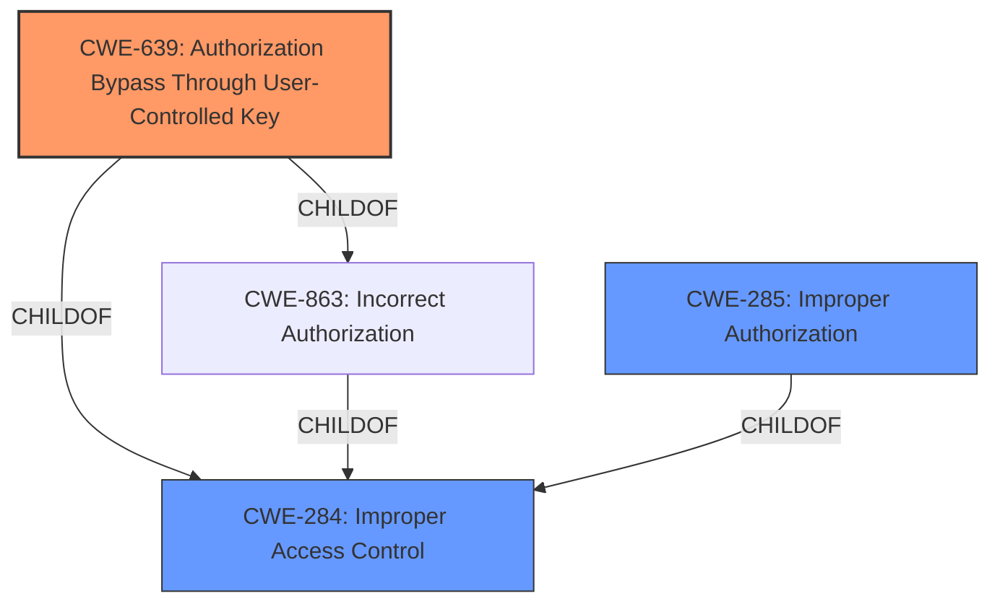

# Analysis for CVE-2021-36167

# Summary
| CWE ID | CWE Name | Confidence | CWE Abstraction Level | CWE Vulnerability Mapping Label | CWE-Vulnerability Mapping Notes |
|---|---|---|---|---|---|
| CWE-639 | Authorization Bypass Through User-Controlled Key | 0.8 | Base | Allowed | Primary CWE. The vulnerability allows an unauthenticated attacker to bypass webfilter control by modifying the session-id parameter. |
| CWE-285 | Improper Authorization | 0.6 | Class | Discouraged | Secondary candidate. The vulnerability description indicates an authorization issue, but CWE-285 is too general. |
| CWE-284 | Improper Access Control | 0.4 | Pillar | Discouraged | Secondary candidate. CWE-284 is a very high-level category, and more specific CWEs should be preferred. |

## Evidence and Confidence

*   **Confidence Score:** 0.8
*   **Evidence Strength:** HIGH

## Relationship Analysis
The analysis considered the following CWE relationships:
  - CWE-639 is a child of CWE-863 (Incorrect Authorization) and CWE-284 (Improper Access Control), indicating a more specific type of authorization issue.
  - CWE-285 is a child of CWE-284, representing a more general authorization problem.
  - The hierarchical structure guided the selection of CWE-639 as the most specific and relevant CWE.

## Vulnerability Chain
The vulnerability chain involves:
  - **Root Cause:** **Improper authorization** and **improper access control** due to the modification of the session-id parameter.
  - **Weakness:** The system does not properly validate or restrict the modification of the session ID, allowing unauthorized access.
  - **Impact:** Bypassing the webfilter control, potentially leading to further unauthorized actions.

## Summary of Analysis
The initial assessment focused on the **improper authorization** as the root cause of the vulnerability. The selection of CWE-639 is based on the provided evidence indicating that an unauthenticated attacker can bypass the web filter control by modifying the session-id parameter. This aligns with the description of CWE-639, which covers authorization bypass through user-controlled keys.

The "Vulnerability Description" states: "An **improper authorization** vulnerability [CWE-285] in FortiClient Windows versions 7.0.0 and 6.4.6 and below and 6.2.8 and below may allow an unauthenticated attacker to bypass the webfilter control via modifying the session-id parameter."

The "CVE Reference Links Content Summary" confirms: "**Root cause of vulnerability:** Improper authorization in FortiClient Windows related to the handling of session IDs. **Weaknesses/vulnerabilities present:** Improper access control (CWE-285) leading to web filter bypass. Modifying the session-id parameter allows an unauthenticated attacker to circumvent the web filter."

CWE-285 and CWE-284 were considered but deemed too general. CWE-639 provides a more specific classification by highlighting the user-controlled key aspect of the authorization bypass. The hierarchical relationships influenced the decision to select the most granular and accurate CWE.

CWE-639 is at the optimal level of specificity because it directly addresses the root cause (user-controlled key) and the mechanism (authorization bypass) described in the vulnerability.

Relevant CWE Information:

# Enhanced Context (25 CWEs)
The following CWEs were identified as potentially relevant to this vulnerability:

## CWE-639: Authorization Bypass Through User-Controlled Key
**Abstraction:** Base
**Similarity Score**: 0.75
**Source**: dense

**Description**:
The system's authorization functionality does not prevent one user from gaining access to another user's data or record by modifying the key value identifying the data.

**Mapping Guidance**:
- Usage: Allowed
- Rationale: This CWE entry is at the Base level of abstraction, which is a preferred level of abstraction for mapping to the root causes of vulnerabilities.

## CWE-285: Improper Authorization
**Abstraction:** Class
**Status:** Draft

### Description
The product does not perform or incorrectly performs an authorization check when an actor attempts to access a resource or perform an action.

### Extended Description
Assuming a user with a given identity, authorization is the process of determining whether that user can access a given resource, based on the user's privileges and any permissions or other access-control specifications that apply to the resource.

When access control checks are not applied consistently - or not at all - users are able to access data or perform actions that they should not be allowed to perform. This can lead to a wide range of problems, including information exposures, denial of service, and arbitrary code execution.

### Alternative Terms
AuthZ: "AuthZ" is typically used as an abbreviation of "authorization" within the web application security community. It is distinct from "AuthN" (or, sometimes, "AuthC") which is an abbreviation of "authentication." The use of "Auth" as an abbreviation is discouraged, since it could be used for either authentication or authorization.

### Relationships
ChildOf -> CWE-284

### Mapping Guidance
**Usage:** Discouraged
**Rationale:** CWE-285 is high-level and lower-level CWEs can frequently be used instead. It is a level-1 Class (i.e., a child of a Pillar).
**Comments:** Look at CWE-285's children and consider mapping to CWEs such as CWE-862: Missing Authorization, CWE-863: Incorrect Authorization, CWE-732: Incorrect Permission Assignment for Critical Resource, or others.

## CWE-284: Improper Access Control
**Abstraction:** Pillar
**Status:** Incomplete

### Description
The product does not restrict or incorrectly restricts access to a resource from an unauthorized actor.

### Extended Description
Access control involves the use of several protection mechanisms such as:

  - Authentication (proving the identity of an actor)
  - Authorization (ensuring that a given actor can access a resource), and
  - Accountability (tracking of activities that were performed)

When any mechanism is not applied or otherwise fails, attackers can compromise the security of the product by gaining privileges, reading sensitive information, executing commands, evading detection, etc.

There are two distinct behaviors that can introduce access control weaknesses:

  - Specification: incorrect privileges, permissions, ownership, etc. are explicitly specified for either the user or the resource (for example, setting a password file to be world-writable, or giving administrator capabilities to a guest user). This action could be performed by the program or the administrator.
  - Enforcement: the mechanism contains errors that prevent it from properly enforcing the specified access control requirements (e.g., allowing the user to specify their own privileges, or allowing a syntactically-incorrect ACL to produce insecure settings). This problem occurs within the program itself, in that it does not actually enforce the intended security policy that the administrator specifies.

### Alternative Terms
Authorization: The terms "access control" and "authorization" are often used interchangeably, although many people have distinct definitions. The CWE usage of "access control" is intended as a general term for the various mechanisms that restrict which users can access which resources, and "authorization" is more narrowly defined. It is unlikely that there will be community consensus on the use of these terms.

### Mapping Guidance
**Usage:** Discouraged
**Rationale:** CWE-284 is extremely high-level, a Pillar. Its name, "Improper Access Control," is often misused in low-information vulnerability reports [REF-1287] or by active use of the OWASP Top Ten, such as "A01:2021-Broken Access Control". It is not useful for trend analysis.
**Comments:** Consider using descendants of CWE-284 that are more specific to the kind of access control involved, such as those involving authorization (Missing Authorization (CWE-862), Incorrect Authorization (CWE-863), Incorrect Permission Assignment for Critical Resource (CWE-732), etc.); authentication (Missing Authentication (CWE-306) or Weak Authentication (CWE-1390)); Incorrect User Management (CWE-286); Improper Restriction of Communication Channel to Intended Endpoints (CWE-923); etc.