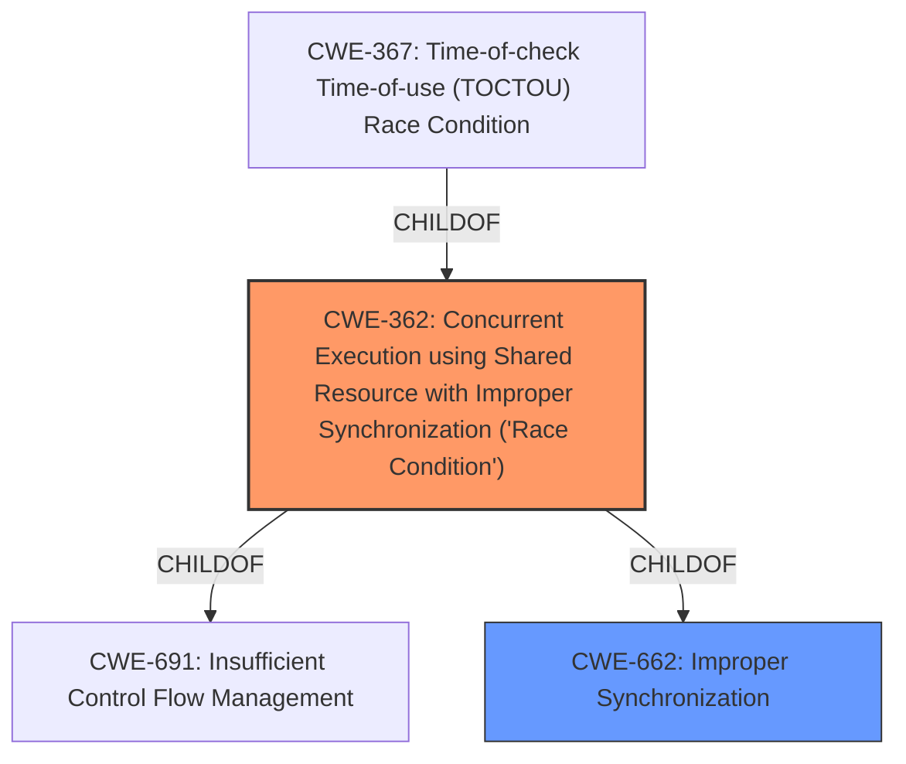

# Analysis for CVE-2021-36181

# Summary
| CWE ID | CWE Name | Confidence | CWE Abstraction Level | CWE Vulnerability Mapping Label | CWE-Vulnerability Mapping Notes |
|---|---|---|---|---|---|
| CWE-362 | Concurrent Execution using Shared Resource with Improper Synchronization ('Race Condition') | 1.0 | Class | Allowed-with-Review | Primary CWE |
| CWE-662 | Improper Synchronization | 0.7 | Class | Discouraged | Secondary Candidate |

## Evidence and Confidence

*   **Confidence Score:** 0.9
*   **Evidence Strength:** HIGH

## Relationship Analysis
The primary CWE, CWE-362, is a Class-level CWE, which means it is a higher-level abstraction. The retriever results show CWE-362 as the top match, and the description aligns well with the vulnerability. However, CWE-362 has a parent, CWE-691, and children, such as CWE-367. The vulnerability description and CVE reference summary clearly indicate a **race condition** due to **improper synchronization**. While CWE-367 is a "Time-of-check Time-of-use (TOCTOU) Race Condition," the provided information doesn't explicitly mention the time-of-check/time-of-use aspect, making CWE-362 a more appropriate fit. CWE-662 is a parent of CWE-362 and represents a more general case of improper synchronization.

## Vulnerability Chain
The vulnerability chain starts with **improper synchronization**, leading to a **race condition**, which then causes the underlying database data to be in an inconsistent state.

## Summary of Analysis
The initial analysis strongly suggests CWE-362 as the primary CWE due to the explicit mention of a **race condition** and **improper synchronization** in the vulnerability description. The CVE reference links content summary reinforces this by stating that the root cause is "improper thread synchronization when accessing the customer database interface" and that a "race condition exists."

The retriever results further support this selection, with CWE-362 being the top match. While CWE-662 is a related CWE, it's a higher-level class, and CWE-362 provides a more specific classification. CWE-367 is a more specific type of race condition, but the details provided do not indicate a time-of-check/time-of-use issue.

The selection of CWE-362 is based on the evidence:
*   "**improper Synchronization vulnerability (Race Condition)**" from the Vulnerability Description Key Phrases
*   "**Root cause of vulnerability:** Improper thread synchronization when accessing the customer database interface. Specifically, a race condition exists where concurrent execution using shared resources can lead to inconsistencies in the database." from the CVE Reference Links Content Summary

The graph relationships confirm that CWE-362 is a child of CWE-662, indicating that improper synchronization is a more general case of the specific race condition. However, CWE-362 is a better fit due to the explicit mention of a race condition.

CWE-362 is at the class level of abstraction. While it is generally better to map to the Base or Variant level when possible, in this case, the information provided is not specific enough to determine the exact type of race condition, so CWE-362 is the most appropriate choice.

Relevant CWE Information:

# Enhanced Context (25 CWEs)
The following CWEs were identified as potentially relevant to this vulnerability:

## CWE-405: Asymmetric Resource Consumption (Amplification)
**Abstraction Level**: Class
**Similarity Score**: 0.78
**Source**: dense

**Description**:
The product does not properly control situations in which an adversary can cause the product to consume or produce excessive resources without requiring the adversary to invest equivalent work or otherwise prove authorization, i.e., the adversary's influence is "asymmetric."

**Mapping Guidance**:
- Usage: Allowed-with-Review
- Rationale: This CWE entry is a Class and might have Base-level children that would be more appropriate

*Not Selected*: This CWE is not applicable as the vulnerability is not about resource amplification but about improper synchronization leading to a race condition.

## CWE-404: Improper Resource Shutdown or Release
**Abstraction Level**: Class
**Similarity Score**: 0.78
**Source**: dense

**Description**:
The product does not release or incorrectly releases a resource before it is made available for re-use.

**Mapping Guidance**:
- Usage: Allowed-with-Review
- Rationale: This CWE entry is a Class and might have Base-level children that would be more appropriate

*Not Selected*: This CWE is not applicable as the vulnerability is not about improper resource shutdown or release, but about improper synchronization leading to a race condition.

## CWE-664: Improper Control of a Resource Through its Lifetime
**Abstraction Level**: Pillar
**Similarity Score**: 0.77
**Source**: dense

**Description**:
The product does not maintain or incorrectly maintains control over a resource throughout its lifetime of creation, use, and release.

**Mapping Guidance**:
- Usage: Discouraged
- Rationale: This CWE entry is high-level when lower-level children are available.

*Not Selected*: This CWE is too general and doesn't capture the specific issue of improper synchronization.

## CWE-799: Improper Control of Interaction Frequency
**Abstraction Level**: Class
**Similarity Score**: 0.76
**Source**: dense

**Description**:
The product does not properly limit the number or frequency of interactions that it has with an actor, such as the number of incoming requests.

**Mapping Guidance**:
- Usage: Allowed-with-Review
- Rationale: This CWE entry is a Class and might have Base-level children that would be more appropriate

*Not Selected*: This CWE is not applicable as the vulnerability is not about controlling interaction frequency, but about improper synchronization leading to a race condition.

## CWE-667: Improper Locking
**Abstraction Level**: Class
**Similarity Score**: 0.76
**Source**: dense

**Description**:
The product does not properly acquire or release a lock on a resource, leading to unexpected resource state changes and behaviors.

**Mapping Guidance**:
- Usage: Allowed-with-Review
- Rationale: This CWE entry is a Class and might have Base-level children that would be more appropriate

*Not Selected*: While locking is a synchronization mechanism, the description does not explicitly state that improper locking is the root cause. Therefore, CWE-362, which covers the general case of improper synchronization leading to a race condition, is a better fit.

## CWE-662: Improper Synchronization
**Abstraction Level**: Class
**Similarity Score**: 0.76
**Source**: dense

**Description**:
The product utilizes multiple threads or processes to allow temporary access to a shared resource that can only be exclusive to one process at a time, but it does not properly synchronize these actions, which might cause simultaneous accesses of this resource by multiple threads or processes.

**Mapping Guidance**:
- Usage: Discouraged
- Rationale: This CWE entry is a level-1 Class (i.e., a child of a Pillar). It might have lower-level children that would be more appropriate

*Considered, but Secondary Candidate*: This CWE is closely related to CWE-362, as improper synchronization is the underlying issue that leads to the race condition. However, the description explicitly mentions a race condition, making CWE-362 the more specific and appropriate choice.

## CWE-226: Sensitive Information in Resource Not Removed Before Reuse
**Abstraction Level**: Base
**Similarity Score**: 0.76
**Source**: dense

**Description**:
The product releases a resource such as memory or a file so that it can be made available for reuse, but it does not clear or "zeroize" the information contained in the resource before the product performs a critical state transition or makes the resource available for reuse by other entities.

**Mapping Guidance**:
- Usage: Allowed
- Rationale: This CWE entry is at the Base level of abstraction, which is a preferred level of abstraction for mapping to the root causes of vulnerabilities.

*Not Selected*: This CWE is not applicable as the vulnerability is not about sensitive information in resources not removed before reuse, but about improper synchronization leading to a race condition.

## CWE-362: Concurrent Execution using Shared Resource with Improper Synchronization ('Race Condition')
**Abstraction Level**: Class
**Similarity Score**: