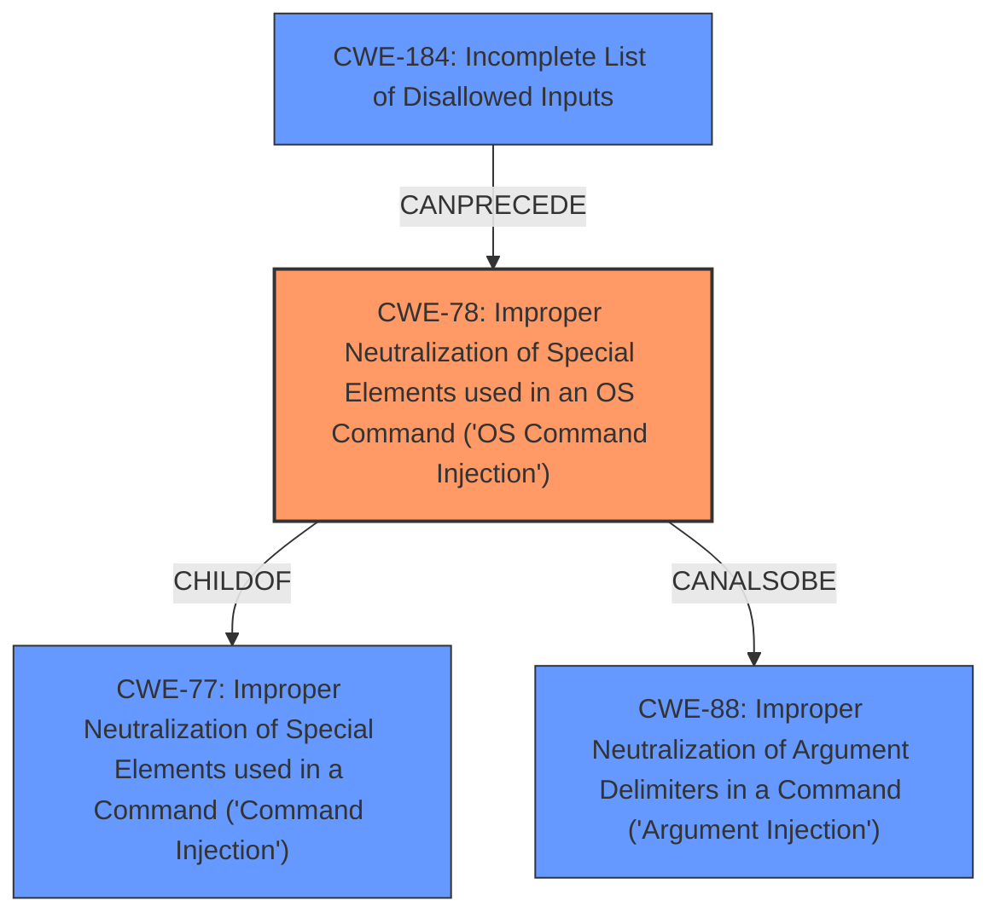

# Analysis for CVE-2021-36185

# Summary
| CWE ID | CWE Name | Confidence | CWE Abstraction Level | CWE Vulnerability Mapping Label | CWE-Vulnerability Mapping Notes |
|---|---|---|---|---|---|
| CWE-78 | Improper Neutralization of Special Elements used in an OS Command ('OS Command Injection') | 1.0 | Base | Allowed | Primary CWE |

## Evidence and Confidence

*   **Confidence Score:** 1.0
*   **Evidence Strength:** HIGH

## Relationship Analysis
The primary relationship that influenced the selection of CWE-78 is its direct relevance to the vulnerability description, which explicitly mentions "OS Command Injection". The "ChildOf" relationship to CWE-77 (Improper Neutralization of Special Elements used in a Command) indicates that CWE-78 is a more specific instance of command injection. The "CanAlsoBe" relationship to CWE-88 (Improper Neutralization of Argument Delimiters in a Command) suggests that argument injection could potentially play a role in OS command injection. The graph shows that CWE-78 can follow CWE-184, indicating a potential chain where an incomplete list of disallowed inputs can lead to OS command injection.

## Vulnerability Chain
The vulnerability chain starts with **improper input sanitization**, leading to **OS command injection**, which allows an attacker to execute unauthorized code.

## Summary of Analysis
The vulnerability description clearly states that the root cause is **improper input sanitization** which allows for **OS Command Injection**. The "Vulnerability Description Key Phrases" section confirms this with entries for rootcause and weakness. The "CVE Reference Links Content Summary" explicitly mentions "Improper neutralization of special elements used in an OS command" and "OS Command Injection (CWE-78)". The retriever results also strongly suggest CWE-78 as the primary CWE. The mapping guidance for CWE-78 recommends its use because it is at the Base level of abstraction. The evidence is strong and directly supports the selection of CWE-78 as the primary CWE. The confidence level is high (1.0) due to the clear and direct evidence from the vulnerability description.

The other CWEs were considered but not used because they did not directly match the described vulnerability. CWE-77 (Improper Neutralization of Special Elements used in a Command) is a more general class of command injection, but since the specific vulnerability involves OS commands, CWE-78 is more appropriate. CWE-89 (Improper Neutralization of Special Elements used in an SQL Command) and CWE-79 (Improper Neutralization of Input During Web Page Generation) are related to SQL injection and Cross-site Scripting, respectively, but are not relevant to this OS command injection vulnerability.