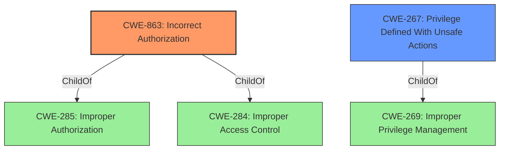

# Analysis Report for CVE-2021-36230

# Vulnerability Analysis Report: CVE-2021-36230

## Description


## Analysis (with Relationship Data)

# Summary
| CWE ID | CWE Name | Confidence | CWE Abstraction Level | CWE Vulnerability Mapping Label | CWE-Vulnerability Mapping Notes |
|---|---|---|---|---|---|
| CWE-863 | Incorrect Authorization | 1.0 | Class | Primary | Allowed-with-Review |
| CWE-267 | Privilege Defined With Unsafe Actions | 0.7 | Base | Secondary | Allowed |

## Evidence and Confidence

*   **Confidence Score:** 0.9
*   **Evidence Strength:** HIGH

## Relationship Analysis
The primary CWE selected is CWE-863 (**Incorrect Authorization**), which is a Class-level CWE. It is a child of both CWE-285 (**Improper Authorization**) and CWE-284 (**Improper Access Control**). CWE-267 (**Privilege Defined With Unsafe Actions**) is a Base-level CWE and a child of CWE-269 (**Improper Privilege Management**). I considered CWE-267 because the vulnerability allowed a user with plan access (a defined privilege) to perform organization-owner tasks (unsafe action).



## Vulnerability Chain
The vulnerability chain starts with **improper authorization** checks, leading to privilege escalation.
  - **Root Cause:** **did not properly perform authorization checks** on API requests using run tokens
  - **Weakness:** Insufficient authorization allows users with limited access to perform actions outside their intended permissions.
  - **Impact:** Privilege escalation to organization owner, where a user with plan access can invite new users to the organization.

## Summary of Analysis
The primary weakness is that the application **did not properly perform authorization checks**, which allowed a user to escalate privileges.

The vulnerability description states: "HashiCorp Terraform Enterprise releases up to v202106-1 **did not properly perform authorization checks** on a subset of API requests executed using the run token, allowing privilege escalation to organization owner."

The CVE Reference Links Content Summary states: "The primary weakness was the failure to enforce proper authorization on API requests that were using run tokens...The specific vulnerability allowed run tokens to invite new users to the organization, which is an administrative task."

CWE-863 (**Incorrect Authorization**) is the most appropriate primary CWE because the product performed an authorization check, but did not correctly perform the check. The description provided for CWE-863 matches the vulnerability details.

CWE-267 (**Privilege Defined With Unsafe Actions**) is a secondary CWE because a particular privilege (plan access to a workspace) was used to perform unsafe actions (inviting new users to the organization).

CWE-284 (**Improper Access Control**) was considered, but it is a Pillar-level CWE and is too general.

CWE-862 (**Missing Authorization**) was considered, but it is not the best fit because the product was performing authorization checks, just not correctly.

CWE-285 (**Improper Authorization**) was considered, but it is a Class-level CWE, and CWE-863 is a more specific child of CWE-285.


## CWE Relationship Analysis

Current CWEs represent these abstraction levels: .


### Vulnerability Chain Analysis

**Chain starting from CWE-862:**
- 862 (Missing Authorization) - ROOT


**Chain starting from CWE-284:**
- 284 (Improper Access Control) - ROOT


### CWE Relationship Diagram

```mermaid
graph TD
    classDef primary fill:#f96,stroke:#333,stroke-width:2px
    classDef secondary fill:#69f,stroke:#333
    classDef tertiary fill:#9e9,stroke:#333
```


*Report generated on 2025-04-02 00:50:25*
