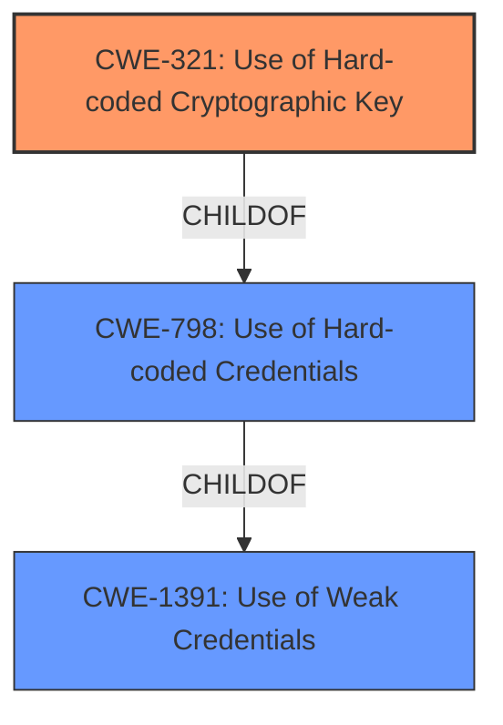

# Enhanced Analysis for CVE-2021-36234

# Summary
| CWE ID | CWE Name | Confidence | CWE Abstraction Level | CWE Vulnerability Mapping Label | CWE-Vulnerability Mapping Notes |
|---|---|---|---|---|---|
| CWE-321 | Use of Hard-coded Cryptographic Key | 1.0 | Variant | Allowed | Primary CWE |
| CWE-798 | Use of Hard-coded Credentials | 0.8 | Base | Allowed | Secondary Candidate |
| CWE-1391 | Use of Weak Credentials | 0.6 | Class | Allowed-with-Review | Secondary Candidate |

## Evidence and Confidence

*   **Confidence Score:** 0.9
*   **Evidence Strength:** HIGH

## Relationship Analysis
The primary CWE, CWE-321, is a Variant of CWE-798 (Base), which is a child of CWE-1391 (Class). This hierarchical relationship confirms that CWE-321 is the most specific and appropriate choice, as it directly addresses the use of a hard-coded cryptographic key.


## Vulnerability Chain
The vulnerability chain is straightforward: the root cause is the **use of a hard-coded cryptographic key** (CWE-321), which leads to the impact of being able to decrypt credentials.

## Summary of Analysis
The primary weakness is CWE-321 (**Use of Hard-coded Cryptographic Key**). This assessment is based on the vulnerability description and the CVE reference link content summary, which explicitly states that the root cause is the use of a hard-coded cryptographic key in MIK.starlight server to encrypt user credentials.
> **Vulnerability Description Key Phrases**
> -   **rootcause:** **Use of a hard-coded cryptographic key**
> **CVE Reference Links Content Summary**
> **Root Cause:** The MIK.starlight server uses a hard-coded cryptographic key to encrypt user credentials.
> **Weaknesses/Vulnerabilities:**
> *   **CWE-321: Use of Hard-Coded Cryptographic Key:** The server employs a static, unchanging key for encryption, making it vulnerable to decryption.

The graph relationships confirm the hierarchical structure, with CWE-321 being the most specific variant of the more general CWE-798 and CWE-1391. This level of specificity is optimal because it accurately reflects the nature of the vulnerability.

Relevant CWE Information:

# Enhanced Context (25 CWEs)

## CWE-321: Use of Hard-coded Cryptographic Key
**Abstraction:** Variant
**Status:** Draft

### Description
The use of a hard-coded cryptographic key significantly increases the possibility that encrypted data may be recovered.

**Technical Explanation:**
The vulnerability involves the **use of a hard-coded cryptographic key**, which means the key used for encryption is embedded directly in the application's code or configuration. This makes it easy for an attacker to discover the key and decrypt sensitive information.
**Security Implications:**
The security implication is that an attacker who gains access to the hard-coded key can decrypt any data encrypted with that key, leading to potential data breaches and unauthorized access.
**Relationship to Other CWEs:**
CWE-321 is a variant of CWE-798 (**Use of Hard-coded Credentials**) and CWE-1391 (**Use of Weak Credentials**). It is more specific than its parents because it focuses specifically on cryptographic keys.
**Mapping Guidance Influence:**
The MITRE mapping guidance recommends using the most specific CWE available, which in this case is CWE-321. The "Usage: Allowed" designation confirms that this is an appropriate mapping.

## CWE-798: Use of Hard-coded Credentials
**Abstraction:** Base
**Status:** Draft

### Description
The product contains hard-coded credentials, such as a password or cryptographic key.

**Technical Explanation:**
CWE-798 is a broader category that includes any hard-coded credentials, including passwords and cryptographic keys. While applicable, it is not as specific as CWE-321.
**Security Implications:**
The security implication is that an attacker can bypass authentication or access sensitive resources by using the hard-coded credentials.
**Relationship to Other CWEs:**
CWE-798 is a base CWE that is a parent of CWE-321.
**Mapping Guidance Influence:**
While CWE-798 is a valid mapping, the MITRE mapping guidance prefers more specific variants when available, making CWE-321 a better choice.

## CWE-1391: Use of Weak Credentials
**Abstraction:** Class
**Status:** Incomplete

### Description
The product uses weak credentials (such as a default key or hard-coded password) that can be calculated, derived, reused, or guessed by an attacker.

**Technical Explanation:**
CWE-1391 is a high-level class that encompasses various types of weak credentials. It is less specific than CWE-321 and CWE-798 because it includes credentials that are not necessarily hard-coded but are otherwise weak.
**Security Implications:**
The security implication is that an attacker can gain unauthorized access by exploiting the weak credentials.
**Relationship to Other CWEs:**
CWE-1391 is a class CWE that is a parent of CWE-798.
**Mapping Guidance Influence:**
The MITRE mapping guidance recommends reviewing children of this entry to see if there is a better fit, which leads to the selection of CWE-321.

## Other CWEs Considered But Not Used:
- CWE-259 (**Use of Hard-coded Password**): This is similar to CWE-321, but specifically for passwords. Since the vulnerability involves a cryptographic key, CWE-259 is not appropriate.
- CWE-656 (**Reliance on Security Through Obscurity**): While the use of a hard-coded key might seem like relying on obscurity, the primary weakness is the hard-coding itself, not the reliance on the key's obscurity.
- CWE-1394 (**Use of Default Cryptographic Key**): This is for *default* keys, not necessarily hardcoded ones, making CWE-321 more accurate.
- CWE-472 (**External Control of Assumed-Immutable Web Parameter**): Not applicable as the vulnerability is not related to web parameters.
- CWE-327 (**Use of a Broken or Risky Cryptographic Algorithm**): This CWE would be relevant if the cryptographic algorithm itself was weak, but the vulnerability is due to the hard-coded key.
- CWE-912 (**Hidden Functionality**): This is too general; the specific issue is the hard-coded key, not merely hidden functionality.
- CWE-916 (**Use of Password Hash With Insufficient Computational Effort**): This is specific to password hashing, and thus not applicable.


## CWE Relationship Analysis

Current CWEs represent these abstraction levels: .


### Vulnerability Chain Analysis

**Chain starting from CWE-912:**
- 912 (Hidden Functionality) - ROOT


**Chain starting from CWE-916:**
- 916 (Use of Password Hash With Insufficient Computational Effort) - ROOT


### CWE Relationship Diagram

```mermaid
graph TD
    classDef primary fill:#f96,stroke:#333,stroke-width:2px
    classDef secondary fill:#69f,stroke:#333
    classDef tertiary fill:#9e9,stroke:#333
```