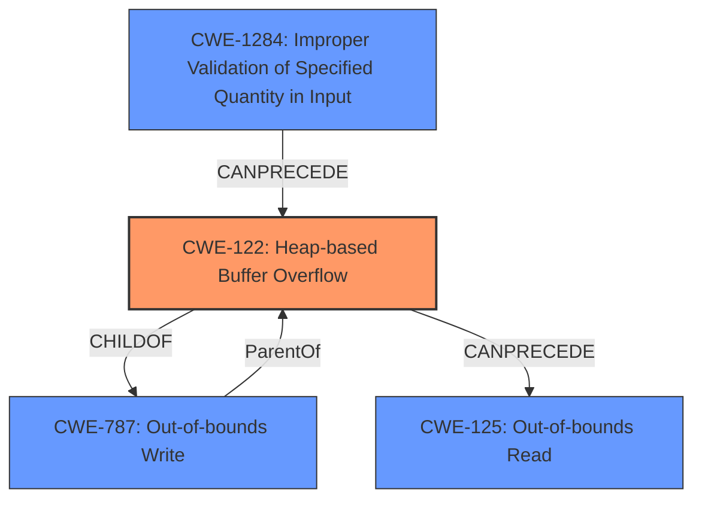

# Analysis for CVE-2021-3625

# Summary
| CWE ID    | CWE Name                                                                    | Confidence | CWE Abstraction Level | CWE Vulnerability Mapping Label | CWE-Vulnerability Mapping Notes |
| :---------- | :-------------------------------------------------------------------------- | :---------- | :---------------------- | :------------------------------ | :------------------------------ |
| CWE-122     | Heap-based Buffer Overflow                                                   | 1          | Variant              | Primary CWE                   | Allowed                       |
| CWE-125     | Out-of-bounds Read                                                         | 0.9         | Base                   | Secondary Candidate           | Allowed                       |
| CWE-1284    | Improper Validation of Specified Quantity in Input                          | 0.8         | Base                   | Secondary Candidate           | Allowed                       |

## Evidence and Confidence

*   **Confidence Score:** 0.9
*   **Evidence Strength:** HIGH

## Relationship Analysis
The primary weakness is **CWE-122** Heap-based Buffer Overflow, a variant of **CWE-787** Out-of-bounds Write. The root cause is **CWE-1284** Improper Validation of Specified Quantity in Input, as the `wLength` parameter is not validated against the buffer size. This leads to out-of-bounds writes and reads (**CWE-125**). **CWE-119** Improper Restriction of Operations within the Bounds of a Memory Buffer is a class-level CWE and too general.

## Vulnerability Chain
The chain of events is as follows:
1.  **CWE-1284** Improper Validation of Specified Quantity in Input: The `wLength` parameter is not properly validated.
2.  **CWE-122** Heap-based Buffer Overflow: An attacker-controlled `wLength` value larger than the buffer size is used in `memcpy`, leading to a heap-based buffer overflow.
3.  **CWE-125** Out-of-bounds Read: When responding to certain commands or after processing the `DFU_DNLOAD` command, the code uses the attacker-controlled `wLength` to determine how much data to send back to the host, potentially leading to out-of-bounds memory reads and information disclosure.

## Summary of Analysis
The analysis indicates a heap-based buffer overflow vulnerability due to **improper input validation**. The primary CWE is **CWE-122**, which aligns with the vulnerability description's key phrases and CVE reference links content summary.

The CVE reference links content summary states:
- **Weakness:** **Heap-based Buffer Overflow (CWE-122)**
- **Root cause of vulnerability**: The vulnerability stems from the fact that the `wLength` parameter from a USB control transfer request, which determines the amount of data to be copied, is not properly validated against the buffer size (`CONFIG_USB_REQUEST_BUFFER_SIZE`). This allows an attacker to specify a `wLength` value larger than the buffer, leading to out-of-bounds memory access during `memcpy`.
- **Buffer Overflow (CWE-122):** The primary vulnerability is a classic buffer overflow due to insufficient bounds checking before the `memcpy` operation.
- **Out-of-bounds Read:** ...the code uses the attacker-controlled `wLength` to determine how much data to send back to the host, potentially leading to out-of-bounds memory reads and information disclosure since `wLength` can be larger than the actual buffer.

**CWE-122** is the most specific and appropriate CWE for this vulnerability. **CWE-125** is a secondary effect due to the overflow. **CWE-1284** is the root cause because the code fails to validate the specified quantity in the input.

Relevant CWE Information:

# Enhanced Context (25 CWEs)

## CWE-191: Integer Underflow (Wrap or Wraparound)
**Abstraction Level**: Base
**Similarity Score**: 0.79
**Source**: dense

**Description**:
The product subtracts one value from another, such that the result is less than the minimum allowable integer value, which produces a value that is not equal to the correct result.

**Mapping Guidance**:
- Usage: Allowed
- Rationale: This CWE entry is at the Base level of abstraction, which is a preferred level of abstraction for mapping to the root causes of vulnerabilities.

*This CWE is not applicable because there is no evidence of subtraction leading to a value less than the minimum allowable integer value.*

## CWE-131: Incorrect Calculation of Buffer Size
**Abstraction Level**: Base
**Similarity Score**: 0.77
**Source**: dense

**Description**:
The product does not correctly calculate the size to be used when allocating a buffer, which could lead to a buffer overflow.

**Mapping Guidance**:
- Usage: Allowed
- Rationale: This CWE entry is at the Base level of abstraction, which is a preferred level of abstraction for mapping to the root causes of vulnerabilities.

*This CWE is not applicable because the buffer size is fixed; the problem is the lack of validation against that fixed size.*

## CWE-805: Buffer Access with Incorrect Length Value
**Abstraction Level**: Base
**Similarity Score**: 0.77
**Source**: dense

**Description**:
The product uses a sequential operation to read or write a buffer, but it uses an incorrect length value that causes it to access memory that is outside of the bounds of the buffer.

**Mapping Guidance**:
- Usage: Allowed
- Rationale: This CWE entry is at the Base level of abstraction, which is a preferred level of abstraction for mapping to the root causes of vulnerabilities.

*While this is related, CWE-122 and CWE-1284 more accurately capture the root cause and nature of the buffer overflow.*

## CWE-681: Incorrect Conversion between Numeric Types
**Abstraction Level**: Base
**Similarity Score**: 0.76
**Source**: dense

**Description**:
When converting from one data type to another, such as long to integer, data can be omitted or translated in a way that produces unexpected values. If the resulting values are used in a sensitive context, then dangerous behaviors may occur.

**Mapping Guidance**:
- Usage: Allowed
- Rationale: This CWE entry is at the Base level of abstraction, which is a preferred level of abstraction for mapping to the root causes of vulnerabilities.

*This CWE is not applicable because there is no evidence of incorrect conversion between numeric types.*

## CWE-130: Improper Handling of Length Parameter Inconsistency
**Abstraction Level**: Base
**Similarity Score**: 0.76
**Source**: dense

**Description**:
The product parses a formatted message or structure, but it does not handle or incorrectly handles a length field that is inconsistent with the actual length of the associated data.

**Mapping Guidance**:
- Usage: Allowed
- Rationale: This CWE entry is at the Base level of abstraction, which is a preferred level of abstraction for mapping to the root causes of vulnerabilities.

*This is similar to CWE-1284, but CWE-1284 is more specific.*

## CWE-124: Buffer Underwrite ('Buffer Underflow')
**Abstraction Level**: Base
**Similarity Score**: 0.76
**Source**: dense

**Description**:
The product writes to a buffer using an index or pointer that references a memory location prior to the beginning of the buffer.

**Mapping Guidance**:
- Usage: Allowed
- Rationale: This CWE entry is at the Base level of abstraction, which is a preferred level of abstraction for mapping to the root causes of vulnerabilities.

*This CWE is not applicable because the vulnerability is a buffer overflow (overwrite) rather than an underwrite.*

## CWE-125: Out-of-bounds Read
**Abstraction Level**: Base
**Similarity Score**: 0.75
**Source**: dense

**Description**:
The product reads data past the end, or before the beginning, of the intended buffer.

**Mapping Guidance**:
- Usage: Allowed
- Rationale: This CWE entry is at the Base level of abstraction, which is a preferred level of abstraction for mapping to the root causes of vulnerabilities.

*This is applicable because the code uses the attacker-controlled `wLength` to determine how much data to send back to the