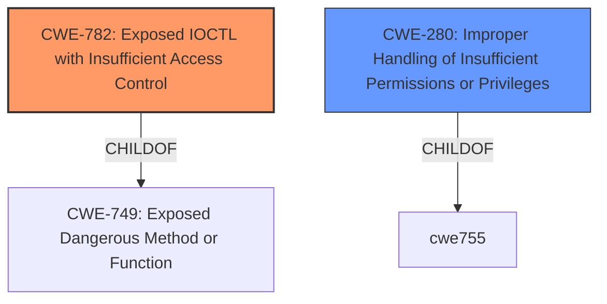

# Analysis for CVE-2021-36276

# Summary
| CWE ID  | CWE Name                                         | Confidence | CWE Abstraction Level | CWE Vulnerability Mapping Label | CWE-Vulnerability Mapping Notes |
|---------|---------------------------------------------------|------------|-----------------------|-----------------------------------|-----------------------------------|
| CWE-782 | Exposed IOCTL with Insufficient Access Control | 0.80       | Variant               | Allowed                           | Primary CWE                       |
| CWE-280 | Improper Handling of Insufficient Permissions or Privileges | 0.60       | Base                  | Allowed                           | Secondary Candidate             |

## Evidence and Confidence

*   **Confidence Score:** 0.70
*   **Evidence Strength:** MEDIUM

## Relationship Analysis
The primary CWE, CWE-782, is a Variant of CWE-749 (Exposed Dangerous Method or Function). The vulnerability involves an IOCTL with **insufficient access control**, which aligns with CWE-782's description. CWE-280 (Improper Handling of Insufficient Permissions or Privileges) is a broader Base CWE, representing a more general case of the issue. Choosing CWE-782 provides a more specific classification.

## Vulnerability Chain
The vulnerability chain starts with the **insufficient access control** on an exposed IOCTL (CWE-782). This can lead to privilege escalation, denial of service, or information disclosure. The root cause is the **lack of proper access control** on the IOCTL, allowing unauthorized users to potentially invoke it and trigger these impacts.

## Summary of Analysis
The initial assessment identified **insufficient access control** as the root cause in Dell's DBUtilDrv2.sys driver, potentially leading to privilege escalation, denial of service, or information disclosure. The primary focus was on accurately mapping this **insufficient access control**.

CWE-782 (Exposed IOCTL with Insufficient Access Control) was selected as the primary CWE because the vulnerability lies in the driver's **insufficient access control** of the IOCTL. The vulnerability description states, "Dell DBUtilDrv2.sys driver (versions 2.5 and 2.6) contains an **insufficient access control** vulnerability which may lead to escalation of privileges, denial of service, or information disclosure." The CVE Reference Links Content Summary confirms this, stating the "Root cause of vulnerability: **Insufficient access control** in the Dell DBUtilDrv2.sys driver." This aligns directly with CWE-782, which describes a product implementing an IOCTL with functionality that should be restricted, but it does not properly enforce access control for the IOCTL.

CWE-280 (Improper Handling of Insufficient Permissions or Privileges) was considered, as it addresses the broader issue of **insufficient privileges**. However, CWE-782 is more specific to the context of exposed IOCTLs.

The decision to use CWE-782 is based on its Variant level of abstraction and its direct relevance to the exposed IOCTL with **insufficient access control**.

Relevant CWE Information:

# Enhanced Context (25 CWEs)
The following CWEs were identified as potentially relevant to this vulnerability:

## CWE-274: Improper Handling of Insufficient Privileges
**Abstraction Level**: Base
**Similarity Score**: 0.79
**Source**: dense

**Description**:
The product does not handle or incorrectly handles when it has insufficient privileges to perform an operation, leading to resultant weaknesses.

**Mapping Guidance**:
- Usage: Discouraged
- Rationale: This CWE entry could be deprecated in a future version of CWE.

*Not selected because the focus is on access control, not just the handling of insufficient privileges.*

## CWE-280: Improper Handling of Insufficient Permissions or Privileges 
**Abstraction Level**: Base
**Similarity Score**: 0.78
**Source**: dense

**Description**:
The product does not handle or incorrectly handles when it has insufficient privileges to access resources or functionality as specified by their permissions. This may cause it to follow unexpected code paths that may leave the product in an invalid state.

**Mapping Guidance**:
- Usage: Allowed
- Rationale: This CWE entry is at the Base level of abstraction, which is a preferred level of abstraction for mapping to the root causes of vulnerabilities.

*Selected as a secondary candidate, because it is a broader case of the issue. The vulnerability description does say "**insufficient access control**" which matches this CWE's description but CWE-782 is a better fit.*

## CWE-266: Incorrect Privilege Assignment
**Abstraction Level**: Base
**Similarity Score**: 0.78
**Source**: dense

**Description**:
A product incorrectly assigns a privilege to a particular actor, creating an unintended sphere of control for that actor.

**Mapping Guidance**:
- Usage: Allowed
- Rationale: This CWE entry is at the Base level of abstraction, which is a preferred level of abstraction for mapping to the root causes of vulnerabilities.

*Not selected because the issue is not about incorrect assignment, but **insufficient control**.*

## CWE-653: Improper Isolation or Compartmentalization
**Abstraction Level**: Class
**Similarity Score**: 0.78
**Source**: dense

**Description**:
The product does not properly compartmentalize or isolate functionality, processes, or resources that require different privilege levels, rights, or permissions.

**Mapping Guidance**:
- Usage: Allowed
- Rationale: This CWE entry is at the Base level of abstraction, which is a preferred level of abstraction for mapping to the root causes of vulnerabilities.

*Not selected because the issue is not about isolating functionality.*

## CWE-267: Privilege Defined With Unsafe Actions
**Abstraction Level**: Base
**Similarity Score**: 0.77
**Source**: dense

**Description**:
A particular privilege, role, capability, or right can be used to perform unsafe actions that were not intended, even when it is assigned to the correct entity.

**Mapping Guidance**:
- Usage: Allowed
- Rationale: This CWE entry is at the Base level of abstraction, which is a preferred level of abstraction for mapping to the root causes of vulnerabilities.

*Not selected because the vulnerability description key phrase is "**insufficient access control**".*

## CWE-667: Improper Locking
**Abstraction Level**: Class
**Similarity Score**: 0.76
**Source**: dense

**Description**:
The product does not properly acquire or release a lock on a resource, leading to unexpected resource state changes and behaviors.

**Mapping Guidance**:
- Usage: Allowed-with-Review
- Rationale: This CWE entry is a Class and might have Base-level children that would be more appropriate

*Not selected because the vulnerability description key phrase is "**insufficient access control**".*

## CWE-1220: Insufficient Granularity of Access Control
**Abstraction Level**: Base
**Similarity Score**: 0.76
**Source**: dense

**Description**:
The product implements access controls via a policy or other feature with the intention to disable or restrict accesses (reads and/or writes) to assets in a system from untrusted agents. However, implemented access controls lack required granularity, which renders the control policy too broad because it allows accesses from unauthorized agents to the security-sensitive assets.

**Mapping Guidance**:
- Usage: Allowed
- Rationale: This CWE entry is at the Base level of abstraction, which is a preferred level of abstraction for mapping to the root causes of vulnerabilities.

*Not selected because the vulnerability description key phrase is "**insufficient access control**".*

## CWE-404: Improper Resource Shutdown or Release
**Abstraction Level**: Class
**Similarity Score**: 0.75
**Source**: dense

**Description**:
The product does not release or incorrectly releases a resource before it is made available for re-use.

**Mapping Guidance**:
- Usage: Allowed-with-Review
- Rationale: This CWE entry is a Class and might have Base-level children that would be more appropriate

*Not selected because the vulnerability description key phrase is "**insufficient access control**".*

## CWE-668: Exposure of Resource to Wrong Sphere
**Abstraction Level**: Class
**Similarity Score**: 0.75
**Source**: dense

**Description**:
The product exposes a resource to the wrong control sphere, providing unintended actors with inappropriate access to the resource.

**Mapping Guidance**:
- Usage: Discouraged
- Rationale: CWE-668 is high-level and is often misused as a catch-all when lower-level CWE IDs might be applicable. It is sometimes used for low-information vulnerability reports [REF-1287]. It is a level-1 Class (i.e., a child of a Pillar). It is not useful for trend analysis