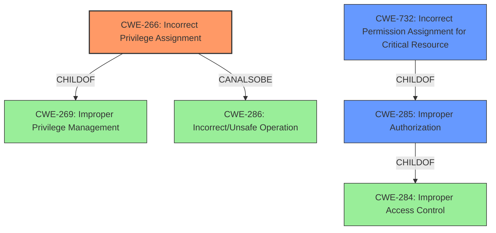

# Analysis Report for CVE-2021-36281

# Vulnerability Analysis Report: CVE-2021-36281

## Description


## Analysis (with Relationship Data)

# Summary
| CWE ID | CWE Name | Confidence | CWE Abstraction Level | CWE Vulnerability Mapping Label | CWE-Vulnerability Mapping Notes |
|---|---|---|---|---|---|
| CWE-266 | Incorrect Privilege Assignment | 1.0 | Base | Allowed | Primary CWE |
| CWE-732 | Incorrect Permission Assignment for Critical Resource | 0.7 | Class | Allowed-with-Review | Secondary Candidate |
| CWE-285 | Improper Authorization | 0.4 | Class | Discouraged | Secondary Candidate |

## Evidence and Confidence

*   **Confidence Score:** 1.0
*   **Evidence Strength:** HIGH

## Relationship Analysis
The primary CWE is CWE-266, which is a Base level CWE. CWE-266 is a child of CWE-269 (Improper Privilege Management), which is a Class level CWE, and can also be related to CWE-286 (Incorrect/Unsafe Operation). CWE-732 (Incorrect Permission Assignment for Critical Resource) and CWE-285 (Improper Authorization) are Class level CWEs that are children of CWE-284 (Improper Access Control). Selecting the Base CWE provides a more specific description of the vulnerability.



## Vulnerability Chain
The chain of events begins with an **incorrect permission assignment** (CWE-266), leading to a low-privileged authenticated user being able to **escalate privileges**.

## Summary of Analysis
Based on the vulnerability description, the **root cause** is an **incorrect permission assignment**, which allows a low-privileged authenticated user to escalate privileges.

The vulnerability description clearly states that there is an **"incorrect permission assignment"**. This directly corresponds to **CWE-266 (Incorrect Privilege Assignment)**, which is defined as "A product incorrectly assigns a privilege to a particular actor, creating an unintended sphere of control for that actor." The impact of this vulnerability is privilege escalation, which aligns with the "unintended sphere of control" aspect of CWE-266.

**CWE-732 (Incorrect Permission Assignment for Critical Resource)** was considered because it also involves incorrect permission assignments. However, CWE-732 is more focused on the resource itself having incorrect permissions, while CWE-266 focuses on the assignment of privileges to an actor. Since the vulnerability description mentions a "low privileged authenticated user" escalating privileges, **CWE-266 is a better fit** because it directly addresses the incorrect assignment of privileges to that user. The description for CWE-732 also states, "While the name itself indicates an assignment of permissions for resources, this is often misused for vulnerabilities in which "permissions" are not checked, which is an 'authorization' weakness (CWE-285 or descendants) within CWE's model."

**CWE-285 (Improper Authorization)** was considered because the incorrect permission assignment could lead to authorization bypass. However, CWE-285 is a more general class of weakness, and the vulnerability description provides enough information to pinpoint the root cause as the **incorrect assignment of privileges**, making CWE-266 a more specific and appropriate choice. Furthermore, CWE-285 is discouraged by MITRE: "CWE-285 is high-level and lower-level CWEs can frequently be used instead. It is a level-1 Class (i.e., a child of a Pillar)."

The decision to map to CWE-266 is based on the clear statement of **incorrect permission assignment** in the vulnerability description. The description aligns perfectly with the definition of CWE-266. This makes CWE-266 the most specific and accurate representation of the vulnerability's **root cause**.


## CWE Relationship Analysis

Current CWEs represent these abstraction levels: .


### Vulnerability Chain Analysis

**Chain starting from CWE-732:**
- 732 (Incorrect Permission Assignment for Critical Resource) - ROOT


**Chain starting from CWE-286:**
- 286 (Incorrect User Management) - ROOT


### CWE Relationship Diagram

```mermaid
graph TD
    classDef primary fill:#f96,stroke:#333,stroke-width:2px
    classDef secondary fill:#69f,stroke:#333
    classDef tertiary fill:#9e9,stroke:#333
```


*Report generated on 2025-04-02 13:55:59*
