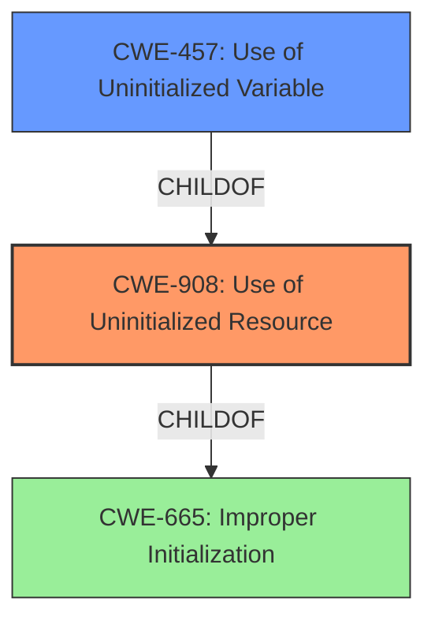

# Analysis Report for CVE-2021-36282

# Vulnerability Analysis Report: CVE-2021-36282

## Description


## Analysis (with Relationship Data)

# Summary
| CWE ID | CWE Name | Confidence | CWE Abstraction Level | CWE Vulnerability Mapping Label | CWE-Vulnerability Mapping Notes |
|---|---|---|---|---|---|
| CWE-908 | Use of Uninitialized Resource | 1.0 | Base | Allowed | Primary CWE |
| CWE-457 | Use of Uninitialized Variable | 0.7 | Variant | Allowed | Secondary Candidate |
| CWE-665 | Improper Initialization | 0.5 | Class | Discouraged | Secondary Candidate |

## Evidence and Confidence

*   **Confidence Score:** 0.9
*   **Evidence Strength:** HIGH

## Relationship Analysis
The primary CWE, CWE-908 (Use of Uninitialized Resource), is a base-level CWE and fits the vulnerability description well. CWE-457 (Use of Uninitialized Variable) is a variant of CWE-908 and could be considered, but the description doesn't explicitly mention a variable, only a resource. CWE-665 (Improper Initialization) is a parent of CWE-908 but is less specific.



## Vulnerability Chain
The vulnerability chain consists of:
1.  A **missing initialization of a resource** (implicit).
2.  The **use of that uninitialized resource**, leading to:
3.  Information disclosure (impact).

## Summary of Analysis
The vulnerability is clearly described as a "**use of uninitialized resource**". The CVE Reference Links Content Summary also states that the "**Root Cause of Vulnerability**" is the "**Use of an uninitialized resource**".

The selection of CWE-908 is directly supported by this evidence. CWE-908 is a Base level CWE, which is a preferred level of abstraction. The retriever results also list CWE-908 as the top candidate.

CWE-457 (Use of Uninitialized Variable) was considered because it is a variant of CWE-908, but the description focuses on a more general "resource" rather than a specific "variable". While a variable *could* be the uninitialized resource, there is insufficient evidence to promote this to the primary CWE.

CWE-665 (Improper Initialization) was also considered, since a missing initialization is a prerequisite for CWE-908. However, the description explicitly states the *use* of the uninitialized resource, making CWE-908 a more precise classification of the **root cause**.

The final decision is based on the provided evidence, the retriever results, and the CWE specifications, favoring the most specific and accurate representation of the vulnerability's root cause.

Relevant CWE Information:

# Enhanced Context (25 CWEs)
The following CWEs were identified as potentially relevant to this vulnerability:

## CWE-274: Improper Handling of Insufficient Privileges
**Abstraction Level**: Base
**Similarity Score**: 0.79
**Source**: dense

**Description**:
The product does not handle or incorrectly handles when it has insufficient privileges to perform an operation, leading to resultant weaknesses.

**Mapping Guidance**:
- Usage: Discouraged
- Rationale: This CWE entry could be deprecated in a future version of CWE.

**Not Selected:** This CWE focuses on privilege handling, which is not the core issue in this vulnerability. The vulnerability is about using an uninitialized resource, not about improper privilege checks.

## CWE-280: Improper Handling of Insufficient Permissions or Privileges 
**Abstraction Level**: Base
**Similarity Score**: 0.79
**Source**: dense

**Description**:
The product does not handle or incorrectly handles when it has insufficient privileges to access resources or functionality as specified by their permissions. This may cause it to follow unexpected code paths that may leave the product in an invalid state.

**Mapping Guidance**:
- Usage: Allowed
- Rationale: This CWE entry is at the Base level of abstraction, which is a preferred level of abstraction for mapping to the root causes of vulnerabilities.

**Not Selected:** Similar to CWE-274, this CWE is not directly related to the root cause, which is the use of an uninitialized resource, not a permission or privilege issue.

## CWE-266: Incorrect Privilege Assignment
**Abstraction Level**: Base
**Similarity Score**: 0.77
**Source**: dense

**Description**:
A product incorrectly assigns a privilege to a particular actor, creating an unintended sphere of control for that actor.

**Mapping Guidance**:
- Usage: Allowed
- Rationale: This CWE entry is at the Base level of abstraction, which is a preferred level of abstraction for mapping to the root causes of vulnerabilities.

**Not Selected:** This CWE is about privilege assignment, which is not the primary weakness. The vulnerability is about using an uninitialized resource.

## CWE-653: Improper Isolation or Compartmentalization
**Abstraction Level**: Class
**Similarity Score**: 0.77
**Source**: dense

**Description**:
The product does not properly compartmentalize or isolate functionality, processes, or resources that require different privilege levels, rights, or permissions.

**Mapping Guidance**:
- Usage: Allowed
- Rationale: This CWE entry is at the Base level of abstraction, which is a preferred level of abstraction for mapping to the root causes of vulnerabilities.

**Not Selected:** This CWE is too high-level and doesn't directly address the root cause, which is the use of an uninitialized resource.

## CWE-404: Improper Resource Shutdown or Release
**Abstraction Level**: Class
**Similarity Score**: 0.77
**Source**: dense

**Description**:
The product does not release or incorrectly releases a resource before it is made available for re-use.

**Mapping Guidance**:
- Usage: Allowed-with-Review
- Rationale: This CWE entry is a Class and might have Base-level children that would be more appropriate

**Not Selected:** This CWE deals with resource shutdown, which is not related to the use of an uninitialized resource.

## CWE-667: Improper Locking
**Abstraction Level**: Class
**Similarity Score**: 0.77
**Source**: dense

**Description**:
The product does not properly acquire or release a lock on a resource, leading to unexpected resource state changes and behaviors.

**Mapping Guidance**:
- Usage: Allowed-with-Review
- Rationale: This CWE entry is a Class and might have Base-level children that would be more appropriate

**Not Selected:** This CWE deals with locking mechanisms, which are not relevant to the use of an uninitialized resource in this vulnerability.

## CWE-668: Exposure of Resource to Wrong Sphere
**Abstraction Level**: Class
**Similarity Score**: 0.76
**Source**: dense

**Description**:
The product exposes a resource to the wrong control sphere, providing unintended actors with inappropriate access to the resource.

**Mapping Guidance**:
- Usage: Discouraged
- Rationale: CWE-668 is high-level and is often misused as a catch-all when lower-level CWE IDs might be applicable. It is sometimes used for low-information vulnerability reports [REF-1287]. It is a level-1 Class (i.e., a child of a Pillar). It is not useful for trend analysis.

**Not Selected:** This CWE is too general and doesn't accurately describe the root cause of using an uninitialized resource.

## CWE-664: Improper Control of a Resource Through its Lifetime
**Abstraction Level**: Pillar
**Similarity Score**: 0.76
**Source**: dense

**Description**:
The product does not maintain or incorrectly maintains control over a resource throughout its lifetime of creation, use, and release.

**Mapping Guidance**:
- Usage: Discouraged
- Rationale: This CWE entry is high-level when lower-level children are available.

**Not Selected:** This CWE is a high-level Pillar and doesn't provide enough specificity compared to CWE-908.

## CWE-267: Privilege Defined With Unsafe Actions
**Abstraction Level**: Base
**Similarity Score**: 0.76
**Source**: dense

**Description**:
A particular privilege, role, capability, or right can be used to perform unsafe actions that were not intended, even when it is assigned to the correct entity.

**Mapping Guidance**:
- Usage: Allowed
- Rationale: This CWE entry is at the Base level of abstraction, which is a preferred level of abstraction for mapping to the root causes of vulnerabilities.

**Not Selected:** The vulnerability is not about privileges but about using an uninitialized resource.

## CWE-665: Improper Initialization
**Abstraction Level**: Class
**Similarity Score**:


## CWE Relationship Analysis

Current CWEs represent these abstraction levels: .


### Vulnerability Chain Analysis

**Chain starting from CWE-667:**
- 667 (Improper Locking) - ROOT


**Chain starting from CWE-664:**
- 664 (Improper Control of a Resource Through its Lifetime) - ROOT


### CWE Relationship Diagram

```mermaid
graph TD
    classDef primary fill:#f96,stroke:#333,stroke-width:2px
    classDef secondary fill:#69f,stroke:#333
    classDef tertiary fill:#9e9,stroke:#333
```


*Report generated on 2025-04-02 08:12:39*
