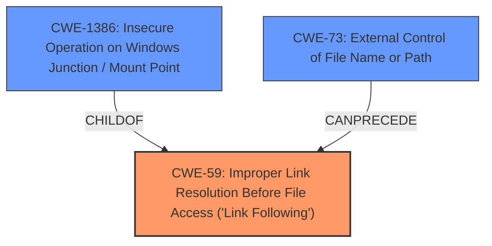

# Raw Analyzer Response for CVE-2021-36286

# Summary
| CWE ID    | CWE Name                                                                 | Confidence | CWE Abstraction Level | CWE Vulnerability Mapping Label | CWE-Vulnerability Mapping Notes |
| :-------- | :----------------------------------------------------------------------- | :--------- | :-------------------- | :------------------------------ | :------------------------------ |
| CWE-59    | Improper Link Resolution Before File Access ('Link Following')          | 0.9        | Base                  | Primary                         | Allowed                       |
| CWE-1386  | Insecure Operation on Windows Junction / Mount Point                     | 0.8        | Base                  | Secondary                       | Allowed                       |
| CWE-73    | External Control of File Name or Path                                   | 0.6        | Base                  | Secondary                       | Allowed                       |

## Evidence and Confidence

*   **Confidence Score:** 0.8
*   **Evidence Strength:** HIGH

## Relationship Analysis
The primary weakness, CWE-59 [Improper Link Resolution Before File Access ('Link Following')], is a base CWE that describes the root cause of the vulnerability, where the software does not properly handle symbolic links. CWE-1386 [Insecure Operation on Windows Junction / Mount Point] is a child of CWE-59 and specifically addresses the use of junctions. CWE-73 [External Control of File Name or Path] is related to CWE-59, as external input influences file operations.

## Vulnerability Chain
The vulnerability chain starts with the **lack of proper input validation** by SupportAssist, leading to the **improper handling of junction points** (NTFS). This then allows a non-privileged user to **delete arbitrary files**, resulting in potential data loss and system instability.
  - The chain of root cause and weaknesses is: **Improper handling of junction points** -> **arbitrary file deletion**.

## Summary of Analysis
Initially, the analysis pointed towards CWE-59 [Improper Link Resolution Before File Access ('Link Following')] as the primary weakness because the vulnerability involves the software's inability to properly handle symbolic links and junction points, allowing an attacker to cause the product to operate on unauthorized files. The vulnerability description clearly states that "Support assist clean files functionality do not distinguish junction points from the physical folder and proceeds to clean the target of the junction that allows nonprivileged users to create junction points and delete arbitrary files on the system which can be accessed only by the admin." This aligns directly with the description of CWE-59 [Improper Link Resolution Before File Access ('Link Following')], which states, "The product attempts to access a file based on the filename, but it does not properly prevent that filename from identifying a link or shortcut that resolves to an unintended resource."

CWE-1386 [Insecure Operation on Windows Junction / Mount Point] was considered because it specifically addresses the insecure handling of junction points, which are central to this vulnerability. It is a child of CWE-59 [Improper Link Resolution Before File Access ('Link Following')], making it a more specific variant. Given the specificity regarding NTFS junction points, CWE-1386 [Insecure Operation on Windows Junction / Mount Point] is a relevant secondary CWE.

CWE-73 [External Control of File Name or Path] was considered because the creation of symbolic links and junction points involves external control over file paths. The vulnerability description highlights that non-privileged users can create junction points, which then leads to the ability to delete arbitrary files.

The selection of CWE-59 [Improper Link Resolution Before File Access ('Link Following')] as the primary CWE is based on its accurate representation of the root cause, the software's failure to properly validate and handle symbolic links and junction points. The selection of CWE-1386 [Insecure Operation on Windows Junction / Mount Point] is based on the fact that the vulnerability involves the exploitation of NTFS junction points. Finally, the selection of CWE-73 [External Control of File Name or Path] as a secondary CWE is based on the external control over file paths in the creation of symbolic links and junction points.

CWE-61 [UNIX Symbolic Link (Symlink) Following] was considered but not selected as the primary CWE because this vulnerability specifically involves NTFS junction points on Windows, not UNIX symbolic links.

The retriever results, particularly the sparse results, strongly support the selection of CWE-59 [Improper Link Resolution Before File Access ('Link Following')] and CWE-1386 [Insecure Operation on Windows Junction / Mount Point], further validating the analysis.

The final decision is based on a comprehensive analysis of the vulnerability description, the retriever results, the CWE specifications, and the relationships between the CWEs. The selected CWEs accurately represent the root cause and the specific details of the vulnerability.