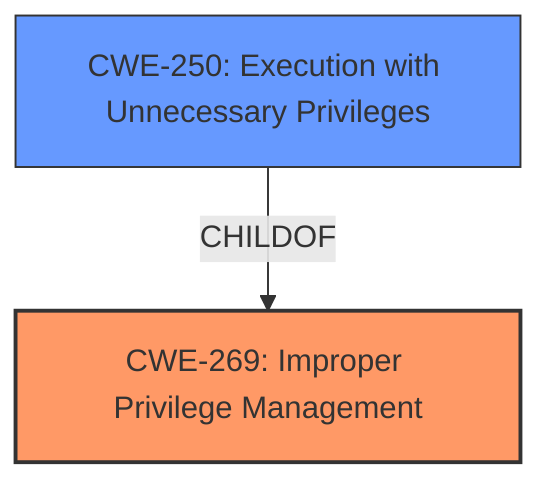

# Analysis Report for CVE-2021-36290

# Vulnerability Analysis Report: CVE-2021-36290

## Description


## Analysis (with Relationship Data)

# Summary
| CWE ID  | CWE Name                                                       | Confidence | CWE Abstraction Level | CWE Vulnerability Mapping Label | CWE-Vulnerability Mapping Notes |
| :-------- | :------------------------------------------------------------- | :--------- | :---------------------- | :------------------------------ | :------------------------------ |
| CWE-269 | Improper Privilege Management | 0.8      | Class                 | Discouraged                   | Discouraged, primary CWE       |
| CWE-250 | Execution with Unnecessary Privileges | 0.6      | Base                  | Allowed                     | Secondary CWE                  |

## Evidence and Confidence

*   **Confidence Score:** 0.7
*   **Evidence Strength:** MEDIUM

## Relationship Analysis
The primary relationship impacting the decision is that CWE-250 is a ChildOf CWE-269. Although CWE-269 is a Class-level CWE and is often misused, there isn't enough information to select a more specific Base-level CWE. CWE-250 is a Base-level CWE and more specific, so it is included as a secondary CWE.



## Vulnerability Chain
The vulnerability chain starts with **improper privilege management** (CWE-269), leading to a privilege escalation. This could be due to the system running with **unnecessary privileges** (CWE-250). The final impact is a local malicious admin gaining elevated privileges.

## Summary of Analysis
The initial assessment, guided by the provided "CWE for similar CVE Descriptions," pointed towards CWE-269 as the primary candidate. The retriever results also listed CWE-269.

The vulnerability description clearly states that the root cause is a **privilege escalation vulnerability**: "The Dell VNX2 for File version 8.1.21.266 and earlier, contains a privilege escalation vulnerability." This aligns with the description of CWE-269: **"The product does not properly assign, modify, track, or check privileges for an actor, creating an unintended sphere of control for that actor."**

However, CWE-269 is a Class-level CWE and is often misused as stated in the MITRE guidance: **"CWE-269 is commonly misused. It can be conflated with "privilege escalation," which is a technical impact that is listed in many low-information vulnerability reports."**

The retriever results also listed CWE-250 "Execution with Unnecessary Privileges" which is a Base-level CWE and a child of CWE-269. The description of CWE-250 is **"The product performs an operation at a privilege level that is higher than the minimum level required, which creates new weaknesses or amplifies the consequences of other weaknesses."** This is a more specific CWE than CWE-269. I am including it as a secondary candidate, because there is not enough information to exclude CWE-269 and make CWE-250 the primary CWE.

I am proceeding with CWE-269 even though it is discouraged, because it is listed as the primary CWE for similar CVE Descriptions and due to the lack of more detailed information.

Other CWEs Considered and Rejected:

*   CWE-732: Incorrect Permission Assignment for Critical Resource - The vulnerability description doesn't specify incorrect permission assignments, focusing more on broader privilege management issues. Therefore, this CWE is not the best fit.
*   CWE-331: Insufficient Entropy - This is related to randomness and token generation, not privilege management.
*   CWE-20: Improper Input Validation - While input validation could be a contributing factor, the core issue is privilege management.
*   CWE-287: Improper Authentication - Authentication is not mentioned in the description, making this CWE irrelevant.
*   CWE-613: Insufficient Session Expiration - Session management is not mentioned.
*   CWE-284: Improper Access Control - This is too high-level (Pillar) compared to CWE-269 (Class).
*   CWE-693: Protection Mechanism Failure - Too high-level.
*   CWE-256: Plaintext Storage of a Password - Password storage is not mentioned.

Relevant CWE Information:

# Enhanced Context (25 CWEs)
The following CWEs were identified as potentially relevant to this vulnerability:

## CWE-312: Cleartext Storage of Sensitive Information
**Abstraction Level**: Base
**Similarity Score**: 0.74
**Source**: dense

**Description**:
The product stores sensitive information in cleartext within a resource that might be accessible to another control sphere.

**Mapping Guidance**:
- Usage: Allowed
- Rationale: This CWE entry is at the Base level of abstraction, which is a preferred level of abstraction for mapping to the root causes of vulnerabilities.

**Why it was not selected:** This CWE is not about storing sensitive information in cleartext.

## CWE-274: Improper Handling of Insufficient Privileges
**Abstraction Level**: Base
**Similarity Score**: 0.74
**Source**: dense

**Description**:
The product does not handle or incorrectly handles when it has insufficient privileges to perform an operation, leading to resultant weaknesses.

**Mapping Guidance**:
- Usage: Discouraged
- Rationale: This CWE entry could be deprecated in a future version of CWE.

**Why it was not selected:** This CWE is not about handling insufficient privileges.

## CWE-807: Reliance on Untrusted Inputs in a Security Decision
**Abstraction Level**: Base
**Similarity Score**: 0.74
**Source**: dense

**Description**:
The product uses a protection mechanism that relies on the existence or values of an input, but the input can be modified by an untrusted actor in a way that bypasses the protection mechanism.

**Mapping Guidance**:
- Usage: Allowed
- Rationale: This CWE entry is at the Base level of abstraction, which is a preferred level of abstraction for mapping to the root causes of vulnerabilities.

**Why it was not selected:** This CWE is not about relying on untrusted inputs in a security decision.

## CWE-653: Improper Isolation or Compartmentalization
**Abstraction Level**: Class
**Similarity Score**: 0.74
**Source**: dense

**Description**:
The product does not properly compartmentalize or isolate functionality, processes, or resources that require different privilege levels, rights, or permissions.

**Mapping Guidance**:
- Usage: Allowed
- Rationale: This CWE entry is at the Base level of abstraction, which is a preferred level of abstraction for mapping to the root causes of vulnerabilities.

**Why it was not selected:** This CWE is not about isolation or compartmentalization.

## CWE-1391: Use of Weak Credentials
**Abstraction Level**: Class
**Similarity Score**: 0.73
**Source**: dense

**Description**:
The product uses weak credentials (such as a default key or hard-coded password) that can be calculated, derived, reused, or guessed by an attacker.

**Mapping Guidance**:
- Usage: Allowed-with-Review
- Rationale: This CWE entry is a Class and might have Base-level children that would be more appropriate

**Why it was not selected:** This CWE is not about using weak credentials.

## CWE-280: Improper Handling of Insufficient Permissions or Privileges 
**Abstraction Level**: Base
**Similarity Score**: 0.73
**Source**: dense

**Description**:
The product does not handle or incorrectly handles when it has insufficient privileges to access resources or functionality as specified by their permissions. This may cause it to follow unexpected code paths that may leave the product in an invalid state.

**Mapping Guidance**:
- Usage: Allowed
- Rationale: This CWE entry is at the Base level of abstraction, which is a preferred level of abstraction for mapping to the root causes of vulnerabilities.

**Why it was not selected:** This CWE is not about handling insufficient permissions or privileges.

## CWE-664: Improper Control of a Resource Through its Lifetime
**Abstraction Level**: Pillar
**Similarity Score**: 0.73
**Source**: dense

**Description**:
The product does not maintain or incorrectly maintains control over a resource throughout its lifetime of creation, use, and release.

**Mapping Guidance**:
- Usage: Discouraged
- Rationale: This CWE entry is high-level when lower-level children are available.

**Why it was not selected:** This CWE is too high level.

## CWE-691: Insufficient Control Flow Management
**Abstraction Level**: Pillar
**Similarity Score**: 0.72
**Source**: dense

**Description**:
The code does not sufficiently manage its control flow during execution, creating conditions in which the control flow can be modified in unexpected ways.

**Mapping Guidance**:
- Usage: Discouraged
- Rationale: This CWE entry is extremely high-level, a Pillar. However, classification research is limited for weaknesses of


## CWE Relationship Analysis

Current CWEs represent these abstraction levels: .


### Vulnerability Chain Analysis

**Chain starting from CWE-732:**
- 732 (Incorrect Permission Assignment for Critical Resource) - ROOT


**Chain starting from CWE-693:**
- 693 (Protection Mechanism Failure) - ROOT


### CWE Relationship Diagram

```mermaid
graph TD
    classDef primary fill:#f96,stroke:#333,stroke-width:2px
    classDef secondary fill:#69f,stroke:#333
    classDef tertiary fill:#9e9,stroke:#333
```


*Report generated on 2025-04-01 22:06:30*
