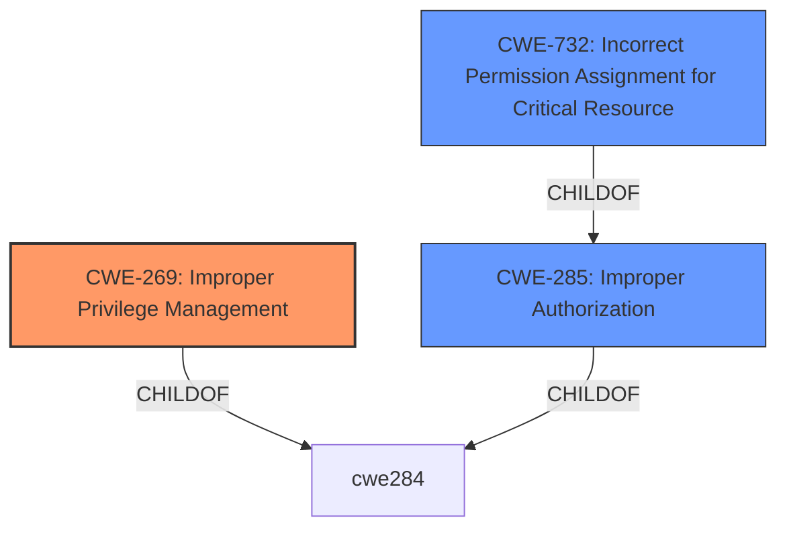

# Enhanced Analysis for CVE-2021-36293

# Summary
| CWE ID | CWE Name | Confidence | CWE Abstraction Level | CWE Vulnerability Mapping Label | CWE-Vulnerability Mapping Notes |
|---|---|---|---|---|---|
| CWE-269 | Improper Privilege Management | 0.75 | Class | Primary | Discouraged |
| CWE-285 | Improper Authorization | 0.60 | Class | Secondary | Discouraged |
| CWE-732 | Incorrect Permission Assignment for Critical Resource | 0.50 | Class | Secondary | Allowed-with-Review |

## Evidence and Confidence

*   **Confidence Score:** 0.70
*   **Evidence Strength:** MEDIUM

## Relationship Analysis
The primary consideration was the high-level nature of the vulnerability description, which focused on the **impact** of privilege escalation.
CWE-269 is a class-level CWE and the parent of CWE-250 (Execution with Unnecessary Privileges) and CWE-266 (Incorrect Privilege Assignment).
CWE-284 (Improper Access Control) is a pillar-level CWE and the parent of CWE-287 (Improper Authentication) and CWE-285 (Improper Authorization).
CWE-732 (Incorrect Permission Assignment for Critical Resource) is a child of CWE-285 and CWE-668 (Exposure of Resource to Wrong Sphere).



## Vulnerability Chain
The vulnerability chain starts with an unspecified **root cause** that leads to **improper privilege management**, which then results in a **privilege escalation**. The advisory provides minimal information about the root cause.

## Summary of Analysis
Initially, the primary CWE match suggested was CWE-269 (Improper Privilege Management), based on similar CVE descriptions. The vulnerability description highlights a privilege escalation **impact** due to a **vulnerability** that allows a local malicious admin to gain elevated privileges. However, the advisory lacks specifics on the root cause mechanism.

CWE-269 is discouraged due to its common misuse and high-level nature, but it aligns with the provided information's focus on privilege-related issues. Given the limited details, a more specific CWE cannot be confidently assigned.

CWE-285 (Improper Authorization) was considered as a potential secondary candidate because privilege escalation often involves authorization failures. However, without specific details, the mapping is less certain.

CWE-732 (Incorrect Permission Assignment for Critical Resource) was also considered because the vulnerability could involve misconfigured permissions. But again, the lack of details makes this mapping speculative.

The decision to map CWE-269 as primary and CWE-285 and CWE-732 as secondary is based on the available evidence, which is limited to the **impact** and the affected component. Further analysis would be needed to identify the specific **root cause**.

Relevant CWE Information:
- Vulnerability Description Key Phrases:
  - **impact:** privilege escalation
  - **attacker:** local malicious admin
  - **product:** Dell VNX2 for File
  - **version:** 8.1.21.266 and earlier
- CVE Reference Links Content Summary:
  - **Root cause of vulnerability:** The advisory states that there is a privilege escalation **vulnerability**.
  - **Weaknesses/vulnerabilities present:** A privilege escalation **vulnerability** exists in Dell VNX2 for File version 8.1.21.266 and earlier.
  - **Impact of exploitation:** A local malicious admin may potentially exploit the **vulnerability** to gain elevated privileges.


## CWE Relationship Analysis

Current CWEs represent these abstraction levels: .


### Vulnerability Chain Analysis

**Chain starting from CWE-732:**
- 732 (Incorrect Permission Assignment for Critical Resource) - ROOT


**Chain starting from CWE-284:**
- 284 (Improper Access Control) - ROOT


### CWE Relationship Diagram

```mermaid
graph TD
    classDef primary fill:#f96,stroke:#333,stroke-width:2px
    classDef secondary fill:#69f,stroke:#333
    classDef tertiary fill:#9e9,stroke:#333
```