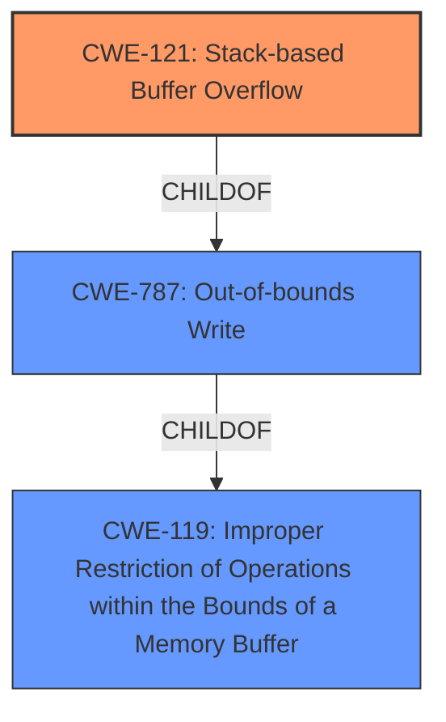

# Analysis Report for CVE-2021-36301

# Vulnerability Analysis Report: CVE-2021-36301

## Description


## Analysis (with Relationship Data)

# Summary
| CWE ID | CWE Name | Confidence | CWE Abstraction Level | CWE Vulnerability Mapping Label | CWE-Vulnerability Mapping Notes |
|---|---|---|---|---|---|
| CWE-121 | Stack-based Buffer Overflow | 1.0 | Variant | Primary | Allowed |
| CWE-119 | Improper Restriction of Operations within the Bounds of a Memory Buffer | 0.5 | Class | Secondary | Discouraged |

## Evidence and Confidence

*   **Confidence Score:** 1.0
*   **Evidence Strength:** HIGH

## Relationship Analysis
The primary CWE selected is CWE-121, Stack-based Buffer Overflow, which is a variant of CWE-787 (Out-of-bounds Write) and CWE-119 (Improper Restriction of Operations within the Bounds of a Memory Buffer). The relationship is hierarchical, with CWE-121 being a more specific case of the more general CWE-119. Selecting CWE-121 provides a more accurate and detailed description of the vulnerability.



## Vulnerability Chain
The vulnerability chain starts with the **stack buffer overflow** condition in the `racadm` component of Dell iDRAC. This allows an authenticated remote attacker to control process execution and potentially gain access to the underlying operating system. The chain is:

1.  **Stack Buffer Overflow (CWE-121)**: The root cause is writing data beyond the allocated memory space on the stack.
2.  **Process Control**: The attacker gains control of process execution.
3.  **OS Access**: The attacker gains access to the underlying operating system.

## Summary of Analysis
The initial analysis identified the **stack buffer overflow** as the primary weakness. The evidence supports this as the **root cause**, and the provided information specifies that the overflow occurs on the stack.

The selection of CWE-121 is based on the explicit mention of a **"Stack Buffer Overflow"** in the vulnerability description and the CVE Reference Links Content Summary. This direct evidence makes it the most appropriate and specific CWE.

The vulnerability description clearly states: "Dell iDRAC 9 prior to version 4.40.40.00 and iDRAC 8 prior to version 2.80.80.80 contain a **Stack Buffer Overflow** in Racadm." The CVE Reference Links Content Summary also confirms this by stating: "A stack buffer overflow vulnerability exists in the `racadm` component of Dell iDRAC" and "Stack Buffer Overflow: The vulnerability is specifically a stack buffer overflow, which occurs when a program writes data beyond the allocated memory space on the stack."

The graph relationships reinforce the choice of CWE-121 as it is a specific type of buffer overflow, a variant of CWE-787 and CWE-119. This level of specificity is preferred when the evidence supports it.

CWE-121 is the optimal level of specificity because it directly addresses the type of buffer overflow (stack-based) described in the vulnerability. While CWE-119 could apply, it is too general, and the mapping guidance discourages its use when more specific CWEs are available. Other CWEs, such as integer overflows or improper input validation, do not directly relate to the described weakness.

Relevant CWE Information:

# Enhanced Context (25 CWEs)
The following CWEs were identified as potentially relevant to this vulnerability:

## CWE-191: Integer Underflow (Wrap or Wraparound)
**Abstraction Level**: Base
**Similarity Score**: 0.77
**Source**: dense

**Description**:
The product subtracts one value from another, such that the result is less than the minimum allowable integer value, which produces a value that is not equal to the correct result.

**Mapping Guidance**:
- Usage: Allowed
- Rationale: This CWE entry is at the Base level of abstraction, which is a preferred level of abstraction for mapping to the root causes of vulnerabilities.

*Not Selected*: This CWE is not related to buffer overflows.

## CWE-805: Buffer Access with Incorrect Length Value
**Abstraction Level**: Base
**Similarity Score**: 0.76
**Source**: dense

**Description**:
The product uses a sequential operation to read or write a buffer, but it uses an incorrect length value that causes it to access memory that is outside of the bounds of the buffer.

**Mapping Guidance**:
- Usage: Allowed
- Rationale: This CWE entry is at the Base level of abstraction, which is a preferred level of abstraction for mapping to the root causes of vulnerabilities.

*Not Selected*: Although related to buffers, the description does not specifically indicate an incorrect length value causing the overflow. The root cause is directly identified as a stack buffer overflow.

## CWE-131: Incorrect Calculation of Buffer Size
**Abstraction Level**: Base
**Similarity Score**: 0.76
**Source**: dense

**Description**:
The product does not correctly calculate the size to be used when allocating a buffer, which could lead to a buffer overflow.

**Mapping Guidance**:
- Usage: Allowed
- Rationale: This CWE entry is at the Base level of abstraction, which is a preferred level of abstraction for mapping to the root causes of vulnerabilities.

*Not Selected*: Similar to CWE-805, the description does not specify an incorrect calculation of buffer size. The root cause is explicitly a stack buffer overflow.

## CWE-126: Buffer Over-read
**Abstraction Level**: Variant
**Similarity Score**: 0.75
**Source**: dense

**Description**:
The product reads from a buffer using buffer access mechanisms such as indexes or pointers that reference memory locations after the targeted buffer.

**Mapping Guidance**:
- Usage: Allowed
- Rationale: This CWE entry is at the Variant level of abstraction, which is a preferred level of abstraction for mapping to the root causes of vulnerabilities.

*Not Selected*: This is a read, and the vulnerability is a buffer overflow (write).

## CWE-125: Out-of-bounds Read
**Abstraction Level**: Base
**Similarity Score**: 0.75
**Source**: dense

**Description**:
The product reads data past the end, or before the beginning, of the intended buffer.

**Mapping Guidance**:
- Usage: Allowed
- Rationale: This CWE entry is at the Base level of abstraction, which is a preferred level of abstraction for mapping to the root causes of vulnerabilities.

*Not Selected*: This is a read, and the vulnerability is a buffer overflow (write).

## CWE-197: Numeric Truncation Error
**Abstraction Level**: Base
**Similarity Score**: 0.75
**Source**: dense

**Description**:
Truncation errors occur when a primitive is cast to a primitive of a smaller size and data is lost in the conversion.

**Mapping Guidance**:
- Usage: Allowed
- Rationale: This CWE entry is at the Base level of abstraction, which is a preferred level of abstraction for mapping to the root causes of vulnerabilities.

*Not Selected*: This is not related to buffer overflows.

## CWE-124: Buffer Underwrite ('Buffer Underflow')
**Abstraction Level**: Base
**Similarity Score**: 0.74
**Source**: dense

**Description**:
The product writes to a buffer using an index or pointer that references a memory location prior to the beginning of the buffer.

**Mapping Guidance**:
- Usage: Allowed
- Rationale: This CWE entry is at the Base level of abstraction, which is a preferred level of abstraction for mapping to the root causes of vulnerabilities.

*Not Selected*: This is a write before the buffer, and the vulnerability is a buffer overflow (write after the buffer).

## CWE-193: Off-by-one Error
**Abstraction Level**: Base
**Similarity Score**: 0.74
**Source**: dense

**Description**:
A product calculates or uses an incorrect maximum or minimum value that is 1 more, or 1 less, than the correct value.

**Mapping Guidance**:
- Usage: Allowed
- Rationale: This CWE entry is at the Base level of abstraction, which is a preferred level of abstraction for mapping to the root causes of vulnerabilities.

*Not Selected*: This is not the described weakness.

## CWE-119: Improper Restriction of Operations within the Bounds of a Memory Buffer
**Abstraction Level**: Class
**Similarity Score**: 0.74
**Source**: dense

**Description**:
The product performs operations on a memory buffer, but it reads from or writes to a memory location outside the buffer's intended boundary. This may result in read or write operations on unexpected memory locations that could be linked to other variables, data structures, or internal program data.

**Mapping Guidance**:


## CWE Relationship Analysis

Current CWEs represent these abstraction levels: .


### Vulnerability Chain Analysis

**Chain starting from CWE-121:**
- 121 (Stack-based Buffer Overflow) - ROOT


**Chain starting from CWE-787:**
- 787 (Out-of-bounds Write) - ROOT


### CWE Relationship Diagram

```mermaid
graph TD
    classDef primary fill:#f96,stroke:#333,stroke-width:2px
    classDef secondary fill:#69f,stroke:#333
    classDef tertiary fill:#9e9,stroke:#333
```


*Report generated on 2025-04-02 04:20:46*
