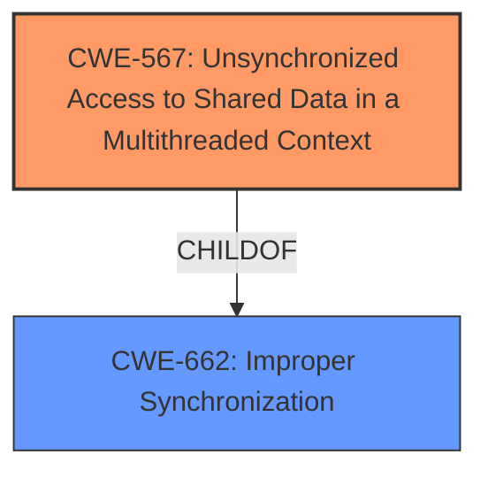

# Analysis Report for CVE-2021-36305

# Vulnerability Analysis Report: CVE-2021-36305

## Description


## Analysis (with Relationship Data)

# Summary
| CWE ID | CWE Name | Confidence | CWE Abstraction Level | CWE Vulnerability Mapping Label | CWE-Vulnerability Mapping Notes |
|---|---|---|---|---|---|
| CWE-567 | Unsynchronized Access to Shared Data in a Multithreaded Context | 1.0 | Base | Allowed | Primary CWE |
| CWE-662 | Improper Synchronization | 0.7 | Class | Discouraged | Secondary Candidate |

## Evidence and Confidence

*   **Confidence Score:** 0.9
*   **Evidence Strength:** HIGH

## Relationship Analysis
The primary CWE selected is CWE-567, which is a Base level weakness and a ChildOf CWE-662.
CWE-662 is a Class level weakness, and a parent of CWE-567.
The analysis chose the base class because the description specifically discusses a multithreaded context, which is discussed in the description of CWE-567.



## Vulnerability Chain
The vulnerability chain starts with the **Unsynchronized Access to Shared Data in a Multithreaded Context** (CWE-567), which leads to a denial of service.

## Summary of Analysis
The analysis identified the root cause as **Unsynchronized Access to Shared Data in a Multithreaded Context** based on the vulnerability description and CVE summary. The retriever results also strongly suggest CWE-567 and CWE-662.

The vulnerability description clearly states: "Dell PowerScale OneFS contains an **Unsynchronized Access to Shared Data in a Multithreaded Context** in SMB CA handling. An authenticated user of SMB on a cluster with CA could potentially exploit this vulnerability, leading to a denial of service over SMB."

The CVE Reference Links Content Summary states: "The vulnerability is due to "Unsynchronized Access to Shared Data in a Multithreaded Context" within the SMB Continuous Availability (CA) handling of Dell PowerScale OneFS... The core issue is a lack of proper synchronization when multiple threads access shared data related to SMB CA functionality. This can lead to race conditions and inconsistent states... Successful exploitation results in a denial-of-service (DoS) condition over SMB."

CWE-567 (Unsynchronized Access to Shared Data in a Multithreaded Context) is a Base level CWE, which is preferred. The description of CWE-567, "The product does not properly synchronize shared data, such as static variables across threads, which can lead to undefined behavior and unpredictable data changes," aligns well with the vulnerability.

CWE-662 (Improper Synchronization) is a Class level CWE. While it is related, CWE-567 is more specific and better captures the multithreaded context. The mapping guidance for CWE-662 discourages its use and suggests examining its children for a better fit.

CWE-367 (Time-of-check Time-of-use (TOCTOU) Race Condition) was considered but deemed less appropriate because the vulnerability description does not explicitly mention a TOCTOU condition, but rather a general lack of synchronization.

CWE-1250 (Improper Preservation of Consistency Between Independent Representations of Shared State) was also considered, but it focuses on distributed components, which is not the primary issue described in the vulnerability.

The selection of CWE-567 is at the optimal level of specificity because it directly addresses the **Unsynchronized Access to Shared Data in a Multithreaded Context**, which is the core weakness identified in the vulnerability description.

Relevant CWE Information:

# Enhanced Context (25 CWEs)
The following CWEs were identified as potentially relevant to this vulnerability:

## CWE-312: Cleartext Storage of Sensitive Information
**Abstraction Level**: Base
**Similarity Score**: 0.76
**Source**: dense

**Description**:
The product stores sensitive information in cleartext within a resource that might be accessible to another control sphere.

**Mapping Guidance**:
- Usage: Allowed
- Rationale: This CWE entry is at the Base level of abstraction, which is a preferred level of abstraction for mapping to the root causes of vulnerabilities.


## CWE-667: Improper Locking
**Abstraction Level**: Class
**Similarity Score**: 0.75
**Source**: dense

**Description**:
The product does not properly acquire or release a lock on a resource, leading to unexpected resource state changes and behaviors.

**Mapping Guidance**:
- Usage: Allowed-with-Review
- Rationale: This CWE entry is a Class and might have Base-level children that would be more appropriate


## CWE-668: Exposure of Resource to Wrong Sphere
**Abstraction Level**: Class
**Similarity Score**: 0.75
**Source**: dense

**Description**:
The product exposes a resource to the wrong control sphere, providing unintended actors with inappropriate access to the resource.

**Mapping Guidance**:
- Usage: Discouraged
- Rationale: CWE-668 is high-level and is often misused as a catch-all when lower-level CWE IDs might be applicable. It is sometimes used for low-information vulnerability reports [REF-1287]. It is a level-1 Class (i.e., a child of a Pillar). It is not useful for trend analysis.


## CWE-226: Sensitive Information in Resource Not Removed Before Reuse
**Abstraction Level**: Base
**Similarity Score**: 0.75
**Source**: dense

**Description**:
The product releases a resource such as memory or a file so that it can be made available for reuse, but it does not clear or "zeroize" the information contained in the resource before the product performs a critical state transition or makes the resource available for reuse by other entities.

**Mapping Guidance**:
- Usage: Allowed
- Rationale: This CWE entry is at the Base level of abstraction, which is a preferred level of abstraction for mapping to the root causes of vulnerabilities.


## CWE-212: Improper Removal of Sensitive Information Before Storage or Transfer
**Abstraction Level**: Base
**Similarity Score**: 0.74
**Source**: dense

**Description**:
The product stores, transfers, or shares a resource that contains sensitive information, but it does not properly remove that information before the product makes the resource available to unauthorized actors.

**Mapping Guidance**:
- Usage: Allowed
- Rationale: This CWE entry is at the Base level of abstraction, which is a preferred level of abstraction for mapping to the root causes of vulnerabilities.


## CWE-1391: Use of Weak Credentials
**Abstraction Level**: Class
**Similarity Score**: 0.74
**Source**: dense

**Description**:
The product uses weak credentials (such as a default key or hard-coded password) that can be calculated, derived, reused, or guessed by an attacker.

**Mapping Guidance**:
- Usage: Allowed-with-Review
- Rationale: This CWE entry is a Class and might have Base-level children that would be more appropriate


## CWE-1390: Weak Authentication
**Abstraction Level**: Class
**Similarity Score**: 0.74
**Source**: dense

**Description**:
The product uses an authentication mechanism to restrict access to specific users or identities, but the mechanism does not sufficiently prove that the claimed identity is correct.

**Mapping Guidance**:
- Usage: Allowed-with-Review
- Rationale: This CWE entry is a Class and might have Base-level children that would be more appropriate


## CWE-274: Improper Handling of Insufficient Privileges
**Abstraction Level**: Base
**Similarity Score**: 0.74
**Source**: dense

**Description**:
The product does not handle or incorrectly handles when it has insufficient privileges to perform an operation, leading to resultant weaknesses.

**Mapping Guidance**:
- Usage: Discouraged
- Rationale: This CWE entry could be deprecated in a future version of CWE.


## CWE-345: Insufficient Verification of Data Authenticity
**Abstraction Level**: Class
**Similarity Score**: 0.74
**Source**: dense

**Description**:
The product does not sufficiently verify the origin or authenticity of data, in a way that causes it to accept invalid data.

**Mapping Guidance**:
- Usage: Discouraged
- Rationale: This CWE entry is a level-1 Class (i.e., a child of a Pillar). It might have lower-level children that would be more appropriate


## CWE-653: Improper Isolation or Compartmentalization
**Abstraction Level**: Class
**Similarity Score**: 0.74
**Source**: dense

**Description**:
The product does not properly compartmentalize or isolate functionality, processes, or resources that require different privilege levels, rights, or permissions.

**Mapping Guidance**:
- Usage: Allowed
- Rationale: This CWE entry is at the Base level of abstraction, which is a preferred level of abstraction for mapping to the root causes of vulnerabilities.


## CWE-367: Time-of-


## CWE Relationship Analysis

Current CWEs represent these abstraction levels: .


### Vulnerability Chain Analysis

**Chain starting from CWE-667:**
- 667 (Improper Locking) - ROOT


**Chain starting from CWE-662:**
- 662 (Improper Synchronization) - ROOT


### CWE Relationship Diagram

```mermaid
graph TD
    classDef primary fill:#f96,stroke:#333,stroke-width:2px
    classDef secondary fill:#69f,stroke:#333
    classDef tertiary fill:#9e9,stroke:#333
```


*Report generated on 2025-04-02 02:07:44*
