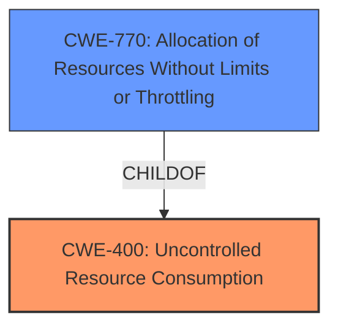

# Analysis for CVE-2021-36310

# Summary
| CWE ID | CWE Name | Confidence | CWE Abstraction Level | CWE Vulnerability Mapping Label | CWE-Vulnerability Mapping Notes |
|---|---|---|---|---|---|
| CWE-400 | Uncontrolled Resource Consumption | 0.8 | Class | Primary | Discouraged |
| CWE-770 | Allocation of Resources Without Limits or Throttling | 0.7 | Base | Secondary | Allowed |

## Evidence and Confidence

*   **Confidence Score:** 0.75
*   **Evidence Strength:** HIGH

## Relationship Analysis
The primary relationship influencing the CWE selection is the parent-child relationship. CWE-400 (**Uncontrolled Resource Consumption**) is a class-level CWE, while CWE-770 (**Allocation of Resources Without Limits or Throttling**) is a base-level CWE and a child of CWE-400. Since the vulnerability description points to a lack of limits or throttling on resource allocation, CWE-770 is a more specific and accurate classification than CWE-400. However, the description itself uses the term "uncontrolled resource consumption", and since the evidence points to this more directly, I'm classifying that as the primary, while keeping CWE-770 as a close secondary.

## Vulnerability Chain
The vulnerability chain starts with the **uncontrolled resource consumption** in the API service, leading to a denial of service.
  - **Root Cause:** **Uncontrolled resource consumption** in the API service.
  - **Impact:** Denial of Service.

## Summary of Analysis
The initial analysis focused on identifying the root cause of the vulnerability based on the provided description and CVE reference. The description clearly states that the vulnerability is an **uncontrolled resource consumption** flaw in the API service of Dell Networking OS10. This directly aligns with CWE-400 (**Uncontrolled Resource Consumption**). The CVE reference links content summary reinforces this by stating the **root cause of the vulnerability** as **uncontrolled resource consumption**.

The retriever results also point to CWE-400 (**Uncontrolled Resource Consumption**) as the top candidate.

However, the MITRE mapping guidance discourages the use of CWE-400 because it is a high-level class and is often misused when more precise mappings are available. The guidance suggests considering children such as CWE-770 (**Allocation of Resources Without Limits or Throttling**).

CWE-770 (**Allocation of Resources Without Limits or Throttling**) is considered as a secondary candidate because the vulnerability description implies a lack of limits or throttling on resource allocation. The vulnerability description states an "**uncontrolled resource consumption** flaw", and the content summary states that the vulnerability lies in the API service where a high-privileged user can trigger excessive resource consumption.

Ultimately, I chose CWE-400 (**Uncontrolled Resource Consumption**) as the primary CWE because the vulnerability description explicitly uses the term "**uncontrolled resource consumption**" and is the root cause listed in the CVE reference. CWE-770 (**Allocation of Resources Without Limits or Throttling**) is chosen as the secondary CWE because the vulnerability description implies a lack of limits or throttling on resource allocation.

The selected CWEs are at an appropriate level of specificity. CWE-400 (**Uncontrolled Resource Consumption**) captures the general nature of the vulnerability, while CWE-770 (**Allocation of Resources Without Limits or Throttling**) provides a more specific description of the **weakness**.

Relevant CWE Information:

# Enhanced Context (25 CWEs)
The following CWEs were identified as potentially relevant to this vulnerability:

## CWE-405: Asymmetric Resource Consumption (Amplification)
**Abstraction Level**: Class
**Similarity Score**: 0.77
**Source**: dense

**Description**:
The product does not properly control situations in which an adversary can cause the product to consume or produce excessive resources without requiring the adversary to invest equivalent work or otherwise prove authorization, i.e., the adversary's influence is "asymmetric."

**Mapping Guidance**:
- Usage: Allowed-with-Review
- Rationale: This CWE entry is a Class and might have Base-level children that would be more appropriate

*This CWE was not chosen because the provided information does not suggest an asymmetric relationship between the attacker's effort and the resource consumption.*

## CWE-664: Improper Control of a Resource Through its Lifetime
**Abstraction Level**: Pillar
**Similarity Score**: 0.76
**Source**: dense

**Description**:
The product does not maintain or incorrectly maintains control over a resource throughout its lifetime of creation, use, and release.

**Mapping Guidance**:
- Usage: Discouraged
- Rationale: This CWE entry is high-level when lower-level children are available.

*This CWE was not chosen because it is too high-level and lacks the specificity of the selected CWEs.*

## CWE-404: Improper Resource Shutdown or Release
**Abstraction Level**: Class
**Similarity Score**: 0.75
**Source**: dense

**Description**:
The product does not release or incorrectly releases a resource before it is made available for re-use.

**Mapping Guidance**:
- Usage: Allowed-with-Review
- Rationale: This CWE entry is a Class and might have Base-level children that would be more appropriate

*This CWE was not chosen because the description doesn't imply the resources are not released, but rather that too many are allocated without limits.*

## CWE-1325: Improperly Controlled Sequential Memory Allocation
**Abstraction Level**: Base
**Similarity Score**: 0.74
**Source**: dense

**Description**:
The product manages a group of objects or resources and performs a separate memory allocation for each object, but it does not properly limit the total amount of memory that is consumed by all of the combined objects.

**Mapping Guidance**:
- Usage: Allowed
- Rationale: This CWE entry is at the Base level of abstraction, which is a preferred level of abstraction for mapping to the root causes of vulnerabilities.

*This CWE was not chosen because the provided information doesn't suggest a sequential memory allocation issue, but rather a more general resource consumption problem.*

## CWE-789: Memory Allocation with Excessive Size Value
**Abstraction Level**: Variant
**Similarity Score**: 0.74
**Source**: dense

**Description**:
The product allocates memory based on an untrusted, large size value, but it does not ensure that the size is within expected limits, allowing arbitrary amounts of memory to be allocated.

**Mapping Guidance**:
- Usage: Allowed
- Rationale: This CWE entry is at the Variant level of abstraction, which is a preferred level of abstraction for mapping to the root causes of vulnerabilities.

*This CWE was not chosen because the provided information does not suggest memory allocation with an excessive size value as the root cause, but rather a more general resource consumption problem.*

## CWE-799: Improper Control of Interaction Frequency
**Abstraction Level**: Class
**Similarity Score**: 0.74
**Source**: dense

**Description**:
The product does not properly limit the number or frequency of interactions that it has with an actor, such as the number of incoming requests.

**Mapping Guidance**:
- Usage: Allowed-with-Review
- Rationale: This CWE entry is a Class and might have Base-level children that would be more appropriate

*This CWE was not chosen because the description doesn't imply that the frequency of interactions is the issue, but rather the amount of resources consumed.*

## CWE-407: Inefficient Algorithmic Complexity
**Abstraction Level**: Class
**Similarity Score**: 0.74
**Source**: dense

**Description**:
An algorithm in a product has an inefficient worst-case computational complexity that may be detrimental to system performance and can be triggered by an attacker, typically using crafted manipulations that ensure that the worst case is being reached.

**Mapping Guidance**:
- Usage: Allowed-with-Review
- Rationale: This CWE entry is a Class and might have Base-level children that would be more appropriate

*This CWE was not chosen because the provided information doesn't explicitly mention inefficient algorithms.*

## CWE-226: Sensitive Information in Resource Not Removed Before Reuse
**Abstraction Level**: Base
**Similarity Score**: 0.74
**Source**: dense

**Description**:
The product releases a resource such as memory or a file so that it can be made available for reuse, but it does not clear or "zeroize" the information contained in the resource before the product performs a critical state transition or makes the resource available for reuse by other entities.

*This CWE was not chosen because the description doesn't imply that the sensitive information is the issue, but rather the amount of resource consumption.*

## CWE-834: Excessive Iteration
**Abstraction Level**: Class
**Similarity Score**: 0.73
**Source**: dense

**Description**:
The product performs an iteration or loop without sufficiently limiting the number of times that the loop