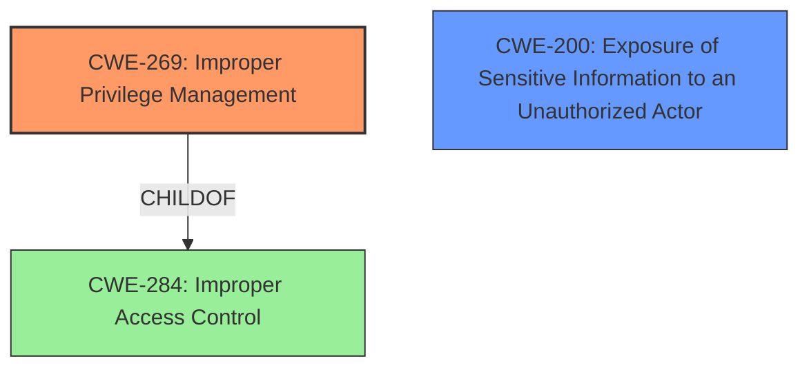

# Raw Analyzer Response for CVE-2021-36316

# Summary
| CWE ID | CWE Name | Confidence | CWE Abstraction Level | CWE Vulnerability Mapping Label | CWE-Vulnerability Mapping Notes |
|---|---|---|---|---|---|
| CWE-269 | Improper Privilege Management | 0.9 | Class | Allowed-with-Review | Primary CWE |
| CWE-200 | Exposure of Sensitive Information to an Unauthorized Actor | 0.7 | Class | Discouraged | Secondary Candidate |

## Evidence and Confidence

*   **Confidence Score:** 0.8
*   **Evidence Strength:** HIGH

## Relationship Analysis
The primary CWE identified is CWE-269, "Improper Privilege Management," which is a Class-level CWE. It is a child of CWE-284 "Improper Access Control". While CWE-269 is a Class, it directly reflects the **root cause** stated in the vulnerability description and CVE summary. CWE-200, "Exposure of Sensitive Information to an Unauthorized Actor," is considered as a secondary candidate because the impact involves disclosure of AUI info. However, it is discouraged to use CWE-200.



## Vulnerability Chain
The vulnerability chain starts with **improper privilege management** (CWE-269), which allows a malicious user with high privileges to perform unauthorized operations, leading to the disclosure of AUI information.
  - Root Cause: CWE-269 (Improper Privilege Management)
  - Impact: Exposure of Sensitive Information (CWE-200) and Unauthorized Operation

## Summary of Analysis
The initial analysis focused on identifying the **root cause** of the vulnerability, which is explicitly stated as **"improper privilege management"** in both the vulnerability description and the CVE Reference Links Content Summary. This led to the selection of CWE-269 "Improper Privilege Management".

The evidence is clear:
> Vulnerability Description Key Phrases
> - **rootcause:** **improper privilege management**
>
> CVE Reference Links Content Summary
> ```
> {
>   "CVE-2021-36316": {
>     "Root cause of vulnerability": "Improper privilege management in AUI."
> ```

The Retriever Results also list CWE-269 as the top combined result.

CWE-200, "Exposure of Sensitive Information to an Unauthorized Actor", was considered because the vulnerability leads to the disclosure of AUI information. However, CWE-200 is discouraged because it represents the impact (loss of confidentiality) rather than the root cause.

The final decision is to classify the vulnerability as CWE-269 "Improper Privilege Management" due to the explicit evidence and its direct relevance to the **root cause** of the vulnerability. This is at the optimal level of specificity as the description clearly indicates a problem with how privileges are managed.

Relevant CWE Information:

# Enhanced Context (25 CWEs)

## CWE-668: Exposure of Resource to Wrong Sphere
**Abstraction Level**: Class
**Similarity Score**: 0.77
**Source**: dense

**Description**:
The product exposes a resource to the wrong control sphere, providing unintended actors with inappropriate access to the resource.

**Mapping Guidance**:
- Usage: Discouraged
- Rationale: CWE-668 is high-level and is often misused as a catch-all when lower-level CWE IDs might be applicable. It is sometimes used for low-information vulnerability reports [REF-1287]. It is a level-1 Class (i.e., a child of a Pillar). It is not useful for trend analysis.

*Not Selected*: This is too high level and not specific to privilege management.

## CWE-497: Exposure of Sensitive System Information to an Unauthorized Control Sphere
**Abstraction Level**: Base
**Similarity Score**: 0.77
**Source**: dense

**Description**:
The product does not properly prevent sensitive system-level information from being accessed by unauthorized actors who do not have the same level of access to the underlying system as the product does.

**Mapping Guidance**:
- Usage: Allowed
- Rationale: This CWE entry is at the Base level of abstraction, which is a preferred level of abstraction for mapping to the root causes of vulnerabilities.

*Not Selected*: While relevant to the impact, it does not represent the root cause of **improper privilege management**.

## CWE-807: Reliance on Untrusted Inputs in a Security Decision
**Abstraction Level**: Base
**Similarity Score**: 0.76
**Source**: dense

**Description**:
The product uses a protection mechanism that relies on the existence or values of an input, but the input can be modified by an untrusted actor in a way that bypasses the protection mechanism.

**Mapping Guidance**:
- Usage: Allowed
- Rationale: This CWE entry is at the Base level of abstraction, which is a preferred level of abstraction for mapping to the root causes of vulnerabilities.

*Not Selected*: Not applicable. The vulnerability is due to **improper privilege management**, not reliance on untrusted inputs.

## CWE-538: Insertion of Sensitive Information into Externally-Accessible File or Directory
**Abstraction Level**: Base
**Similarity Score**: 0.76
**Source**: dense

**Description**:
The product places sensitive information into files or directories that are accessible to actors who are allowed to have access to the files, but not to the sensitive information.

**Mapping Guidance**:
- Usage: Allowed
- Rationale: This CWE entry is at the Base level of abstraction, which is a preferred level of abstraction for mapping to the root causes of vulnerabilities.

*Not Selected*: Not applicable. The vulnerability is due to **improper privilege management**, not insertion of sensitive information into files or directories.

## CWE-226: Sensitive Information in Resource Not Removed Before Reuse
**Abstraction Level**: Base
**Similarity Score**: 0.75
**Source**: dense

**Description**:
The product releases a resource such as memory or a file so that it can be made available for reuse, but it does not clear or "zeroize" the information contained in the resource before the product performs a critical state transition or makes the resource available for reuse by other entities.

**Mapping Guidance**:
- Usage: Allowed
- Rationale: This CWE entry is at the Base level of abstraction, which is a preferred level of abstraction for mapping to the root causes of vulnerabilities.

*Not Selected*: Not applicable. The vulnerability is due to **improper privilege management**, not the failure to remove sensitive information before resource reuse.

## CWE-274: Improper Handling of Insufficient Privileges
**Abstraction Level**: Base
**Similarity Score**: 0.75
**Source**: dense

**Description**:
The product does not handle or incorrectly handles when it has insufficient privileges to perform an operation, leading to resultant weaknesses.

**Mapping Guidance**:
- Usage: Discouraged
- Rationale: This CWE entry could be deprecated in a future version of CWE.

*Not Selected*: This CWE focuses on insufficient privileges, while the vulnerability description speaks to **improper privilege management**.

## CWE-653: Improper Isolation or Compartmentalization
**Abstraction Level**: Class
**Similarity Score**: 0.75
**Source**: dense

**Description**:
The product does not properly compartmentalize or isolate functionality, processes, or resources that require different privilege levels, rights, or permissions.

**Mapping Guidance**:
- Usage: Allowed
- Rationale: This CWE entry is at the Base level of abstraction, which is a preferred level of abstraction for mapping to the root causes of vulnerabilities.

*Not Selected*: The provided information doesn't suggest a lack of isolation or compartmentalization.

## CWE-212: Improper Removal of Sensitive Information Before Storage or Transfer
**Abstraction Level**: Base
**Similarity Score**: 0.75
**Source**: dense

**Description**:
The product stores, transfers, or shares a resource that contains sensitive information, but it does not properly remove that information before the product makes the resource available to unauthorized actors.

**Mapping Guidance**:
- Usage: Allowed
- Rationale: This CWE entry is at the Base level of abstraction, which is a preferred level of abstraction for mapping to the root causes of vulnerabilities.

*Not Selected*: This CWE is not applicable as the primary issue isn't about removing sensitive information before storage or transfer.

## CWE-41: Improper Resolution of Path Equivalence
**Abstraction Level**: Base
**Similarity Score**: 0.75
**Source**: dense

**Description**:
The product is vulnerable to file system contents disclosure through path equivalence. Path equivalence involves the use of special characters in file and directory names. The associated manipulations are intended to generate multiple names for the same object.

**Mapping Guidance**:
- Usage: Allowed