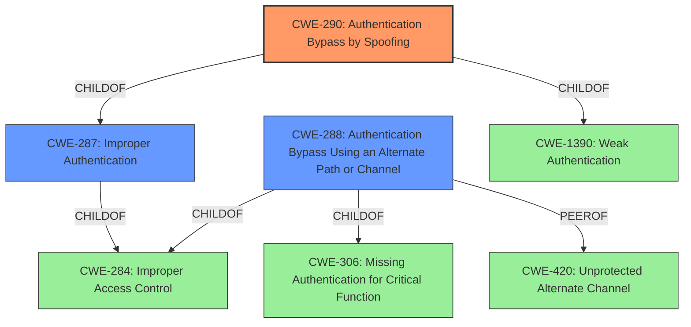

# Raw Analyzer Response for CVE-2021-36320

# Summary
| CWE ID | CWE Name | Confidence | CWE Abstraction Level | CWE Vulnerability Mapping Label | CWE-Vulnerability Mapping Notes |
|---|---|---|---|---|---|
| CWE-290 | Authentication Bypass by Spoofing | 0.9 | Base | Allowed | Primary CWE. The vulnerability allows an unauthenticated attacker to hijack a session by forging the session ID. |
| CWE-287 | Improper Authentication | 0.6 | Class | Discouraged | Secondary CWE. The product does not sufficiently prove that the claim to an identity is correct. |
| CWE-288 | Authentication Bypass Using an Alternate Path or Channel | 0.5 | Base | Allowed | Secondary CWE. The attacker can bypass authentication via an alternate path. |

## Evidence and Confidence

*   **Confidence Score:** 0.9
*   **Evidence Strength:** HIGH

## Relationship Analysis
The primary CWE is CWE-290, Authentication Bypass by Spoofing, a **Base** level CWE. It is a child of CWE-1390 (Weak Authentication) and CWE-287 (Improper Authentication). CWE-287 is a **Class** level CWE, and is too general, but is related. CWE-288 Authentication Bypass Using an Alternate Path or Channel is a **Base** level CWE and a peer of CWE-420 (Unprotected Alternate Channel).

## Vulnerability Chain
The vulnerability chain involves an **improper authentication** mechanism that allows an attacker to **forge a session ID**, leading to an **authentication bypass** and **session hijacking**.

## Summary of Analysis
The initial assessment correctly identifies the core issue as an authentication bypass vulnerability. The vulnerability description states that a remote unauthenticated attacker can hijack a session and access the webserver by forging the session ID. The CVE Reference Links Content Summary confirms this, stating that the root cause is an authentication bypass issue and that the attacker can gain unauthorized access to the webserver.

The retriever results suggest several CWEs, including CWE-331 (Insufficient Entropy), CWE-287 (Improper Authentication), CWE-290 (Authentication Bypass by Spoofing), and CWE-288 (Authentication Bypass Using an Alternate Path or Channel).

CWE-290 (Authentication Bypass by Spoofing) is the most appropriate primary CWE because the attacker forges a session ID to bypass authentication. This aligns directly with the description of CWE-290. The mapping guidance allows for this CWE to be used.
> CWE-290: Authentication Bypass by Spoofing
> This attack-focused weakness is caused by incorrectly implemented authentication schemes that are subject to spoofing attacks.

CWE-287 (Improper Authentication) is a related CWE. This CWE is a **Class** level and discouraged for use. However, it is a parent of CWE-290, so it is still relevant. The vulnerability description states that the authentication mechanism is flawed, which aligns with the general concept of CWE-287.

CWE-288 (Authentication Bypass Using an Alternate Path or Channel) is also relevant, because the forged session ID acts as an alternate path that bypasses the intended authentication process.

CWE-331 (Insufficient Entropy) is less relevant because there is no information provided that suggests the generation of the session ID uses insufficient entropy.

The final selection is based on the evidence provided and the relationship analysis. CWE-290 is the most specific and accurate representation of the vulnerability. The other CWEs considered provide additional context and highlight related aspects of the authentication bypass.