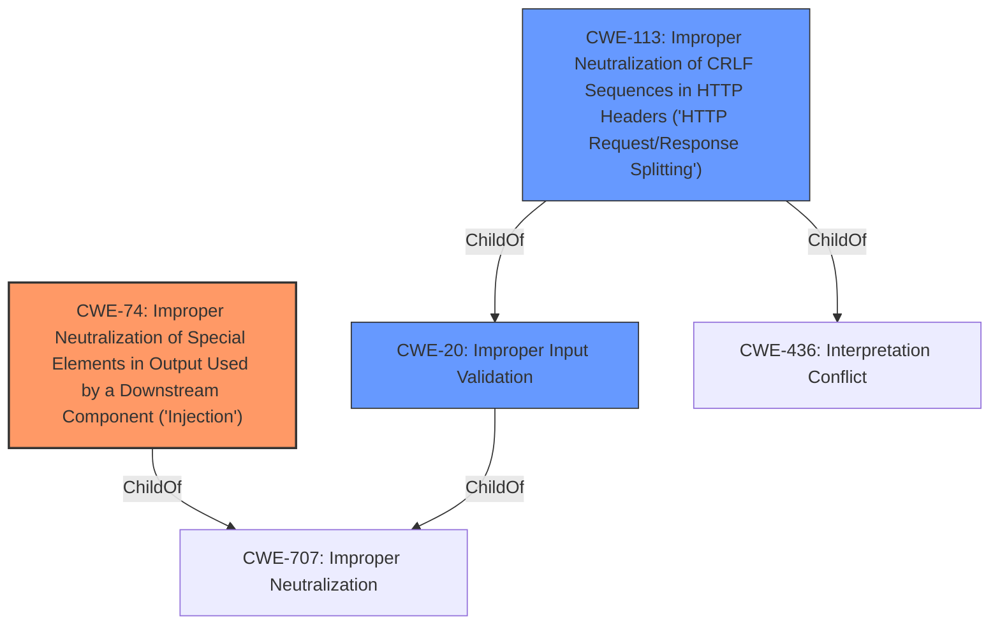

# Raw Analyzer Response for CVE-2021-36322

# Summary
| CWE ID | CWE Name | Confidence | CWE Abstraction Level | CWE Vulnerability Mapping Label | CWE-Vulnerability Mapping Notes |
|---|---|---|---|---|---|
| CWE-74 | Improper Neutralization of Special Elements in Output Used by a Downstream Component ('Injection') | 0.7 | Class | Primary | The product constructs all or part of a command, data structure, or record using externally-influenced input from an upstream component, but it does not neutralize or incorrectly neutralizes special elements that could modify how it is parsed or interpreted when it is sent to a downstream component. |
| CWE-113 | Improper Neutralization of CRLF Sequences in HTTP Headers ('HTTP Request/Response Splitting') | 0.6 | Variant | Secondary | The product receives data from an HTTP agent/component (e.g., web server, proxy, browser, etc.), but it does not neutralize or incorrectly neutralizes CR and LF characters before the data is included in outgoing HTTP headers. |
| CWE-20 | Improper Input Validation | 0.4 | Class | Secondary | The product receives input or data, but it does not validate or incorrectly validates that the input has the properties that are required to process the data safely and correctly. |

## Evidence and Confidence

*   **Confidence Score:** 0.7
*   **Evidence Strength:** MEDIUM

## Relationship Analysis
The primary CWE is CWE-74 which is a class level weakness. CWE-74 is a parent of CWE-78 (OS Command Injection) and CWE-79 (Cross-site Scripting). CWE-113 and CWE-20 are also considered as secondary weaknesses. CWE-113 is a variant of CWE-20 and CWE-436, while CWE-20 is a child of CWE-707.

## Vulnerability Chain
The vulnerability chain starts with the **lack of proper validation** of the host header (CWE-20), leading to **improper neutralization of special elements** (CWE-74). This can then be exploited by an attacker to inject arbitrary host header values, resulting in web-cache poisoning or trigger redirections. HTTP Request/Response Splitting can occur from the same **lack of validation** (CWE-113).

## Summary of Analysis
The analysis is based on the provided vulnerability description and the CVE reference links content summary. The primary weakness is identified as CWE-74 due to the **host header injection vulnerability**. The "CVE Reference Links Content Summary" section states that "The vulnerability is caused by a **lack of proper validation** of the host header" and that "A remote unauthenticated attacker can exploit this vulnerability to inject arbitrary host header values." This indicates that the application does not properly neutralize special elements in the host header before using it in a downstream component, which aligns with the description of CWE-74.

The retriever results also list CWE-74 as the top candidate CWE.

CWE-113 is considered as a secondary weakness, as host header injection may lead to HTTP request/response splitting if CRLF sequences are not properly neutralized.

CWE-20 is considered as a secondary weakness due to the "lack of proper validation" of the host header.

The selected CWEs are at the appropriate level of specificity, as they directly address the root cause and potential impact of the vulnerability. CWE-74 is at the Class level, which is suitable for this type of injection vulnerability. CWE-113 is at the Variant level, which is more specific to HTTP request/response splitting. CWE-20 is at the Class level, which describes the **lack of proper validation**.

Relevant CWE Information:
- **CWE-74: Improper Neutralization of Special Elements in Output Used by a Downstream Component ('Injection')**
  - This CWE aligns with the **host header injection vulnerability**, where arbitrary host header values are injected due to **improper neutralization**.
  - The potential impact includes web-cache poisoning or trigger redirections.
  - CWE-74 is a class-level CWE, providing a general description of injection vulnerabilities.
  - The usage is discouraged because lower-level weaknesses are more appropriate

- **CWE-113: Improper Neutralization of CRLF Sequences in HTTP Headers ('HTTP Request/Response Splitting')**
  - This CWE addresses the specific scenario where CRLF sequences are not properly neutralized in HTTP headers.
  - The potential impact includes HTTP request/response splitting, which can lead to cache poisoning or other attacks.
  - CWE-113 is a variant-level CWE, providing a more specific description of HTTP request/response splitting vulnerabilities.
  - The usage is allowed

- **CWE-20: Improper Input Validation**
  - This CWE captures the **lack of proper validation** of the host header, which is the root cause of the vulnerability.
  - The potential impact includes various attacks, such as web-cache poisoning or trigger redirections.
  - CWE-20 is a class-level CWE, providing a general description of input validation vulnerabilities.
  - The usage is discouraged because lower-level weaknesses could be used instead.

- **CWE-78: Improper Neutralization of Special Elements used in an OS Command ('OS Command Injection')**
  - This CWE was considered but not used because the vulnerability does not involve OS command injection.

- **CWE-79: Improper Neutralization of Input During Web Page Generation ('Cross-site Scripting')**
  - This CWE was considered but not used because the vulnerability does not directly involve cross-site scripting.

- **CWE-88: Improper Neutralization of Argument Delimiters in a Command ('Argument Injection')**
  - This CWE was considered but not used because the vulnerability does not involve argument injection.