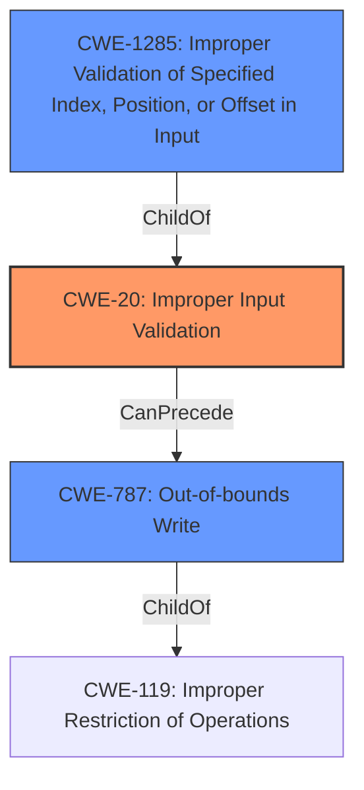

# Analysis for CVE-2021-36324

# Summary

| CWE ID  | CWE Name                                                                 | Confidence | CWE Abstraction Level | CWE Vulnerability Mapping Label | CWE-Vulnerability Mapping Notes |
| :-------- | :----------------------------------------------------------------------- | :--------- | :---------------------- | :------------------------------ | :------------------------------ |
| CWE-20    | Improper Input Validation                                                | 0.9        | Class                   | Primary                         | Discouraged, but applicable     |
| CWE-1285  | Improper Validation of Specified Index, Position, or Offset in Input | 0.7        | Base                    | Secondary                       | Allowed                         |
| CWE-787 | Out-of-bounds Write | 0.5        | Base                    | Secondary                       | Allowed                         |

## Evidence and Confidence

*   **Confidence Score:** 0.8
*   **Evidence Strength:** HIGH

## Relationship Analysis

The primary relationship is that CWE-1285 is a child of CWE-20, indicating that the improper input validation specifically relates to an index, position, or offset. CWE-787 is related to CWE-119 which is a parent of CWE-20. The choice of CWE-20 as the primary CWE is due to the explicit mention of "**improper input validation**" in the vulnerability description.

## Vulnerability Chain

The vulnerability chain starts with **improper input validation** (CWE-20), which allows a local attacker to use an SMI to gain arbitrary code execution in SMRAM. This suggests a potential for out-of-bounds write (CWE-787) if the **improperly validated** input is used to write to memory.
Root Cause: **Improper Input Validation** (CWE-20) -> Impact: Arbitrary code execution in SMRAM

## Summary of Analysis

The initial assessment strongly points towards CWE-20 as the primary weakness, given the explicit mention of "**improper input validation**" in the description. The retriever results and similar CVE descriptions also support this. However, CWE-20 is a Class-level CWE and is discouraged for use when more specific CWEs are available.

The analysis considered the child CWEs of CWE-20 and the relationships between them. CWE-1285, which represents **improper validation** of a specified index, position, or offset, is a strong candidate. Since the vulnerability leads to arbitrary code execution in SMRAM, a memory corruption issue such as CWE-787, Out-of-bounds Write, could be a secondary weakness.

The final decision is to use CWE-20 as the primary CWE due to the direct evidence in the vulnerability description. CWE-1285 and CWE-787 are considered as secondary CWEs that provide more specific details about the nature of the **improper validation** and its potential impact.
The selection of CWE-20 is at the optimal level of specificity given the available information. While a more specific variant of **improper input validation** might exist, the description does not provide enough detail to pinpoint it.

Relevant CWE Information:

# Enhanced Context (25 CWEs)

## CWE-665: Improper Initialization
**Abstraction Level**: Class
**Similarity Score**: 0.75
**Source**: dense

**Description**:
The product does not initialize or incorrectly initializes a resource, which might leave the resource in an unexpected state when it is accessed or used.

**Mapping Guidance**:
- Usage: Discouraged
- Rationale: This CWE entry is a level-1 Class (i.e., a child of a Pillar). It might have lower-level children that would be more appropriate

*Not Selected*: This CWE doesn't fit the vulnerability description which is focused on **improper input validation**, not initialization.

## CWE-1289: Improper Validation of Unsafe Equivalence in Input
**Abstraction Level**: Base
**Similarity Score**: 0.75
**Source**: dense

**Description**:
The product receives an input value that is used as a resource identifier or other type of reference, but it does not validate or incorrectly validates that the input is equivalent to a potentially-unsafe value.

**Mapping Guidance**:
- Usage: Allowed
- Rationale: This CWE entry is at the Base level of abstraction, which is a preferred level of abstraction for mapping to the root causes of vulnerabilities.

*Not Selected*: The description doesn't mention unsafe equivalence.

## CWE-667: Improper Locking
**Abstraction Level**: Class
**Similarity Score**: 0.75
**Source**: dense

**Description**:
The product does not properly acquire or release a lock on a resource, leading to unexpected resource state changes and behaviors.

**Mapping Guidance**:
- Usage: Allowed-with-Review
- Rationale: This CWE entry is a Class and might have Base-level children that would be more appropriate

*Not Selected*: Locking is not mentioned.

## CWE-404: Improper Resource Shutdown or Release
**Abstraction Level**: Class
**Similarity Score**: 0.75
**Source**: dense

**Description**:
The product does not release or incorrectly releases a resource before it is made available for re-use.

**Mapping Guidance**:
- Usage: Allowed-with-Review
- Rationale: This CWE entry is a Class and might have Base-level children that would be more appropriate

*Not Selected*: Resource shutdown/release isn't relevant.

## CWE-691: Insufficient Control Flow Management
**Abstraction Level**: Pillar
**Similarity Score**: 0.75
**Source**: dense

**Description**:
The code does not sufficiently manage its control flow during execution, creating conditions in which the control flow can be modified in unexpected ways.

**Mapping Guidance**:
- Usage: Discouraged
- Rationale: This CWE entry is extremely high-level, a Pillar. However, classification research is limited for weaknesses of this type, so there can be gaps or organizational difficulties within CWE that force use of this weakness, even at such a high level of abstraction.

*Not Selected*: Too high-level.

## CWE-226: Sensitive Information in Resource Not Removed Before Reuse
**Abstraction Level**: Base
**Similarity Score**: 0.74
**Source**: dense

**Description**:
The product releases a resource such as memory or a file so that it can be made available for reuse, but it does not clear or "zeroize" the information contained in the resource before the product performs a critical state transition or makes the resource available for reuse by other entities.

**Mapping Guidance**:
- Usage: Allowed
- Rationale: This CWE entry is at the Base level of abstraction, which is a preferred level of abstraction for mapping to the root causes of vulnerabilities.

*Not Selected*: Sensitive information handling is not described.

## CWE-653: Improper Isolation or Compartmentalization
**Abstraction Level**: Class
**Similarity Score**: 0.74
**Source**: dense

**Description**:
The product does not properly compartmentalize or isolate functionality, processes, or resources that require different privilege levels, rights, or permissions.

**Mapping Guidance**:
- Usage: Allowed
- Rationale: This CWE entry is at the Base level of abstraction, which is a preferred level of abstraction for mapping to the root causes of vulnerabilities.

*Not Selected*: Isolation/Compartmentalization isn't the main issue.

## CWE-664: Improper Control of a Resource Through its Lifetime
**Abstraction Level**: Pillar
**Similarity Score**: 0.74
**Source**: dense

**Description**:
The product does not maintain or incorrectly maintains control over a resource throughout its lifetime of creation, use, and release.

**Mapping Guidance**:
- Usage: Discouraged
- Rationale: This CWE entry is high-level when lower-level children are available.

*Not Selected*: Too high-level.

## CWE-657: Violation of Secure Design Principles
**Abstraction Level**: Class
**Similarity Score**: 0.74
**Source**: dense

**Description**:
The product violates well-established principles for secure design.

**Mapping Guidance**:
- Usage: Discouraged
- Rationale: This CWE entry is a level-1 Class (i.e., a child of a Pillar). It might have lower-level children that would be more appropriate

*Not Selected*: Too general.

## CWE-662: Improper Synchronization
**Abstraction Level**: Class
**Similarity Score**: 0.73
**Source**: dense

**Description**:
The product utilizes multiple threads or