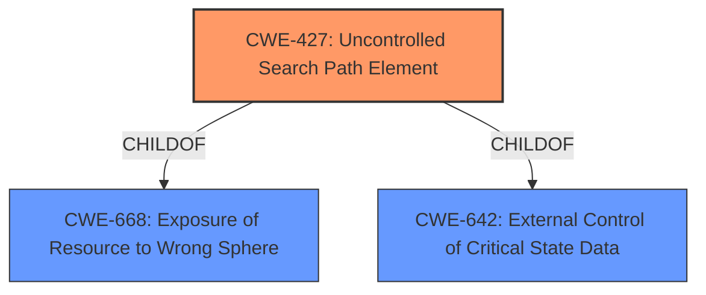

# Raw Analyzer Response for CVE-2021-3633

# Summary
| CWE ID | CWE Name | Confidence | CWE Abstraction Level | CWE Vulnerability Mapping Label | CWE-Vulnerability Mapping Notes |
|---|---|---|---|---|---|
| CWE-427 | Uncontrolled Search Path Element | 1.0 | Base | Allowed | Primary CWE. The vulnerability description explicitly mentions a **DLL preloading vulnerability**. |

## Evidence and Confidence

*   **Confidence Score:** 1.0
*   **Evidence Strength:** HIGH

## Relationship Analysis
The primary CWE is CWE-427. It has a hierarchical relationship with CWE-668 (Exposure of Resource to Wrong Sphere) and CWE-642 (External Control of Critical State Data). CWE-427 is a base level CWE, which is the preferred level of abstraction.

## Vulnerability Chain
The vulnerability chain starts with the **DLL preloading vulnerability** (CWE-427) which then leads to privilege escalation.

## Summary of Analysis
The initial analysis strongly suggests CWE-427 as the primary CWE due to the presence of the phrase "**DLL preloading vulnerability**" in the vulnerability description.

The evidence from the vulnerability description is clear and direct. The description states: "A **DLL preloading vulnerability** was reported in Lenovo Driver Management prior to version 2.9.0719.1104 that could allow privilege escalation." This directly corresponds to the definition of CWE-427, which involves the use of a fixed or controlled search path, but one or more locations in that path can be under the control of unintended actors. This allows for **DLL preloading**, where a malicious DLL can be loaded instead of the intended one, leading to privilege escalation.

The graph relationships confirm the suitability of CWE-427. It's a base-level CWE, providing a good balance of specificity and generality.

I am confident in the selection of CWE-427 because it aligns perfectly with the provided evidence and the nature of the vulnerability. The vulnerability description specifically mentions "**DLL preloading vulnerability**", which is a strong indicator of CWE-427. The use of a base-level CWE ensures sufficient specificity while remaining broadly applicable to the observed weakness.

Other CWEs Considered:
- CWE-787: Out-of-bounds Write - While privilege escalation could be achieved through memory corruption, the description points to **DLL preloading** as the mechanism
- CWE-732: Incorrect Permission Assignment for Critical Resource - While related to privilege escalation, this is not the root cause. The root cause is the **DLL preloading**.
- CWE-426: Untrusted Search Path - Similar to CWE-427, but CWE-427 is more specific to the vulnerability described.
- CWE-20: Improper Input Validation - Too generic.
- CWE-295: Improper Certificate Validation - Not relevant to the vulnerability.
- CWE-269: Improper Privilege Management - Too generic. The description mentions **DLL preloading** that allows privilege escalation.