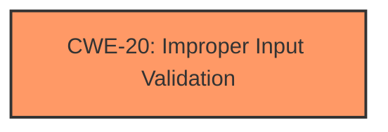

# Analysis Report for CVE-2021-36335

# Vulnerability Analysis Report: CVE-2021-36335

## Description


## Analysis (with Relationship Data)

# Summary
| CWE ID | CWE Name | Confidence | CWE Abstraction Level | CWE Vulnerability Mapping Label | CWE-Vulnerability Mapping Notes |
|---|---|---|---|---|---|
| CWE-20 | Improper Input Validation | 1.0 | Class | Primary | Discouraged |

## Evidence and Confidence

*   **Confidence Score:** 1.0
*   **Evidence Strength:** HIGH

## Relationship Analysis
The primary CWE is CWE-20 (**Improper Input Validation**). Although CWE-20 is a Class-level CWE and is generally discouraged because more specific CWEs should be used, there is insufficient information to determine a more specific CWE.



## Vulnerability Chain
The vulnerability chain is as follows:
1.  **Improper Input Validation (CWE-20)**
2.  Execution of arbitrary files (Impact)

## Summary of Analysis
The vulnerability description clearly states that the root cause is **Improper Input Validation**. The vulnerability occurs in Dell EMC CloudLink 7.1 and prior versions. A remote, low-privileged attacker can exploit this vulnerability, leading to the execution of arbitrary files on the server.

The "Vulnerability Description Key Phrases" section highlights:

*   **rootcause:** **Improper Input Validation**
*   **impact:** execution of arbitrary files

The "CVE Reference Links Content Summary" section confirms:

*   **root\_cause:** **Improper Input Validation**
*   **weaknesses:** ["Improper Input Validation"]
*   **impact:** "Execution of arbitrary files on the server"

The primary CWE identified is CWE-20 (**Improper Input Validation**). While CWE-20 is a Class-level CWE and the mapping guidance discourages its use because more specific CWEs should be used, there is insufficient information to determine a more specific CWE.

The Retriever Results also lists CWE-20 (**Improper Input Validation**) as the top candidate, further supporting its selection. Other CWEs like CWE-280 (**Improper Handling of Insufficient Permissions or Privileges**) and CWE-190 (**Integer Overflow or Wraparound**) were considered but deemed less relevant.

The decision to use CWE-20 is based on the explicit evidence provided in the vulnerability description and supporting documentation, despite the general guidance to select more specific CWEs when possible. In this instance, the available information only points to a general lack of input validation.


## CWE Relationship Analysis

Current CWEs represent these abstraction levels: .


### Vulnerability Chain Analysis

**Chain starting from CWE-190:**
- 190 (Integer Overflow or Wraparound) - ROOT


**Chain starting from CWE-20:**
- 20 (Improper Input Validation) - ROOT


### CWE Relationship Diagram

```mermaid
graph TD
    classDef primary fill:#f96,stroke:#333,stroke-width:2px
    classDef secondary fill:#69f,stroke:#333
    classDef tertiary fill:#9e9,stroke:#333
```


*Report generated on 2025-04-02 00:22:47*
