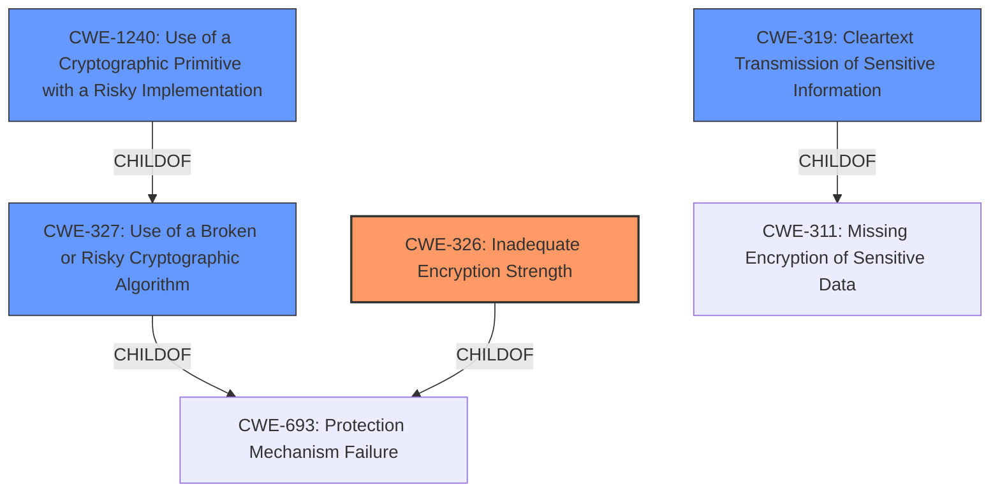

# Analysis Report for CVE-2021-36337

# Vulnerability Analysis Report: CVE-2021-36337

## Description


## Analysis (with Relationship Data)

# Summary
| CWE ID | CWE Name | Confidence | CWE Abstraction Level | CWE Vulnerability Mapping Label | CWE-Vulnerability Mapping Notes |
|---|---|---|---|---|---|
| CWE-326 | Inadequate Encryption Strength | 0.9 | Class | Allowed-with-Review | Primary CWE: The vulnerability lies in the use of **insecure Transport Security Protocols TLS 1.0 and TLS 1.1**, which indicates inadequate encryption strength. |
| CWE-319 | Cleartext Transmission of Sensitive Information | 0.7 | Base | Allowed | Secondary Candidate: Using TLS 1.0 and TLS 1.1 could lead to sensitive information being transmitted in cleartext if the encryption is bypassed or compromised. |
| CWE-327 | Use of a Broken or Risky Cryptographic Algorithm | 0.6 | Class | Allowed-with-Review | Secondary Candidate: TLS 1.0 and TLS 1.1 are considered risky cryptographic algorithms due to known vulnerabilities. |
| CWE-1240 | Use of a Cryptographic Primitive with a Risky Implementation | 0.5 | Base | Allowed | Secondary Candidate: Usage of TLS 1.0 and 1.1 would classify as a risky implementation of cryptography. |

## Evidence and Confidence

*   **Confidence Score:** 0.8
*   **Evidence Strength:** HIGH

## Relationship Analysis
The primary CWE is CWE-326 (Inadequate Encryption Strength), a Class-level weakness, which could lead to other weaknesses like CWE-319 (Cleartext Transmission of Sensitive Information), a Base-level weakness. CWE-327 (Use of a Broken or Risky Cryptographic Algorithm) is also relevant because TLS 1.0 and 1.1 are considered broken or risky. CWE-1240 (Use of a Cryptographic Primitive with a Risky Implementation) is also considered as its a risky implementation of cryptography. The relationships show a progression from a general encryption weakness to specific issues with the transport of data.



## Vulnerability Chain
The vulnerability chain starts with the **insecure Transport Security Protocols TLS 1.0 and TLS 1.1** (CWE-326). This **weakness** can lead to Man-In-The-Middle attacks which compromises the confidentiality and integrity of data (Impact). The use of these protocols might result in sensitive information being transmitted in cleartext (CWE-319) if encryption is bypassed.

## Summary of Analysis
Initially, the presence of **insecure Transport Security Protocols TLS 1.0 and TLS 1.1** pointed towards CWE-326 (Inadequate Encryption Strength) as the primary issue. The description clearly states that these protocols are susceptible to Man-In-The-Middle attacks, compromising confidentiality and integrity.

*   **Evidence:** "Dell Wyse Management Suite version 3.3.1 and prior support **insecure Transport Security Protocols TLS 1.0 and TLS 1.1** which are susceptible to Man-In-The-Middle attacks thereby compromising Confidentiality and Integrity of data."

The retriever results and relationship analysis reinforced this selection. CWE-326 is a Class, and while there might be more specific Base-level children, it accurately represents the core problem. CWE-319, CWE-327, and CWE-1240 were considered as secondary issues stemming from the **root cause**, but CWE-326 is the most direct representation of the **weakness**.

CWE-326 is at the optimal level of specificity because it addresses the **root cause** of the vulnerability which is the use of **inadequate encryption strength**, rather than just the potential consequences like cleartext transmission. The graph relationships show how this **root cause** can lead to other issues, but the primary focus remains on the encryption itself.

The other CWEs considered were not chosen as primary because they represent potential consequences or related issues rather than the main **weakness** which is **inadequate encryption strength**. For example, while CWE-319 (Cleartext Transmission of Sensitive Information) is a possible outcome, it is not guaranteed, as the attacker would still need to intercept and decrypt the traffic. Similarly, CWE-327 and CWE-1240 are related but less direct than CWE-326.


## CWE Relationship Analysis

Current CWEs represent these abstraction levels: .


### Vulnerability Chain Analysis

**Chain starting from CWE-311:**
- 311 (Missing Encryption of Sensitive Data) - ROOT


**Chain starting from CWE-319:**
- 319 (Cleartext Transmission of Sensitive Information) - ROOT


### CWE Relationship Diagram

```mermaid
graph TD
    classDef primary fill:#f96,stroke:#333,stroke-width:2px
    classDef secondary fill:#69f,stroke:#333
    classDef tertiary fill:#9e9,stroke:#333
```


*Report generated on 2025-04-02 00:10:31*
