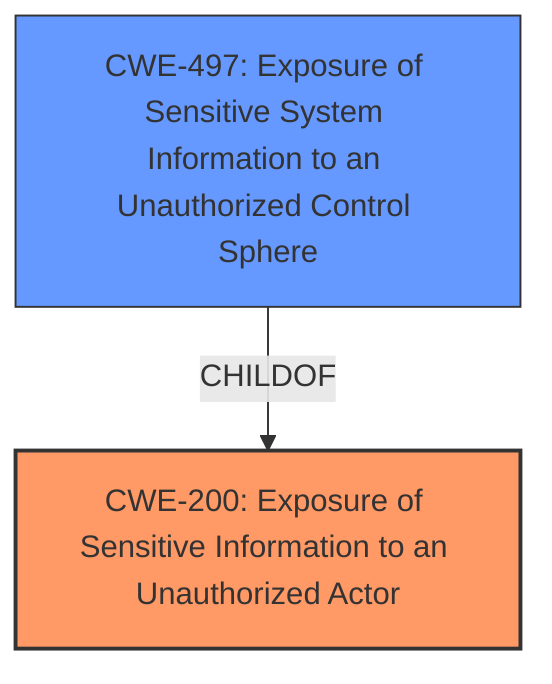

# Enhanced Analysis for CVE-2021-36341

# Summary
| CWE ID | CWE Name | Confidence | CWE Abstraction Level | CWE Vulnerability Mapping Label | CWE-Vulnerability Mapping Notes |
|---|---|---|---|---|---|
| CWE-200 | Exposure of Sensitive Information to an Unauthorized Actor | 0.8 | Class | Primary | Discouraged |
| CWE-497 | Exposure of Sensitive System Information to an Unauthorized Control Sphere | 0.6 | Base | Secondary | Allowed |

## Evidence and Confidence

*   **Confidence Score:** 0.7
*   **Evidence Strength:** MEDIUM

## Relationship Analysis
The primary relationship influencing the CWE selection is the hierarchical relationship between CWE-200 (Class) and CWE-497 (Base), where CWE-497 is a child of CWE-200. While CWE-200 is a broader category, the vulnerability description suggests that the exposed sensitive information relates to system-level details, making CWE-497 a more specific, albeit less confident, secondary candidate. The discouragement of using CWE-200 generally pushes for more specific mappings, further supporting the consideration of CWE-497.



## Vulnerability Chain
The vulnerability chain is relatively straightforward:

1.  **Root Cause:** **Sensitive data exposure** due to **explicit insertion** of sensitive information into resources or **unintentional exposure**
2.  **Weakness:** The application **fails to protect** sensitive information from unauthorized access
3.  **Impact:** A local authenticated user with low privileges can access sensitive information

## Summary of Analysis
Initially, CWE-200 appears to be the most suitable mapping due to the **sensitive data exposure** described in the vulnerability. However, CWE-200 is discouraged for general use and suggests mapping to more specific CWEs. The description mentions a local authenticated user with low privileges gaining access to sensitive information, leaning towards a more system-level exposure.

CWE-497, "Exposure of Sensitive System Information to an Unauthorized Control Sphere," is considered as a secondary candidate because it addresses the system-level aspect of the exposure.

The final assessment relies on the provided evidence, specifically:
- "Dell Wyse Device Agent version 14.5.4.1 and below contain a **sensitive data exposure** vulnerability."
- "A local authenticated user with low privileges could potentially exploit this vulnerability in order to access sensitive information."

The choice of CWE-200 as primary with CWE-497 as secondary reflects the initial broad classification and a more specific, though less confidently asserted, classification based on system-level details.

Relevant CWE Information:

# Enhanced Context (25 CWEs)

## CWE-538: Insertion of Sensitive Information into Externally-Accessible File or Directory
**Abstraction Level**: Base
**Similarity Score**: 0.75
**Source**: dense
Not selected. This CWE implies the sensitive data is placed in a file or directory, which isn't explicitly stated in the vulnerability description.

## CWE-226: Sensitive Information in Resource Not Removed Before Reuse
**Abstraction Level**: Base
**Similarity Score**: 0.75
**Source**: dense
Not selected. This CWE relates to the failure to clear sensitive information before resource reuse, which isn't the focus of the vulnerability description.

## CWE-497: Exposure of Sensitive System Information to an Unauthorized Control Sphere
**Abstraction Level**: Base
**Similarity Score**: 0.74
**Source**: dense
Selected as a secondary candidate. This CWE is relevant because the vulnerability involves a local user gaining access to sensitive system information. It's a more specific case of information exposure than CWE-200.

## CWE-668: Exposure of Resource to Wrong Sphere
**Abstraction Level**: Class
**Similarity Score**: 0.74
**Source**: dense
Not selected. This CWE is too broad and discouraged for use when more specific CWEs are available.

## CWE-312: Cleartext Storage of Sensitive Information
**Abstraction Level**: Base
**Similarity Score**: 0.74
**Source**: dense
Not selected. This CWE relates to storing sensitive information in cleartext, which isn't mentioned in the vulnerability description.

## CWE-212: Improper Removal of Sensitive Information Before Storage or Transfer
**Abstraction Level**: Base
**Similarity Score**: 0.73
**Source**: dense
Not selected. This CWE focuses on the improper removal of sensitive data, which isn't the primary issue described in the vulnerability.

## CWE-274: Improper Handling of Insufficient Privileges
**Abstraction Level**: Base
**Similarity Score**: 0.73
**Source**: dense
Not selected. This CWE relates to insufficient privileges, which isn't the core of the sensitive data exposure.

## CWE-552: Files or Directories Accessible to External Parties
**Abstraction Level**: Base
**Similarity Score**: 0.73
**Source**: dense
Not selected. This CWE focuses on making files/directories accessible, which isn't the main problem in the description.

## CWE-213: Exposure of Sensitive Information Due to Incompatible Policies
**Abstraction Level**: Base
**Similarity Score**: 0.73
**Source**: dense
Not selected. This CWE is about conflicting policies, which isn't relevant to the vulnerability.

## CWE-653: Improper Isolation or Compartmentalization
**Abstraction Level**: Class
**Similarity Score**: 0.73
**Source**: dense
Not selected. This CWE relates to improper isolation, which is not the main issue.

## CWE-200: Exposure of Sensitive Information to an Unauthorized Actor
**Abstraction Level**: Class
**Similarity Score**: 6180.88
**Source**: sparse
Selected as the primary CWE. It directly addresses the **sensitive data exposure** vulnerability, even though it is discouraged.

## CWE-863: Incorrect Authorization
**Abstraction Level**: Class
**Similarity Score**: 6007.06
**Source**: sparse
Not selected. This CWE deals with incorrect authorization checks, which isn't explicitly stated in the vulnerability.

## CWE-497: Exposure of Sensitive System Information to an Unauthorized Control Sphere
**Abstraction Level**: Base
**Similarity Score**: 5939.86
**Source**: sparse
Selected as a secondary candidate. As explained before.

## CWE-285: Improper Authorization
**Abstraction Level**: Class
**Similarity Score**: 5909.02
**Source**: sparse
Not selected. Similar to CWE-863, it deals with authorization checks, which is not the core issue.

## CWE-639: Authorization Bypass Through User-Controlled Key
**Abstraction Level**: Base
**Similarity Score**: 5892.06
**Source**: sparse
Not selected. This is specific to user-controlled keys for authorization, which is not applicable here.

## CWE-201: Insertion of Sensitive Information Into Sent Data
**Abstraction Level**: base
**Similarity Score**: 4.33
**Source**: graph
Not selected. This CWE relates to sending sensitive data, which isn't the focus of the vulnerability description.

## CWE-1272: Sensitive Information Uncleared Before Debug/Power State Transition
**Abstraction Level**: base
**Similarity Score**: 4.33
**Source**: graph
Not selected. This CWE relates to clearing sensitive data during state transitions, which is not the main issue.

## CWE-266: Incorrect Privilege Assignment
**Abstraction Level**: base
**Similarity Score**: 3.64
**Source**: graph
Not selected. This CWE deals with privilege assignments, which isn't the primary issue.

## CWE-226: Sensitive Information in Resource Not Removed Before Reuse
**Abstraction Level**: Base
**Similarity Score**: 2.90
**Source**: graph
Not selected. As explained before.

## CWE-322: Key Exchange without Entity Authentication
**Abstraction Level**: base
**Similarity Score**: 2.87
**Source**: graph
Not selected. This CWE relates to key exchange, which is not relevant to the vulnerability.

## CWE-499: Serializable Class Containing Sensitive Data
**Abstraction Level**: variant
**Similarity Score**: 2.68
**Source**: graph
Not selected. This CWE is specific to serializable classes, which is not applicable.

## CWE-498: Cloneable Class Containing Sensitive Information
**Abstraction Level**: variant
**Similarity Score**: 2.68
**Source**: graph
Not selected. This CWE is specific to cloneable classes, which is not applicable.

## CWE-942: Permissive Cross-domain Policy with Untrusted Domains
**Abstraction Level**: variant
**Similarity Score**: 2.68
**Source**: graph
Not selected. This CWE relates to cross-domain policies, which


## CWE Relationship Analysis

Current CWEs represent these abstraction levels: .


### Vulnerability Chain Analysis

**Chain starting from CWE-266:**
- 266 (Incorrect Privilege Assignment) - ROOT


**Chain starting from CWE-213:**
- 213 (Exposure of Sensitive Information Due to Incompatible Policies) - ROOT


### CWE Relationship Diagram

```mermaid
graph TD
    classDef primary fill:#f96,stroke:#333,stroke-width:2px
    classDef secondary fill:#69f,stroke:#333
    classDef tertiary fill:#9e9,stroke:#333
```