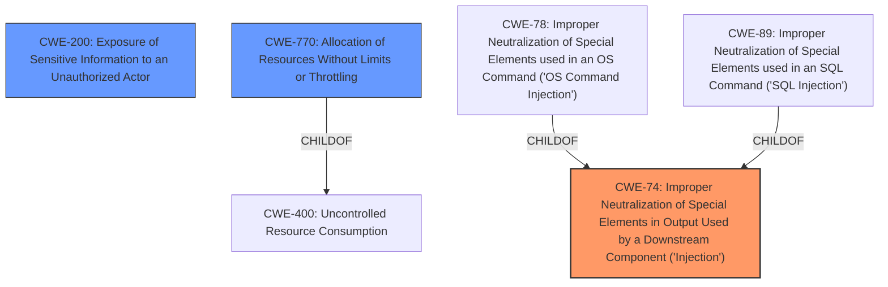

# Analysis Report for CVE-2021-36348

# Vulnerability Analysis Report: CVE-2021-36348

## Description


## Analysis (with Relationship Data)

# Summary
| CWE ID | CWE Name | Confidence | CWE Abstraction Level | CWE Vulnerability Mapping Label | CWE-Vulnerability Mapping Notes |
|---|---|---|---|---|---|
| CWE-74 | Improper Neutralization of Special Elements in Output Used by a Downstream Component ('Injection') | 0.9 | Class | Primary CWE | Allowed-with-Review |
| CWE-200 | Exposure of Sensitive Information to an Unauthorized Actor | 0.6 | Class | Secondary Candidate | Discouraged |
| CWE-770 | Allocation of Resources Without Limits or Throttling | 0.6 | base | Secondary Candidate | Allowed |

## Evidence and Confidence

*   **Confidence Score:** 0.7
*   **Evidence Strength:** HIGH

## Relationship Analysis
The primary CWE is CWE-74 which is a class level CWE.
CWE-74 is parent of CWE-78 and CWE-89.
CWE-20 is a peer of CWE-116.
CWE-770 is child of CWE-400.



## Vulnerability Chain
The vulnerability chain starts with an **input injection** **weakness**, leading to potential information disclosure or denial of service.

## Summary of Analysis
The vulnerability is described as an **input injection** flaw in Dell EMC iDRAC9. A remote authenticated malicious user with low privileges can exploit this vulnerability to cause information disclosure or denial of service by supplying specially crafted input data to iDRAC.

The core **weakness** is the improper handling of input data, allowing an attacker to inject malicious data into the iDRAC system. The impacts include potential information disclosure and denial of service.

The evidence strongly points to an injection vulnerability, making CWE-74 (Improper Neutralization of Special Elements in Output Used by a Downstream Component ('Injection')) the most appropriate primary CWE. Although CWE-74 is a Class level CWE, the provided information does not give enough information to select a more specific Base level CWE.

CWE-200 (Exposure of Sensitive Information to an Unauthorized Actor) is considered as a possible secondary CWE due to the information disclosure impact, but it is less direct than the injection itself. CWE-770 (Allocation of Resources Without Limits or Throttling) is also considered as a possible secondary CWE due to the denial of service impact.

Relevant CWE Information:

# Enhanced Context (25 CWEs)
The following CWEs were identified as potentially relevant to this vulnerability:

## CWE-74: Improper Neutralization of Special Elements in Output Used by a Downstream Component ('Injection')
**Abstraction Level**: Class
**Similarity Score**: 0.73
**Source**: dense

**Description**:
The product constructs all or part of a command, data structure, or record using externally-influenced input from an upstream component, but it does not neutralize or incorrectly neutralizes special elements that could modify how it is parsed or interpreted when it is sent to a downstream component.

**Mapping Guidance**:
- Usage: Discouraged
- Rationale: CWE-74 is high-level and often misused when lower-level weaknesses are more appropriate.

**Justification:**
This CWE is selected as the primary CWE because the vulnerability involves the injection of specially crafted input data, which aligns with the description of CWE-74. The vulnerability description key phrases includes "**weakness:** **input injection**".

## CWE-200: Exposure of Sensitive Information to an Unauthorized Actor
**Abstraction Level**: Class
**Similarity Score**: 0.544
**Source**: dense

**Description**:
The product exposes sensitive information to an actor that is not explicitly authorized to have access to that information.

**Mapping Guidance**:
- Usage: Discouraged
- Rationale: CWE-200 is commonly misused to represent the loss of confidentiality in a vulnerability, but confidentiality loss is a technical impact - not a root cause error. As of CWE 4.9, over 400 CWE entries can lead to a loss of confidentiality. Other options are often available. [REF-1287].
**Comments:** If an error or mistake causes information to be disclosed, then use the CWE ID for that error. Consider starting with improper authorization (CWE-285), insecure permissions (CWE-732), improper authentication (CWE-287), etc. Also consider children such as Insertion of Sensitive Information Into Sent Data (CWE-201), Observable Discrepancy (CWE-203), Insertion of Sensitive Information into Externally-Accessible File or Directory (CWE-538), or others.

**Justification:**
This CWE is considered because one of the impacts of the vulnerability is information disclosure. However, since the root cause is **input injection**, CWE-74 is more directly relevant. The evidence mentions "information disclosure" as a potential impact.

## CWE-770: Allocation of Resources Without Limits or Throttling
**Abstraction Level**: Base
**Similarity Score**: 4.33
**Source**: graph

**Description**:
CWE-770: Allocation of Resources Without Limits or Throttling

**Mapping Guidance**:
- Usage: Allowed
- Rationale: This CWE entry is at the Base level of abstraction, which is a preferred level of abstraction for mapping to the root causes of vulnerabilities.

**Justification:**
This CWE is considered because one of the impacts of the vulnerability is denial of service. The advisory states that the crafted input could lead to "denial of service".

## Other CWEs Considered and Rejected:

*   CWE-20 (Improper Input Validation): While the vulnerability involves improper handling of input, CWE-74 is more specific to injection flaws. Also, CWE-20 is discouraged.
*   CWE-89 (Improper Neutralization of Special Elements used in an SQL Command ('SQL Injection')): This is too specific, as the **input injection** may not necessarily be SQL injection.
*   CWE-78 (Improper Neutralization of Special Elements used in an OS Command ('OS Command Injection')): This is also too specific, as the **input injection** may not necessarily be OS command injection.
*   CWE-120 (Buffer Copy without Checking Size of Input ('Classic Buffer Overflow')): This is not relevant as the vulnerability is about **input injection**, not necessarily a buffer overflow.

The selection of CWE-74 is at the optimal level of specificity given the available information. While a more specific CWE might exist, the description does not provide enough detail to confidently select one.


## CWE Relationship Analysis

Current CWEs represent these abstraction levels: .


### Vulnerability Chain Analysis

**Chain starting from CWE-732:**
- 732 (Incorrect Permission Assignment for Critical Resource) - ROOT


**Chain starting from CWE-201:**
- 201 (Insertion of Sensitive Information Into Sent Data) - ROOT


### CWE Relationship Diagram

```mermaid
graph TD
    classDef primary fill:#f96,stroke:#333,stroke-width:2px
    classDef secondary fill:#69f,stroke:#333
    classDef tertiary fill:#9e9,stroke:#333
```


*Report generated on 2025-04-02 03:06:57*
