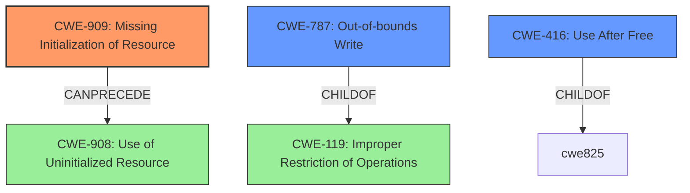

# Enhanced Analysis for CVE-2021-3635

# Summary
| CWE ID | CWE Name | Confidence | CWE Abstraction Level | CWE Vulnerability Mapping Label | CWE-Vulnerability Mapping Notes |
|---|---|---|---|---|---|
| CWE-909 | Missing Initialization of Resource | 0.75 | Class | Allowed-with-Review | Primary CWE |
| CWE-787 | Out-of-bounds Write | 0.5 | Base | Allowed | Secondary Candidate |
| CWE-416 | Use After Free | 0.5 | Variant | Allowed | Secondary Candidate |

## Evidence and Confidence

*   **Confidence Score:** 0.7
*   **Evidence Strength:** MEDIUM

## Relationship Analysis
The primary focus is on **CWE-909 (Missing Initialization of Resource)** as a potential root cause, given the **missing** generation check. While other CWEs like **CWE-787 (Out-of-bounds Write)** and **CWE-416 (Use After Free)** are considered due to potential consequences of this flaw, the immediate cause appears to be the **lack of initialization** that sets the stage for these later issues. The relationships show that **CWE-909** can precede **CWE-908 (Use of Uninitialized Resource)**, which indicates a potential chain of events. The abstraction level of **CWE-909** is Class, suggesting a need to examine more specific descendants if available, while **CWE-787** and **CWE-416** are at the Base and Variant levels, respectively, indicating greater specificity, but are only potential consequences.



## Vulnerability Chain
The vulnerability chain starts with a **missing generation check** during DELTABLE processing. This **missing** check leads to the DELFLOWTABLE operation being queued a second time. This can then lead to:
  - Data corruption.
  - A denial-of-service condition.
  - System panic.

The sequence can be mapped as: **Missing Initialization (CWE-909)** -> potential **Use of Uninitialized Resource (CWE-908)** -> potential **Out-of-bounds Write (CWE-787)** or **Use After Free (CWE-416)** -> **Data Corruption/Denial of Service**.

## Summary of Analysis
The initial analysis pointed towards **CWE-909 (Missing Initialization of Resource)** as a potential root cause due to the **missing** generation check, as stated in the CVE description: "A **missing** generation check during DELTABLE processing causes it to queue the DELFLOWTABLE operation a second time". This aligns with the description of **CWE-909** where "The product does not initialize a critical resource."

Other CWEs such as **CWE-787 (Out-of-bounds Write)** and **CWE-416 (Use After Free)** were considered as potential consequences of the **missing** initialization, but they are downstream effects rather than the immediate cause. The retriever results also listed **CWE-119 (Improper Restriction of Operations within the Bounds of a Memory Buffer)**, but it is discouraged and more general than **CWE-787**.

The graph relationships influenced the selection by highlighting the potential chain of events, where a **missing** initialization can lead to the use of uninitialized resources and potentially out-of-bounds writes or use-after-free conditions. However, the immediate cause is the **missing** initialization.

The selected CWE is at the optimal level of specificity because it directly addresses the **root cause** described in the CVE, which is the **lack of a generation check**. While the consequences can be severe, the initial flaw lies in the **missing** initialization.

Relevant CWE Information:

# Enhanced Context (25 CWEs)
The following CWEs were identified as potentially relevant to this vulnerability:

## CWE-667: Improper Locking
**Abstraction Level**: Class
**Similarity Score**: 0.79
**Source**: dense

**Description**:
The product does not properly acquire or release a lock on a resource, leading to unexpected resource state changes and behaviors.

**Mapping Guidance**:
- Usage: Allowed-with-Review
- Rationale: This CWE entry is a Class and might have Base-level children that would be more appropriate

## CWE-226: Sensitive Information in Resource Not Removed Before Reuse
**Abstraction Level**: Base
**Similarity Score**: 0.78
**Source**: dense

**Description**:
The product releases a resource such as memory or a file so that it can be made available for reuse, but it does not clear or "zeroize" the information contained in the resource before the product performs a critical state transition or makes the resource available for reuse by other entities.

**Mapping Guidance**:
- Usage: Allowed
- Rationale: This CWE entry is at the Base level of abstraction, which is a preferred level of abstraction for mapping to the root causes of vulnerabilities.

## CWE-404: Improper Resource Shutdown or Release
**Abstraction Level**: Class
**Similarity Score**: 0.78
**Source**: dense

**Description**:
The product does not release or incorrectly releases a resource before it is made available for re-use.

**Mapping Guidance**:
- Usage: Allowed-with-Review
- Rationale: This CWE entry is a Class and might have Base-level children that would be more appropriate

## CWE-908: Use of Uninitialized Resource
**Abstraction Level**: Base
**Similarity Score**: 0.77
**Source**: dense

**Description**:
The product uses or accesses a resource that has not been initialized.

**Mapping Guidance**:
- Usage: Allowed
- Rationale: This CWE entry is at the Base level of abstraction, which is a preferred level of abstraction for mapping to the root causes of vulnerabilities.

## CWE-909: Missing Initialization of Resource
**Abstraction Level**: Class
**Similarity Score**: 0.77
**Source**: dense

**Description**:
The product does not initialize a critical resource.

**Mapping Guidance**:
- Usage: Allowed-with-Review
- Rationale: This CWE entry is a Class and might have Base-level children that would be more appropriate

## CWE-125: Out-of-bounds Read
**Abstraction Level**: Base
**Similarity Score**: 0.77
**Source**: dense

**Description**:
The product reads data past the end, or before the beginning, of the intended buffer.

**Mapping Guidance**:
- Usage: Allowed
- Rationale: This CWE entry is at the Base level of abstraction, which is a preferred level of abstraction for mapping to the root causes of vulnerabilities.

## CWE-824: Access of Uninitialized Pointer
**Abstraction Level**: Base
**Similarity Score**: 0.77
**Source**: dense

**Description**:
The product accesses or uses a pointer that has not been initialized.

**Mapping Guidance**:
- Usage: Allowed
- Rationale: This CWE entry is at the Base level of abstraction, which is a preferred level of abstraction for mapping to the root causes of vulnerabilities.

## CWE-362: Concurrent Execution using Shared Resource with Improper Synchronization ('Race Condition')
**Abstraction Level**: Class
**Similarity Score**: 0.77
**Source**: dense

**Description**:
The product contains a concurrent code sequence that requires temporary, exclusive access to a shared resource, but a timing window exists in which the shared resource can be modified by another code sequence operating concurrently.

**Mapping Guidance**:
- Usage: Allowed-with-Review
- Rationale: This CWE entry is a Class and might have Base-level children that would be more appropriate

## CWE-665: Improper Initialization
**Abstraction Level**: Class
**Similarity Score**: 0.77
**Source**: dense

**Description**:
The product does not initialize or incorrectly initializes a resource, which might leave the resource in an unexpected state when it is accessed or used.

**Mapping Guidance**:
- Usage: Discouraged
- Rationale: This CWE entry is a level-1 Class (i.e., a child of a Pillar). It might have lower-level children that would be more appropriate

## CWE-843: Access of Resource Using Incompatible Type ('Type Confusion')
**Abstraction Level**: Base
**Similarity


## CWE Relationship Analysis

Current CWEs represent these abstraction levels: .


### Vulnerability Chain Analysis

**Chain starting from CWE-667:**
- 667 (Improper Locking) - ROOT


**Chain starting from CWE-787:**
- 787 (Out-of-bounds Write) - ROOT


### CWE Relationship Diagram

```mermaid
graph TD
    classDef primary fill:#f96,stroke:#333,stroke-width:2px
    classDef secondary fill:#69f,stroke:#333
    classDef tertiary fill:#9e9,stroke:#333
```