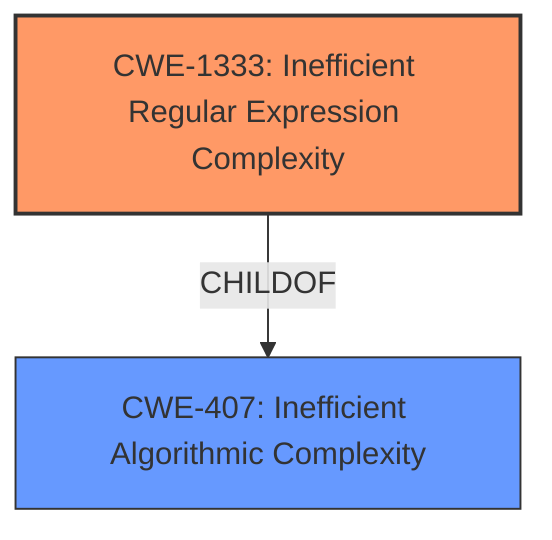

# Enhanced Analysis for CVE-2021-3649

# Summary
| CWE ID | CWE Name | Confidence | CWE Abstraction Level | CWE Vulnerability Mapping Label | CWE-Vulnerability Mapping Notes |
|---|---|---|---|---|---|
| CWE-1333 | Inefficient Regular Expression Complexity | 0.9 | Base | Allowed | Primary CWE |
| CWE-407 | Inefficient Algorithmic Complexity | 0.7 | Class | Allowed-with-Review | Secondary Candidate |

## Evidence and Confidence

*   **Confidence Score:** 0.9
*   **Evidence Strength:** HIGH

## Relationship Analysis
The primary relationship is that CWE-1333 is a child of CWE-407. This means that CWE-1333 is a more specific type of CWE-407. The vulnerability description mentions "Inefficient Regular Expression Complexity", making CWE-1333 a more precise fit than its parent, CWE-407, which covers general algorithmic complexity issues.



## Vulnerability Chain
The vulnerability chain starts with the use of an inefficient regular expression in the chatwoot application. This leads to excessive CPU consumption when processing specifically crafted input.

## Summary of Analysis
The initial assessment identified CWE-1333 as the primary candidate due to the explicit mention of "Inefficient Regular Expression Complexity" in the vulnerability description. The evidence from the "CVE Reference Links Content Summary" supports this, indicating that the root cause involves how regular expressions are handled in the application.

The relationship analysis further solidifies this choice. While CWE-407 (Inefficient Algorithmic Complexity) is a parent of CWE-1333, the latter is a more specific and accurate representation of the vulnerability.

The final decision is based on the direct evidence of an inefficient regular expression being the root cause. The retriever results also support this, with CWE-1333 having the highest score. The "Complete CWE Specifications" confirm that CWE-1333 is a base-level CWE, which is the preferred level of abstraction.

Relevant CWE Information:

# Enhanced Context (25 CWEs)

## CWE-407: Inefficient Algorithmic Complexity
**Abstraction Level**: Class
**Similarity Score**: 0.76
**Source**: dense

**Description**:
An algorithm in a product has an inefficient worst-case computational complexity that may be detrimental to system performance and can be triggered by an attacker, typically using crafted manipulations that ensure that the worst case is being reached.

**Mapping Guidance**:
- Usage: Allowed-with-Review
- Rationale: This CWE entry is a Class and might have Base-level children that would be more appropriate

## CWE-1333: Inefficient Regular Expression Complexity
**Abstraction Level**: Base
**Similarity Score**: 5127.44
**Source**: sparse

**Description**:
The product uses a regular expression with an inefficient, possibly exponential worst-case computational complexity that consumes excessive CPU cycles.

**Mapping Guidance**:
- Usage: Allowed
- Rationale: This CWE entry is at the Base level of abstraction, which is a preferred level of abstraction for mapping to the root causes of vulnerabilities.

### Detailed Analysis of Selected CWEs:

1.  **CWE-1333: Inefficient Regular Expression Complexity**
    *   **Explanation:** This CWE accurately describes the vulnerability. The description explicitly mentions "Inefficient Regular Expression Complexity". The commit history also mentions the removal of the `EmailContentParser.js` file, which was responsible for stripping style characters. The new `stripStyleCharacters` function utilizes DOMPurify.sanitize to remove potentially malicious tags and attributes.
    *   **Security Implications:** An attacker could craft input that causes excessive backtracking in the regular expression, leading to a denial-of-service condition due to high CPU consumption.
    *   **Relationships:** CWE-1333 is a child of CWE-407 (Inefficient Algorithmic Complexity), making it a more specific classification.
    *   **Mapping Guidance:** The usage is "Allowed" and the abstraction level is "Base", which is the preferred level.
2.  **CWE-407: Inefficient Algorithmic Complexity**
    *   **Explanation:** This CWE is a more general classification that could apply, but CWE-1333 is more specific.
    *   **Security Implications:** An attacker could craft input that triggers the inefficient algorithm, leading to a denial-of-service condition due to high CPU consumption.
    *   **Relationships:** CWE-407 is the parent of CWE-1333.
    *   **Mapping Guidance:** The usage is "Allowed-with-Review" because it is a class-level CWE and more specific base-level CWEs exist.

### CWEs Considered But Not Used:

*   **CWE-186: Overly Restrictive Regular Expression**: This CWE was considered because regular expressions are involved, but the vulnerability is about inefficiency rather than being overly restrictive.
*   **CWE-625: Permissive Regular Expression**: This CWE was considered because regular expressions are involved, but the vulnerability is about inefficiency rather than being permissive.
*   **CWE-184: Incomplete List of Disallowed Inputs**: This CWE was considered because the fix involves sanitizing HTML content, which could be seen as a form of disallowed input. However, the root cause is the inefficient regular expression, making CWE-1333 a better fit.
*   **CWE-626: Null Byte Interaction Error (Poison Null Byte)**: This CWE was considered, but it is not relevant to the described vulnerability. The issue is related to regular expression complexity, not null byte handling.


## CWE Relationship Analysis

Current CWEs represent these abstraction levels: .


### Vulnerability Chain Analysis

**Chain starting from CWE-186:**
- 186 (Overly Restrictive Regular Expression) - ROOT


**Chain starting from CWE-1333:**
- 1333 (Inefficient Regular Expression Complexity) - ROOT


### CWE Relationship Diagram

```mermaid
graph TD
    classDef primary fill:#f96,stroke:#333,stroke-width:2px
    classDef secondary fill:#69f,stroke:#333
    classDef tertiary fill:#9e9,stroke:#333
```