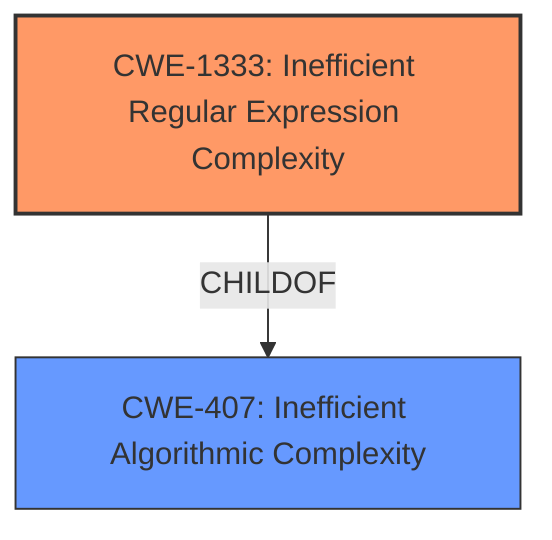

# Analysis for CVE-2021-3649

# Summary
| CWE ID | CWE Name | Confidence | CWE Abstraction Level | CWE Vulnerability Mapping Label | CWE-Vulnerability Mapping Notes |
|---|---|---|---|---|---|
| CWE-1333 | Inefficient Regular Expression Complexity | 0.9 | Base | Allowed | Primary CWE |
| CWE-407 | Inefficient Algorithmic Complexity | 0.7 | Class | Allowed-with-Review | Secondary Candidate |

## Evidence and Confidence

*   **Confidence Score:** 0.9
*   **Evidence Strength:** HIGH

## Relationship Analysis
The primary relationship is that CWE-1333 is a child of CWE-407. This means that CWE-1333 is a more specific type of CWE-407. The vulnerability description mentions "Inefficient Regular Expression Complexity", making CWE-1333 a more precise fit than its parent, CWE-407, which covers general algorithmic complexity issues.

## Vulnerability Chain
The vulnerability chain starts with the use of an inefficient regular expression in the chatwoot application. This leads to excessive CPU consumption when processing specifically crafted input.

## Summary of Analysis
The initial assessment identified CWE-1333 as the primary candidate due to the explicit mention of "Inefficient Regular Expression Complexity" in the vulnerability description. The evidence from the "CVE Reference Links Content Summary" supports this, indicating that the root cause involves how regular expressions are handled in the application.

The relationship analysis further solidifies this choice. While CWE-407 (Inefficient Algorithmic Complexity) is a parent of CWE-1333, the latter is a more specific and accurate representation of the vulnerability.

The final decision is based on the direct evidence of an inefficient regular expression being the root cause. The retriever results also support this, with CWE-1333 having the highest score. The "Complete CWE Specifications" confirm that CWE-1333 is a base-level CWE, which is the preferred level of abstraction.

Relevant CWE Information:

# Enhanced Context (25 CWEs)

## CWE-407: Inefficient Algorithmic Complexity
**Abstraction Level**: Class
**Similarity Score**: 0.76
**Source**: dense

**Description**:
An algorithm in a product has an inefficient worst-case computational complexity that may be detrimental to system performance and can be triggered by an attacker, typically using crafted manipulations that ensure that the worst case is being reached.

**Mapping Guidance**:
- Usage: Allowed-with-Review
- Rationale: This CWE entry is a Class and might have Base-level children that would be more appropriate

## CWE-1333: Inefficient Regular Expression Complexity
**Abstraction Level**: Base
**Similarity Score**: 5127.44
**Source**: sparse

**Description**:
The product uses a regular expression with an inefficient, possibly exponential worst-case computational complexity that consumes excessive CPU cycles.

**Mapping Guidance**:
- Usage: Allowed
- Rationale: This CWE entry is at the Base level of abstraction, which is a preferred level of abstraction for mapping to the root causes of vulnerabilities.

### Detailed Analysis of Selected CWEs:

1.  **CWE-1333: Inefficient Regular Expression Complexity**
    *   **Explanation:** This CWE accurately describes the vulnerability. The description explicitly mentions "Inefficient Regular Expression Complexity". The commit history also mentions the removal of the `EmailContentParser.js` file, which was responsible for stripping style characters. The new `stripStyleCharacters` function utilizes DOMPurify.sanitize to remove potentially malicious tags and attributes.
    *   **Security Implications:** An attacker could craft input that causes excessive backtracking in the regular expression, leading to a denial-of-service condition due to high CPU consumption.
    *   **Relationships:** CWE-1333 is a child of CWE-407 (Inefficient Algorithmic Complexity), making it a more specific classification.
    *   **Mapping Guidance:** The usage is "Allowed" and the abstraction level is "Base", which is the preferred level.
2.  **CWE-407: Inefficient Algorithmic Complexity**
    *   **Explanation:** This CWE is a more general classification that could apply, but CWE-1333 is more specific.
    *   **Security Implications:** An attacker could craft input that triggers the inefficient algorithm, leading to a denial-of-service condition due to high CPU consumption.
    *   **Relationships:** CWE-407 is the parent of CWE-1333.
    *   **Mapping Guidance:** The usage is "Allowed-with-Review" because it is a class-level CWE and more specific base-level CWEs exist.

### CWEs Considered But Not Used:

*   **CWE-186: Overly Restrictive Regular Expression**: This CWE was considered because regular expressions are involved, but the vulnerability is about inefficiency rather than being overly restrictive.
*   **CWE-625: Permissive Regular Expression**: This CWE was considered because regular expressions are involved, but the vulnerability is about inefficiency rather than being permissive.
*   **CWE-184: Incomplete List of Disallowed Inputs**: This CWE was considered because the fix involves sanitizing HTML content, which could be seen as a form of disallowed input. However, the root cause is the inefficient regular expression, making CWE-1333 a better fit.
*   **CWE-626: Null Byte Interaction Error (Poison Null Byte)**: This CWE was considered, but it is not relevant to the described vulnerability. The issue is related to regular expression complexity, not null byte handling.

# Enhanced Query for CVE-2021-3649

## Vulnerability Description
chatwoot is vulnerable to Inefficient Regular Expression Complexity

### Vulnerability Description Key Phrases
- **product:** chatwoot

## CVE Reference Links Content Summary
The provided content is related to a commit that fixes a vulnerability by using DOMPurify to sanitize user-provided content.

- **Root cause of vulnerability**: The application was vulnerable to style injection via HTML content in messages. This could lead to issues with displaying the content properly and potentially other attacks. The commit addresses this vulnerability by sanitizing the HTML content using DOMPurify.
- **Weaknesses/vulnerabilities present**: The primary vulnerability was the lack of sanitization of HTML content, allowing for the injection of malicious styles and potentially other types of attacks. The application was not properly stripping or sanitizing style tags and attributes from user input.
- **Impact of exploitation**: An attacker could inject malicious styles into messages, potentially disrupting the user interface or even leading to more severe attacks such as phishing or cross-site scripting (XSS) if the unsanitized HTML was mishandled elsewhere.
- **Attack vectors**: The attacker could inject malicious content through messages within the chat application. This includes embedding malicious `style` tags or using attributes that can alter the layout or behavior of the application's display.
- **Required attacker capabilities/position**: The attacker would need to be in a position to send messages, meaning they would likely need to be a user of the chat application or have compromised an existing user's account.

The commit introduces DOMPurify to remove style tags and attributes.
The following specific changes were made:

- The `EmailContentParser.js` file, which was previously responsible for stripping style characters, was removed.
- The `stripStyleCharacters` function was moved to `messageFormatterMixin.js` and now utilizes `DOMPurify.sanitize` to remove potentially malicious tags and attributes. The function specifically forbids 'style' tags and the attributes 'id', 'class', 'style', 'bgcolor', 'valign', 'width', 'face', 'color', 'height', 'lang', 'align', and 'size'.
- The `Message.vue` component was updated to use the new `stripStyleCharacters` function from the mixin.
- A test case was added to `messageFormatterMixin.spec.js` to ensure the `stripStyleCharacters` function correctly removes style tags and attributes.

## Retriever Results

### Top Combined Results

| Rank | CWE ID | Name | Abstraction | Usage  | Retrievers | Individual Scores |
|------|--------|------|-------------|-------|------------|-------------------|
| 1 | 1333 | Inefficient Regular Expression Complexity | Base | Allowed | sparse | 0.041 |
| 2 | 407 | Inefficient Algorithmic Complexity | Class | Allowed-with-Review | sparse | 0.026 |
| 3 | 186 | Overly Restrictive Regular Expression | Base | Allowed | sparse | 0.026 |
| 4 | 185 | Incorrect Regular Expression | Class | Allowed-with-Review | sparse | 0.020 |
| 5 | 777 | Regular Expression without Anchors | Variant | Allowed | sparse | 0.020 |
| 6 | 637 | Unnecessary Complexity in Protection Mechanism (Not Using 'Economy of Mechanism') | Class | Allowed-with-Review | dense | 0.466 |
| 7 | 187 | Partial String Comparison | Variant | Allowed | graph | 0.003 |
| 8 | 624 | Executable Regular Expression Error | Base | Allowed | sparse | 0.019 |
| 9 | 1176 | Inefficient CPU Computation | Class | Allowed-with-Review | sparse | 0.018 |
| 10 | 626 | Null Byte Interaction Error (Poison Null Byte) | Variant | Allowed | sparse | 0.017 |

# Complete CWE Specifications

## CWE-1333: Inefficient Regular Expression Complexity
**Abstraction:** Base
**Status:** Draft

### Description
The product uses a regular expression with an inefficient, possibly exponential worst-case computational complexity that consumes excessive CPU cycles.

### Extended Description
Some regular expression engines have a feature called "backtracking". If the token cannot match, the engine "backtracks" to a position that may result in a different token that can match.
 Backtracking becomes a weakness if all of these conditions are met:

  - The number of possible backtracking attempts are exponential relative to the length of the input.

  - The input can fail to match the regular expression.

  - The input can be long enough.

 Attackers can create crafted inputs that intentionally cause the regular expression to use excessive backtracking in a way that causes the CPU consumption to spike. 

### Alternative Terms
ReDoS: ReDoS is an abbreviation of "Regular expression Denial of Service".
Regular Expression Denial of Service: While this term is attack-focused, this is commonly used to describe the weakness.
Catastrophic backtracking: This term is used to describe the behavior of the regular expression as a negative technical impact.

### Relationships
ChildOf -> CWE-407
ChildOf -> CWE-407

### Mapping Guidance
**Usage:** Allowed
**Rationale:** This CWE entry is at the Base level of abstraction, which is a preferred level of abstraction for mapping to the root causes of vulnerabilities.
**Comments:** Carefully read both the name and description to ensure that this mapping is an appropriate fit. Do not try to 'force' a mapping to a lower-level Base/Variant simply to comply with this preferred level of abstraction.
**Reasons:**
- Acceptable-Use

### Observed Examples
- **CVE-2020-5243:** server allows ReDOS with crafted User-Agent strings, due to overlapping capture groups that cause excessive backtracking.
- **CVE-2021-21317:** npm package for user-agent parser prone to ReDoS due to overlapping capture groups
- **CVE-2019-16215:** Markdown parser uses inefficient regex when processing a message, allowing users to cause CPU consumption and delay preventing processing of other messages.

## CWE-407: Inefficient Algorithmic Complexity
**Abstraction:** Class
**Status:** Incomplete

### Description
An algorithm in a product has an inefficient worst-case computational complexity that may be detrimental to system performance and can be triggered by an attacker, typically using crafted manipulations that ensure that the worst case is being reached.

### Extended Description
Not provided

### Alternative Terms
Quadratic Complexity: Used when the algorithmic complexity is related to the square of the number of inputs (N^2)

### Relationships
ChildOf -> CWE-405

### Mapping Guidance
**Usage:** Allowed-with-Review
**Rationale:** This CWE entry is a Class and might have Base-level children that would be more appropriate
**Comments:** Examine children of this entry to see if there is a better fit
**Reasons:**
- Abstraction

### Observed Examples
- **CVE-2021-32617:** C++ library for image metadata has "quadratic complexity" issue with unnecessarily repetitive parsing each time an invalid character is encountered
- **CVE-2020-10735:** Python has "quadratic complexity" issue when converting string to int with many digits in unexpected bases
- **CVE-2020-5243:** server allows ReDOS with crafted User-Agent strings, due to overlapping capture groups that cause excessive backtracking.

## CWE-186: Overly Restrictive Regular Expression
**Abstraction:** Base
**Status:** Draft

### Description
A regular expression is overly restrictive, which prevents dangerous values from being detected.

### Extended Description
This weakness is not about regular expression complexity. Rather, it is about a regular expression that does not match all values that are intended. Consider the use of a regexp to identify acceptable values or to spot unwanted terms. An overly restrictive regexp misses some potentially security-relevant values leading to either false positives *or* false negatives, depending on how the regexp is being used within the code. Consider the expression /[0-8]/ where the intention was /[0-9]/. This expression is not "complex" but the value "9" is not matched when maybe the programmer planned to check for it.

### Alternative Terms
None

### Relationships
ChildOf -> CWE-185
CanAlsoBe -> CWE-184
CanAlsoBe -> CWE-183

### Mapping Guidance
**Usage:** Allowed
**Rationale:** This CWE entry is at the Base level of abstraction, which is a preferred level of abstraction for mapping to the root causes of vulnerabilities.
**Comments:** Carefully read both the name and description to ensure that this mapping is an appropriate fit. Do not try to 'force' a mapping to a lower-level Base/Variant simply to comply with this preferred level of abstraction.
**Reasons:**
- Acceptable-Use

### Additional Notes
**[Relationship]** Can overlap allowlist/denylist errors (CWE-183/CWE-184)

### Observed Examples
- **CVE-2005-1604:** MIE. ".php.ns" bypasses ".php$" regexp but is still parsed as PHP by Apache. (manipulates an equivalence property under Apache)

## CWE-185: Incorrect Regular Expression
**Abstraction:** Class
**Status:** Draft

### Description
The product specifies a regular expression in a way that causes data to be improperly matched or compared.

### Extended Description
When the regular expression is used in protection mechanisms such as filtering or validation, this may allow an attacker to bypass the intended restrictions on the incoming data.

### Alternative Terms
None

### Relationships
ChildOf -> CWE-697
CanPrecede -> CWE-187
CanPrecede -> CWE-182

### Mapping Guidance
**Usage:** Allowed-with-Review
**Rationale:** This CWE entry is a Class and might have Base-level children that would be more appropriate
**Comments:** Examine children of this entry to see if there is a better fit
**Reasons:**
- Abstraction

### Additional Notes
**[Relationship]** While there is some overlap with allowlist/denylist problems, this entry is intended to deal with incorrectly written regular expressions, regardless of their intended use. Not every regular expression is intended for use as an allowlist or denylist. In addition, allowlists and denylists can be implemented using other mechanisms besides regular expressions.

**[Research Gap]** Regexp errors are likely a primary factor in many MFVs, especially those that require multiple manipulations to exploit. However, they are rarely diagnosed at this level of detail.

### Observed Examples
- **CVE-2002-2109:** Regexp isn't "anchored" to the beginning or end, which allows spoofed values that have trusted values as substrings.
- **CVE-2005-1949:** Regexp for IP address isn't anchored at the end, allowing appending of shell metacharacters.
- **CVE-2001-1072:** Bypass access restrictions via multiple leading slash, which causes a regular expression to fail.

## CWE-777: Regular Expression without Anchors
**Abstraction:** Variant
**Status:** Incomplete

### Description
The product uses a regular expression to perform neutralization, but the regular expression is not anchored and may allow malicious or malformed data to slip through.

### Extended Description
When performing tasks such as validating against a set of allowed inputs (allowlist), data is examined and possibly modified to ensure that it is well-formed and adheres to a list of safe values. If the regular expression is not anchored, malicious or malformed data may be included before or after any string matching the regular expression. The type of malicious data that is allowed will depend on the context of the application and which anchors are omitted from the regular expression.

### Alternative Terms
None

### Relationships
ChildOf -> CWE-625

### Mapping Guidance
**Usage:** Allowed
**Rationale:** This CWE entry is at the Variant level of abstraction, which is a preferred level of abstraction for mapping to the root causes of vulnerabilities.
**Comments:** Carefully read both the name and description to ensure that this mapping is an appropriate fit. Do not try to 'force' a mapping to a lower-level Base/Variant simply to comply with this preferred level of abstraction.
**Reasons:**
- Acceptable-Use

### Observed Examples
- **CVE-2022-30034:** Chain: Web UI for a Python RPC framework does not use regex anchors to validate user login emails (CWE-777), potentially allowing bypass of OAuth (CWE-1390).

## CWE-637: Unnecessary Complexity in Protection Mechanism (Not Using 'Economy of Mechanism')
**Abstraction:** Class
**Status:** Draft

### Description
The product uses a more complex mechanism than necessary, which could lead to resultant weaknesses when the mechanism is not correctly understood, modeled, configured, implemented, or used.

### Extended Description
Security mechanisms should be as simple as possible. Complex security mechanisms may engender partial implementations and compatibility problems, with resulting mismatches in assumptions and implemented security. A corollary of this principle is that data specifications should be as simple as possible, because complex data specifications result in complex validation code. Complex tasks and systems may also need to be guarded by complex security checks, so simple systems should be preferred.

### Alternative Terms
Unnecessary Complexity

### Relationships
ChildOf -> CWE-657

### Mapping Guidance
**Usage:** Allowed-with-Review
**Rationale:** This CWE entry is a Class and might have Base-level children that would be more appropriate
**Comments:** Examine children of this entry to see if there is a better fit
**Reasons:**
- Abstraction

### Observed Examples
- **CVE-2007-6067:** Support for complex regular expressions leads to a resultant algorithmic complexity weakness (CWE-407).
- **CVE-2007-1552:** Either a filename extension and a Content-Type header could be used to infer the file type, but the developer only checks the Content-Type, enabling unrestricted file upload (CWE-434).
- **CVE-2007-6479:** In Apache environments, a "filename.php.gif" can be redirected to the PHP interpreter instead of being sent as an image/gif directly to the user. Not knowing this, the developer only checks the last extension of a submitted filename, enabling arbitrary code execution.

## CWE-187: Partial String Comparison
**Abstraction:** Variant
**Status:** Incomplete

### Description
The product performs a comparison that only examines a portion of a factor before determining whether there is a match, such as a substring, leading to resultant weaknesses.

### Extended Description
For example, an attacker might succeed in authentication by providing a small password that matches the associated portion of the larger, correct password.

### Alternative Terms
None

### Relationships
ChildOf -> CWE-1023

### Mapping Guidance
**Usage:** Allowed
**Rationale:** This CWE entry is at the Variant level of abstraction, which is a preferred level of abstraction for mapping to the root causes of vulnerabilities.
**Comments:** Carefully read both the name and description to ensure that this mapping is an appropriate fit. Do not try to 'force' a mapping to a lower-level Base/Variant simply to comply with this preferred level of abstraction.
**Reasons:**
- Acceptable-Use

### Additional Notes
**[Relationship]** This is conceptually similar to other weaknesses, such as insufficient verification and regular expression errors. It is primary to some weaknesses.

### Observed Examples
- **CVE-2014-6394:** Product does not prevent access to restricted directories due to partial string comparison with a public directory
- **CVE-2004-1012:** Argument parser of an IMAP server treats a partial command "body[p" as if it is "body.peek", leading to index error and out-of-bounds corruption.
- **CVE-2004-0765:** Web browser only checks the hostname portion of a certificate when the hostname portion of the URI is not a fully qualified domain name (FQDN), which allows remote attackers to spoof trusted certificates.

## CWE-624: Executable Regular Expression Error
**Abstraction:** Base
**Status:** Incomplete

### Description
The product uses a regular expression that either (1) contains an executable component with user-controlled inputs, or (2) allows a user to enable execution by inserting pattern modifiers.

### Extended Description
Case (2) is possible in the PHP preg_replace() function, and possibly in other languages when a user-controlled input is inserted into a string that is later parsed as a regular expression.

### Alternative Terms
None

### Relationships
ChildOf -> CWE-77
ChildOf -> CWE-77
ChildOf -> CWE-77

### Mapping Guidance
**Usage:** Allowed
**Rationale:** This CWE entry is at the Base level of abstraction, which is a preferred level of abstraction for mapping to the root causes of vulnerabilities.
**Comments:** Carefully read both the name and description to ensure that this mapping is an appropriate fit. Do not try to 'force' a mapping to a lower-level Base/Variant simply to comply with this preferred level of abstraction.
**Reasons:**
- Acceptable-Use

### Additional Notes
**[Research Gap]** Under-studied. The existing PHP reports are limited to highly skilled researchers, but there are few examples for other languages. It is suspected that this is under-reported for all languages. Usability factors might make it more prevalent in PHP, but this theory has not been investigated.

### Observed Examples
- **CVE-2006-2059:** Executable regexp in PHP by inserting "e" modifier into first argument to preg_replace
- **CVE-2005-3420:** Executable regexp in PHP by inserting "e" modifier into first argument to preg_replace
- **CVE-2006-2878:** Complex curly syntax inserted into the replacement argument to PHP preg_replace(), which uses the "/e" modifier

## CWE-1176: Inefficient CPU Computation
**Abstraction:** Class
**Status:** Incomplete

### Description
The product performs CPU computations using
         algorithms that are not as efficient as they could be for the
         needs of the developer, i.e., the computations can be
         optimized further.

### Extended Description

This issue can make the product perform more slowly, possibly in ways that are noticeable to the users. If an attacker can influence the amount of computation that must be performed, e.g. by triggering worst-case complexity, then this performance problem might introduce a vulnerability.

### Alternative Terms
None

### Relationships
ChildOf -> CWE-405

### Mapping Guidance
**Usage:** Allowed-with-Review
**Rationale:** This CWE entry is a Class and might have Base-level children that would be more appropriate
**Comments:** Examine children of this entry to see if there is a better fit
**Reasons:**
- Abstraction

### Observed Examples
- **CVE-2022-37734:** Chain: lexer in Java-based GraphQL server does not enforce maximum of tokens early enough (CWE-696), allowing excessive CPU consumption (CWE-1176)

## CWE-626: Null Byte Interaction Error (Poison Null Byte)
**Abstraction:** Variant
**Status:** Draft

### Description
The product does not properly handle null bytes or NUL characters when passing data between different representations or components.

### Extended Description

A null byte (NUL character) can have different meanings across representations or languages. For example, it is a string terminator in standard C libraries, but Perl and PHP strings do not treat it as a terminator. When two representations are crossed - such as when Perl or PHP invokes underlying C functionality - this can produce an interaction error with unexpected results. Similar issues have been reported for ASP. Other interpreters written in C might also be affected.

The poison null byte is frequently useful in path traversal attacks by terminating hard-coded extensions that are added to a filename. It can play a role in regular expression processing in PHP.

### Alternative Terms
None

### Relationships
ChildOf -> CWE-147
ChildOf -> CWE-436

### Mapping Guidance
**Usage:** Allowed
**Rationale:** This CWE entry is at the Variant level of abstraction, which is a preferred level of abstraction for mapping to the root causes of vulnerabilities.
**Comments:** Carefully read both the name and description to ensure that this mapping is an appropriate fit. Do not try to 'force' a mapping to a lower-level Base/Variant simply to comply with this preferred level of abstraction.
**Reasons:**
- Acceptable-Use

### Additional Notes
**[Terminology]** Current usage of "poison null byte" is typically related to this C/Perl/PHP interaction error, but the original term in 1998 was applied to an off-by-one buffer overflow involving a null byte.

**[Research Gap]** There are not many CVE examples, because the poison NULL byte is a design limitation, which typically is not included in CVE by itself. It is typically used as a facilitator manipulation to widen the scope of potential attacks against other vulnerabilities.

### Observed Examples
- **CVE-2005-4155:** NUL byte bypasses PHP regular expression check
- **CVE-2005-3153:** inserting SQL after a NUL byte bypasses allowlist regexp, enabling SQL injection

